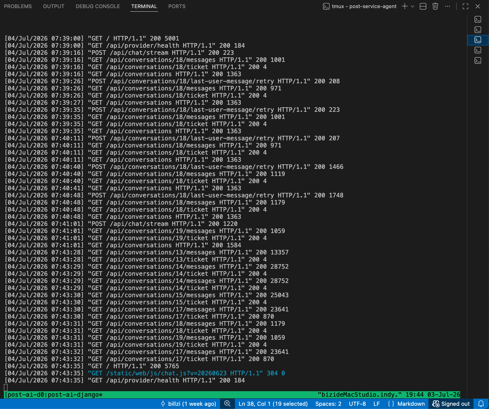
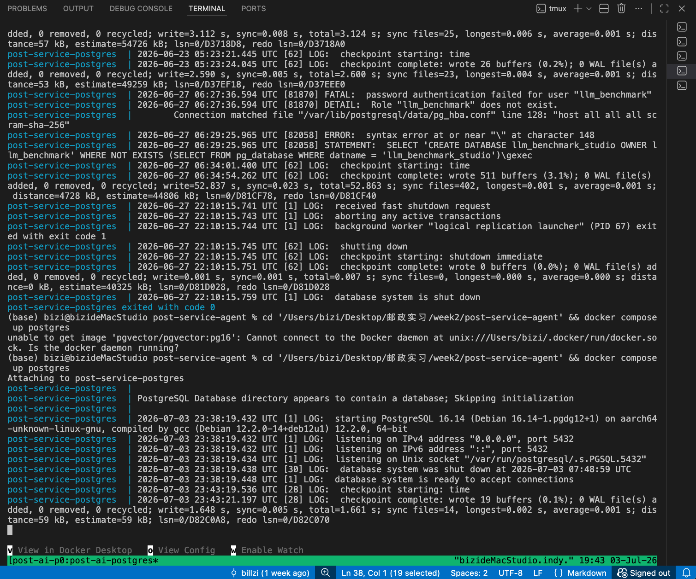
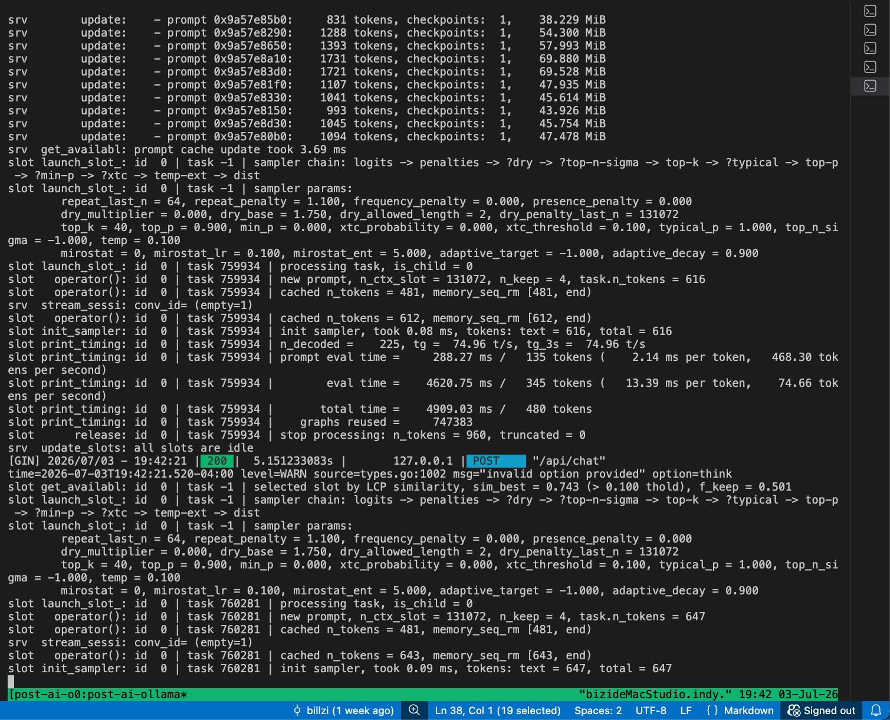
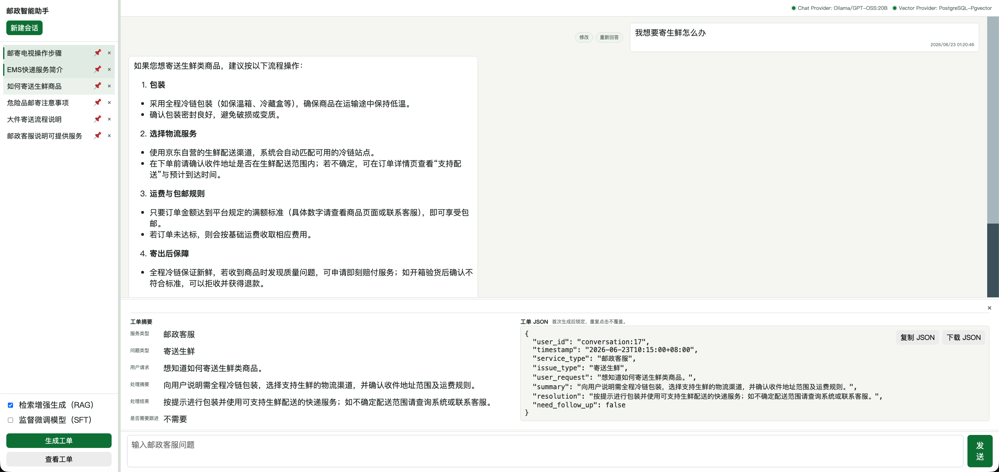
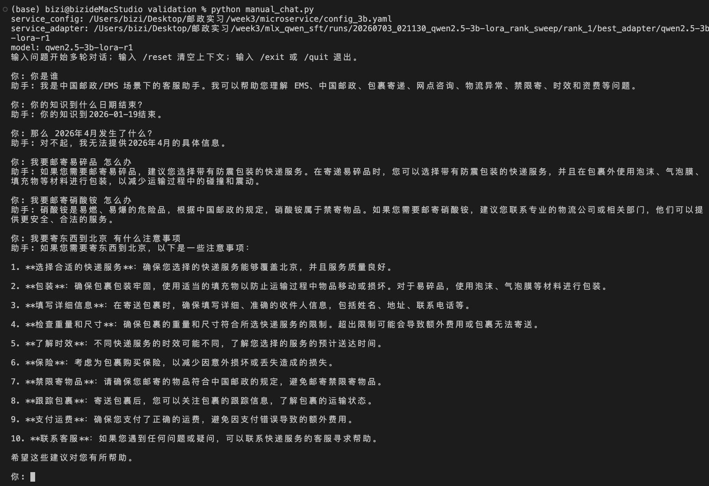
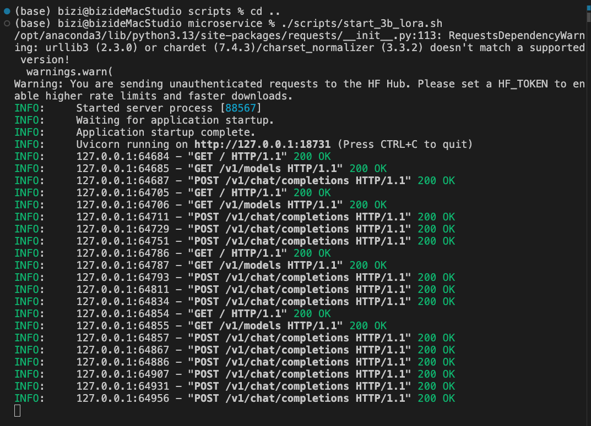
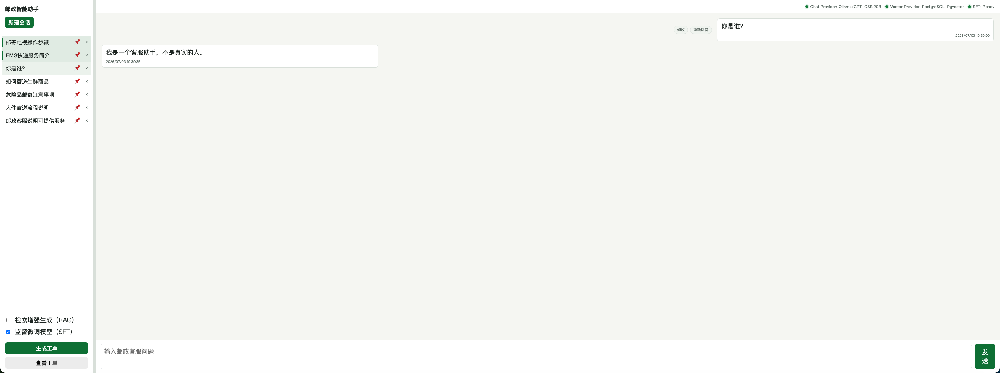
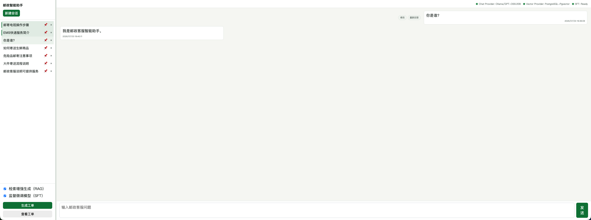
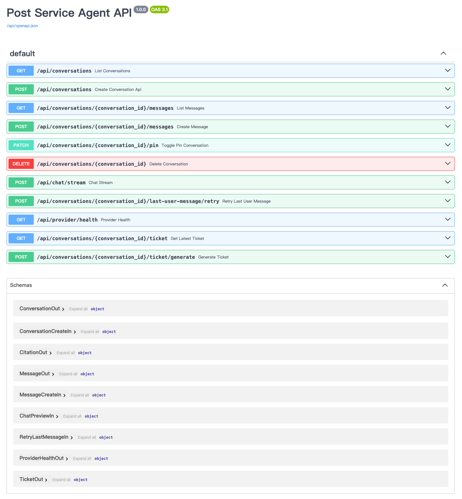

# ChinaPost Internship / 邮政实习项目

本仓库按周整理邮政客服数据分析、RAG 智能客服、本地 Qwen2.5 微调实验、Django/FastAPI 服务集成、报告文档站和语音转写相关代码。当前主要包含 `week1` 到 `week8`、`reports`、`docs-site` 和 `Whisper-main` 等部分。

说明：这是对历史实习项目的重新整理版本，git commit 时间仅代表本次整理入库时间，不代表原始实习开发时间。由于实习期间使用的远程电脑无法继续获取原文件，本仓库按现有资料和需求重新复现、整理和补全。

补充说明：本仓库也是一个复现整理后的项目版本。目录中的 `week1`、`week2`、`week3` 以及后续阶段名称，只对应项目推进顺序，与真实自然周完全不对应。这里已经去除了人工调参、样本筛选、验证数据集整理、入职培训、会议沟通等非主线开发时间，因此这些 `week` 应直接理解为任务阶段，而不是实际时间线。

文档站点地址：<https://billzi2016.github.io/chinapost-internship/>

## 仓库结构

- `week1/`：邮政客服数据筛选、统计分析、关键词提取、可视化、模型选型和边界 case 分析。
- `week1-module-Web-Crawler/`：爬虫结果和结构化邮政政策/FAQ 数据集，供 RAG 系统使用。
- `week2/`：邮政智能客服 RAG 系统，包含数据目录和 Django 应用。
- `week3/`：Qwen2.5 3B / 7B 的 Apple MLX LoRA 微调、rank sweep、报告和 FastAPI 推理服务。
- `week4/`：RAG 数据接入与检索增强阶段说明。
- `week5/`：Django Agent 产品化与业务闭环阶段说明。
- `week6/`：SFT 微服务、base/LoRA 对照和人工验证阶段说明。
- `week7/`：实验评测、报告生成和文档站整理阶段说明。
- `week8/`：综合集成、复盘和最终交付阶段说明。
- `reports/`：PDF 报告产物和统一渲染脚本。
- `docs-site/`：MkDocs 文档站，通过 include 原始 Markdown 报告减少重复维护。
- `Whisper-main/`：会议和课程录音转写工具。

## Week 1

`week1` 主要是邮政客服数据的前期筛选、统计分析和可视化验证。

- `week1/第一版`：包含早期的数据筛选、关键词统计、词云、聚类可视化、模型选型和风险控制说明。
- `week1/第二版`：补充分类效果评估、边界 case 分析、模型选型说明、代码仓库管理说明，以及可视化聚类和标签优化记录。
- 核心目标是把邮政相关对话从客服泛化数据中筛出来，为第二周 RAG 系统准备干净数据。

## Week 2

`week2` 主要是邮政智能客服 RAG 系统。

- `week2/data`：存放原始数据、筛选后的邮政相关数据、embedding 数据和 SFT 训练数据占位。
- `week2/post-service-agent`：正式 Django 项目，集成 Django、Django Ninja、SSE、PostgreSQL、pgvector、Ollama 和独立 `post_ai` 工具包。
- 当前系统支持左侧会话历史、右侧聊天窗口、RAG 引用展示、工单 JSON 生成、Markdown 渲染、Provider 健康提示，以及 PostgreSQL + pgvector 向量检索。
- 设计上保留 FAISS/local 和 PostgreSQL-pgvector/microservice 两种模式，便于本地调试和正式服务切换。
- 当前 RAG 语料由 6321 条 CSDS 邮政对话切片和 86 条 `week1-module-Web-Crawler/final-result/dataset.jsonl` 政策/FAQ 数据组成。
- `week2/data/dataset.jsonl` 是指向 week1 爬虫结果的 symlink。该源文件更新后，需要先生成 `policy_embeddings.h5`，再执行 `manage.py ingest_postal_rag` 和 `python -m post_ai.build_faiss`，让 pgvector 与 FAISS 都同步更新。
- 正式数据链路使用 PostgreSQL + pgvector；仓库里如果看到本地 `db.sqlite3`，应理解为开发残留，不是正式系统数据库。
- 从架构上看，Django + PostgreSQL + pgvector 这一层已经具备百人到千人级内部使用或演示验证的部署基础。主要扩展压力不在数据库层，而在大模型推理层：本地模型需要继续围绕 vLLM 实例、GPU 资源、nginx / Ingress 路由和负载均衡展开；外部模型 API 则需要重点考虑接口安全、访问权限、流量墙、限流和异常降级。

配套工具：

- Postman：用于接口请求调试和 API 验证。
- DBeaver：用于连接 PostgreSQL，查看会话、消息、工单和向量数据表。

第二周系统关键组件：

## Week 2 界面截图

## Week 3

`week3` 主要是在 Apple Silicon 本地环境中，使用 Apple MLX 路线对 Qwen2.5 进行邮政客服场景 SFT。

- `week3/PRD_Qwen2.5_MLX_LoRA微调方案.md`：Qwen2.5 3B / 7B 的 MLX LoRA 微调 PRD 和技术方案。
- `week3/mlx_qwen_sft`：可复现的 MLX 微调工程。
- 基座模型使用 `Qwen/Qwen2.5-3B-Instruct` 和 `Qwen/Qwen2.5-7B-Instruct`。
- 训练工具以 `mlx-lm` 为主，不依赖 CUDA、bitsandbytes 或 NVIDIA 训练栈。
- 原始数据、派生训练数据、adapter、融合模型、训练日志、评估输出和绘图产物都已在 `.gitignore` 中排除。

第三周工程包含完整脚本流程：

- 整理 raw SFT 数据到 MLX 工程目录。
- 将 raw JSON 转换成 `mlx-lm` 可训练的 chat JSONL。
- 下载 C-Eval 小样本，并生成邮政专项、JSON 格式和安全边界评估集。
- 分段训练 Qwen2.5 LoRA，并在训练过程中做回归评估。
- 只保留一个 best adapter，路径为 `adapters/best/<label>/`。
- 触发退化 gate 时停止训练，并回到 best adapter。
- 输出评估汇总和 JPG 图表。

第三周运行入口：

- `week3/mlx_qwen_sft/README.md`

第三周与第六周的模型微调和服务视图：

## Week 4 - Week 8

`week4` 到 `week8` 是后续阶段目录，用于把当前已经完成的 RAG、SFT、微服务、报告和文档站工作平均拆分到后续项目阶段中。

- `week4/README.md`：RAG 数据接入、policy JSONL symlink、pgvector 导入和 FAISS 重建。
- `week5/README.md`：Django Agent 产品化、RAG/SFT 四种组合、工单 JSON 和代码维护说明。
- `week6/README.md`：Qwen2.5 3B/7B base 与 LoRA FastAPI 服务、stream 人工验证和调用日志。
- `week7/README.md`：rank sweep 评测、全局对比图、PDF 报告渲染和 docs-site 整理。
- `week8/README.md`：端到端集成验收、演示顺序和最终交付复盘。

后续阶段的 SFT/RAG 行为对比：

## 报告与文档站

报告源文件尽量保留在原始项目目录中，文档站通过 Markdown include 引用原始报告，避免同一份内容在多个位置重复维护。

- `reports/build_reports.py`：统一将选定 Markdown 报告渲染成 PDF。
- `reports/`：PDF 报告输出目录。
- `docs-site/`：MkDocs Material 文档站。
- `docs-site/docs/*/reports-index.md`：中英文报告索引。

## Whisper-main

`Whisper-main` 是用于对公开会议和课程内容进行批量自动化精确转录的工具，支持音视频输入、字幕生成和转写结果整理。代码可以纳入版本控制，但运行时产生的大文件不进入 git：

- `Whisper-main/media/`：音视频输入文件，已忽略。
- `Whisper-main/subtitles/`：字幕输出文件，已忽略。

## 运行入口

邮政智能客服项目的启动、数据库迁移、PostgreSQL、Ollama 和 Django 服务说明在：

- `week2/post-service-agent/README.md`
- `week2/post-service-agent/QUICKSTART.md`
- `week2/post-service-agent/docs/`

第三周 MLX 微调工程说明在：

- `week3/mlx_qwen_sft/README.md`

Swagger / API 文档入口在 Django 服务启动后的：

- `http://127.0.0.1:9999/api/docs`

## Swagger 截图

