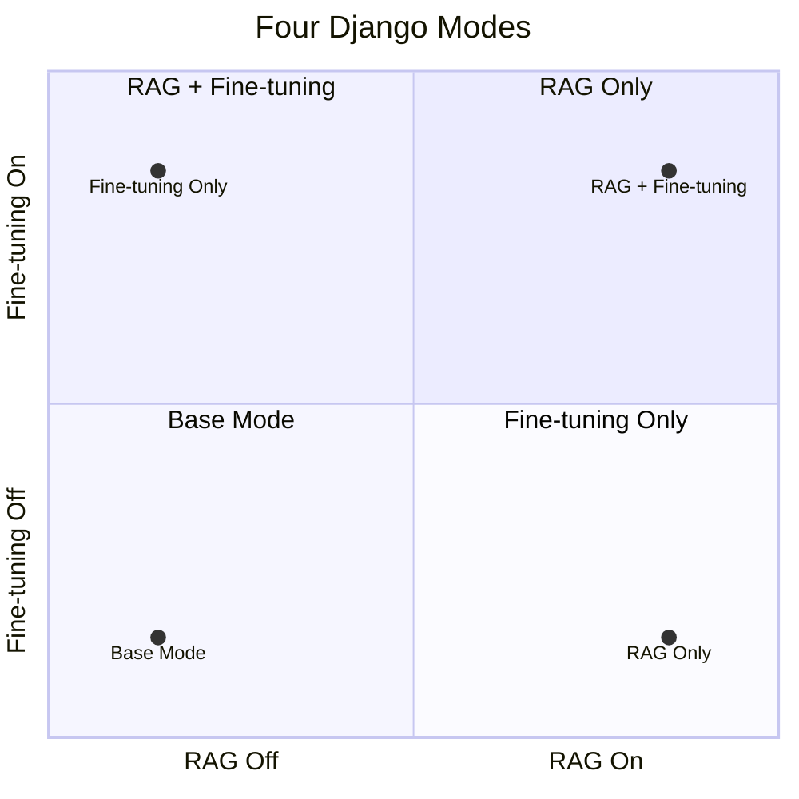

# Django System and APIs

The second phase delivered a complete Django-based postal customer-service system, but this layer is better understood as the demo and integration shell around the RAG and model tracks. The web UI, API orchestration, session persistence, and RAG citation rendering were organized here.

## System Structure

Main project location:

```text
week2/post-service-agent/
```

The structure can be summarized as:

```text
templates/web/chat.html     page templates
apps/web                    page layer
apps/api                    django-ninja APIs and SSE
apps/core                   Django ORM models
post_ai                     provider, RAG, prompt, ticket JSON
PostgreSQL + pgvector       conversations, messages, tickets, docs, vectors
```

## Web Features

The web layer includes more than a single chat box. The current UI organization includes:

1. Conversation history on the left panel.
2. Pin and delete actions for conversations.
3. Chat area on the right panel.
4. RAG toggle.
5. SFT toggle and unavailable-state hint.
6. SSE streaming responses.
7. Citation display.
8. Markdown rendering and sanitization.
9. Edit previous question.
10. Retry previous question.
11. Manual ticket generation.
12. Ticket JSON copy and download.
13. Provider health display.

## API Layer

The API layer uses `django-ninja` and handles:

1. Conversation CRUD.
2. Message exchange.
3. Streaming response orchestration.
4. RAG result return.
5. Ticket JSON generation and persistence.
6. Provider health checks.

SSE is used for streaming responses so the frontend can render token flow progressively instead of waiting for a full blocking response.

## Four Running Modes

The Django system was not limited to one fixed chat mode. It could switch across four combinations based on whether RAG and fine-tuning were enabled.

The four combinations can be understood as a simple quadrant:



That gives four direct combinations:

1. no RAG, no fine-tuning
2. RAG on, fine-tuning off
3. RAG off, fine-tuning on
4. RAG on, fine-tuning on

This made it possible to compare the actual user-facing behavior of different capability combinations through one unified interface.

## Effect Comparison

Besides the page-level toggle behavior, scripts were also used to analyze the final effect of the four modes. The full comparison code is not completely reorganized into the current repository yet, but the comparison workflow itself belongs to the finished project track rather than an unimplemented idea.

## Data Layer

The formal data path used PostgreSQL + pgvector.

`db.sqlite3` may still appear as a local development residue in the reconstructed repository, but it is not the intended formal database path for this system.
