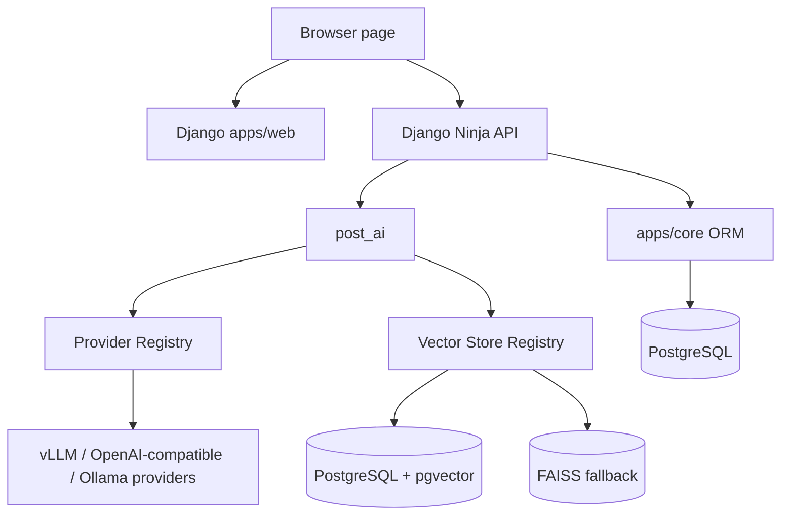
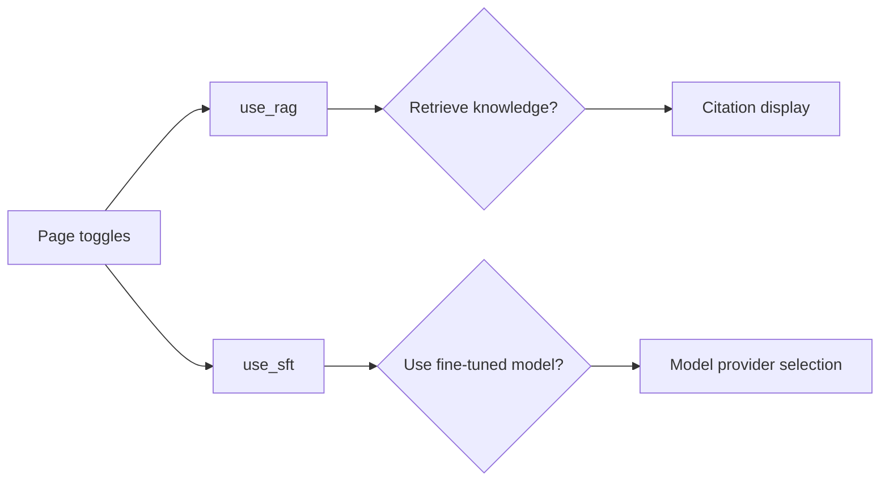
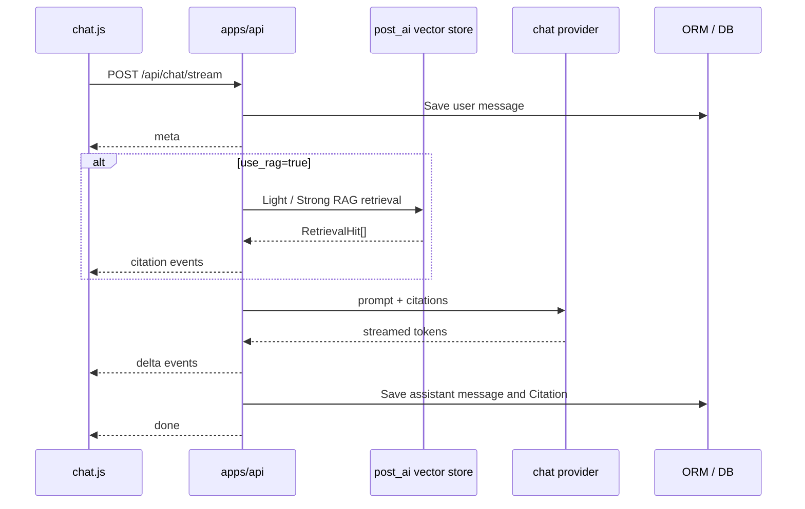
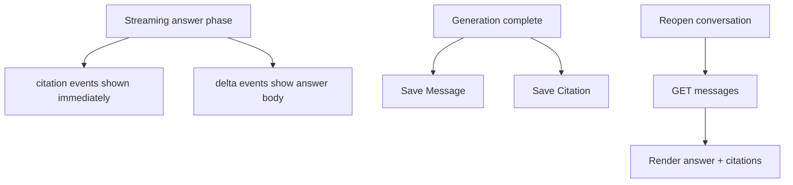
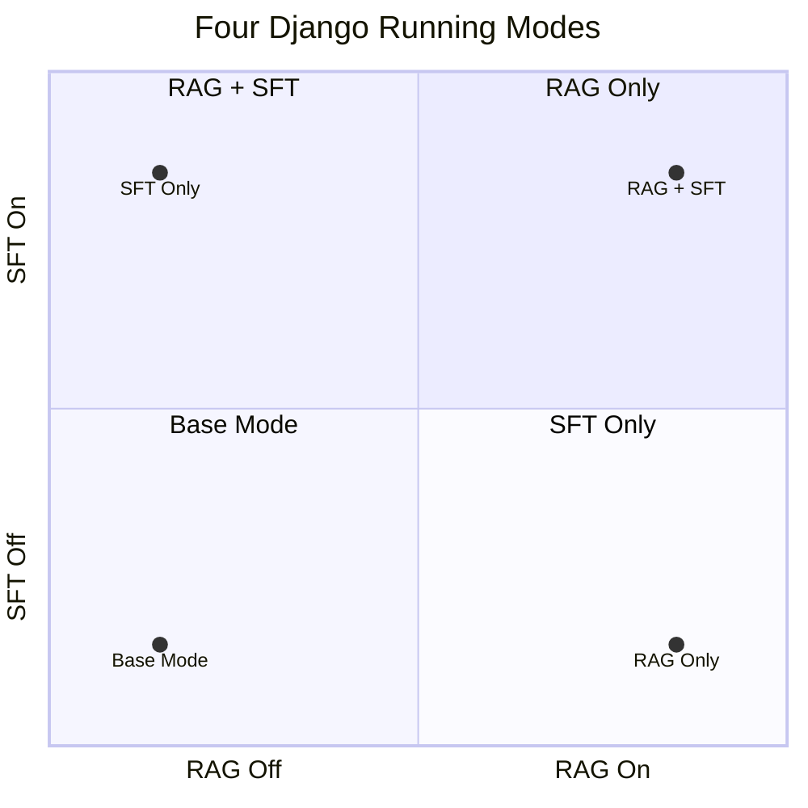
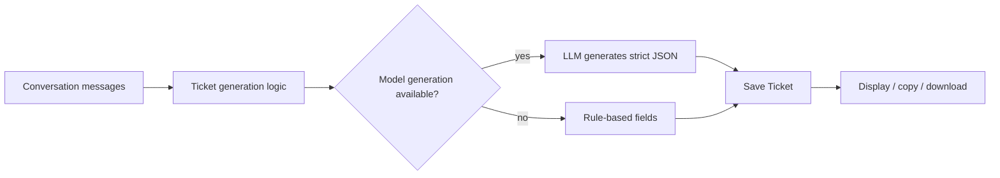

# Django System and APIs

The second phase delivered a Django-based customer-service system. Django was not the main research target by itself. The core tracks were still RAG and LoRA, but the Django layer connected the page, APIs, sessions, citations, ticket JSON, and model calls into one runnable demo and validation entry point.

The important part is that the previous work becomes usable here, not just documented in scripts and reports. From the page, a user can switch RAG, switch the fine-tuned model path, inspect citations, generate ticket JSON, and keep conversation history for later analysis.

Main project directory:

```text
week2/post-service-agent/
```

## How the system is split

The code can be read by responsibility:

| Location | Responsibility |
|---|---|
| `templates/web/chat.html` | Chat page skeleton: sidebar, mode toggles, input area, and ticket panel entry. |
| `static/web/js/chat.js` | Frontend behavior: requests, SSE consumption, Markdown rendering, citations, and tickets. |
| `apps/api` | `django-ninja` APIs for conversations, messages, streaming, tickets, and health checks. |
| `apps/core` | Django ORM models for conversations, messages, citations, tickets, postal docs, and related data. |
| `post_ai` | Model providers, RAG retrieval, prompt assembly, and ticket JSON generation. |
| PostgreSQL + pgvector | Formal data and vector storage path. |
| FAISS | Local fallback for debugging and offline validation. |



With this split, the page does not need to know how model serving is deployed, and the API layer is not locked to a single model backend. Model providers and vector stores are both selected through registries, so changing the inference service or vector backend does not require rewriting the UI.

## Why Django

This system needed more than a model-calling endpoint. It needed pages, sessions, messages, citations, tickets, database models, CSRF handling, static files, and a clear application structure. Django fits this kind of stateful web application.

For this project, Django helped in three concrete ways:

1. the ORM can model Conversation, Message, Citation, Ticket, and PostalDocument cleanly,
2. templates and static files make it fast to build a demonstrable page without adding an unnecessarily heavy frontend stack,
3. `django-ninja` lets the API layer live inside the same Django project and reuse the same data models.

FastAPI would also work for a pure API demo. This project needed page interaction, citations, history, and ticket JSON in the same system, so Django was the more convenient fit.

## What the page includes

The page is not just a standalone chat box. It follows a customer-service workflow.

The left side shows conversation history, with create, switch, pin, and delete actions. The main area shows the chat. Assistant responses are streamed with SSE. A ticket panel can show the structured JSON generated from the current conversation.

The page has two important toggles:

1. `检索增强生成（RAG）`
2. `监督微调模型（SFT）`

The RAG toggle is sent to the backend as `use_rag`. When enabled, the backend retrieves from the knowledge base and returns citations. When disabled, the backend skips retrieval and asks the model to answer from the current prompt.

The SFT toggle switches the request into the fine-tuned model path. When it is off, the request uses the base model path. Together with the RAG toggle, it lets the same page compare four capability combinations directly.



## One send request

When the user clicks send, the frontend calls:

```text
POST /api/chat/stream
```

The request body contains:

```json
{
  "conversation_id": 1,
  "message": "邮件滞留海关如何处理？",
  "use_rag": true,
  "use_sft": false
}
```

The backend returns SSE. The usual event order is:

```text
meta -> citation -> delta -> done
```

On failure, the backend returns `error`.

SSE is used because the user should see the answer stream in, rather than waiting for the model to finish the whole response. Citations come through `citation` events, answer text comes through `delta`, and `done` closes the round. This also makes debugging easier: retrieval, generation, and persistence can be checked as separate stages.



`meta` tells the frontend the current conversation id and whether RAG/SFT are enabled. `citation` carries `rank`, `score`, `source_key`, and `quoted_text`. `delta` is the streamed answer text. `done` marks completion and returns the assistant message id.

## Citation display is part of the workflow

When RAG is on, the page shows “引用对话” below the answer. Each citation is an expandable block with rank and score in the title. The expanded body shows the recalled text.

The frontend recognizes citation text like:

```text
用户[0]: 邮件滞留海关如何处理
客服[1]: 海关部门对于无法预判价值或价值较高的邮件都会进行查验，一般最长不超过一个月
```

It displays `用户[0]:` and `客服[1]:` as speaker labels instead of merging everything into one paragraph.

Historical messages keep citations too. When a conversation is reopened, the page calls:

```text
GET /api/conversations/{conversation_id}/messages
```

That endpoint returns messages together with the `citations` attached to assistant messages, so citations survive page refresh and conversation switching.



## Four running modes

The two toggles create four modes for comparing capability combinations in the same interface.



The behavior is:

| Mode | `use_rag` | `use_sft` | Behavior |
|---|---:|---:|---|
| Base mode | false | false | No knowledge retrieval; generate with the default model path. |
| RAG only | true | false | Retrieve from the knowledge base and generate with citations. |
| SFT only | false | true | Skip retrieval and generate with the fine-tuned model. |
| RAG + SFT | true | true | Retrieve knowledge first, then let the fine-tuned model organize the answer with citations. |

The point of these modes is comparison through one page. For the same question, such as compensation for damaged insured mail, the page can show how the base model, base model with RAG, fine-tuned model, and RAG + fine-tuned model behave differently. The project also includes scripts for analyzing the final effects of the four modes.

This is where the system shows its value most clearly: the page does not merely prove that the chatbot can talk. It separates model capability from knowledge-base capability. RAG supplies evidence, SFT supplies domain style and response organization, and the combined mode shows how the two behave together. The same quadrant design also makes later quantitative comparison easier because the modes are already separated at the product level.

The quadrant design comes from separating the actual variables. RAG answers “where does the evidence come from,” while SFT answers “how should the model speak and organize responses in this domain.” If there were only one global switch, it would be hard to tell whether a change came from retrieval or fine-tuning. With four modes, each experiment has a clean comparison point.

## Ticket JSON

The page also has “生成工单” and “查看工单”. This supports the post-processing step in a customer-service workflow: after a conversation, the system extracts the user request, issue type, summary, resolution, and follow-up flag into structured JSON.

Backend endpoint:

```text
POST /api/conversations/{conversation_id}/ticket/generate
```

The generated ticket is saved as `Ticket`. Clicking generate again does not overwrite an existing ticket. The page can copy the JSON or download it as a JSON file.



Ticket fields include:

| Field | Meaning |
|---|---|
| `service_type` | Service type, fixed as postal customer service. |
| `issue_type` | Issue type, such as customs, compensation, or complaint. |
| `user_request` | One-sentence summary of the user request. |
| `summary` | Short summary of the service handling process. |
| `resolution` | Current result or suggested next step. |
| `need_follow_up` | Whether the case needs follow-up. |

## Database and environment boundary

The formal path uses PostgreSQL + pgvector. The database stores conversations, messages, citations, tickets, postal documents, and vectors.

The repository may still contain `db.sqlite3`, but that is local development residue, not the formal database shape for this phase. PostgreSQL is the main path for persistence and vector retrieval.

Security in this version mainly covers basic CSRF, XSS handling, and frontend Markdown sanitization. Authentication, permission tiers, audit logs, and stricter production configuration can be extended later. The page and deployment chain focus on carrying the RAG and model capabilities and providing a system entry point that can be demonstrated, compared, and analyzed.
