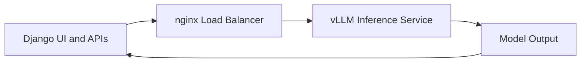

# Inference Serving

The inference layer was not limited to local testing. It was organized as an actual serving path for the customer-service system, although it should still be understood as the serving shell around the core RAG and LoRA work rather than the sole project goal.

## Deployment Shape

Model inference used `vLLM`, running on an `A100` machine with a single-node `8-GPU` setup.

This layer existed to provide a stable online inference endpoint for the upper Django system.

## Load Balancing

`nginx` was used in front of the inference layer for load balancing.

This kept the serving path cleaner:

1. one unified external entry,
2. easier backend forwarding,
3. room for later routing or node expansion.

## Service Flow

The serving path can be summarized as:

```text
Django / API layer
  -> nginx
  -> vLLM inference service
  -> model output returned
```

The same service relationship can be shown as:



## Django and Serving

The Django layer itself can be replicated horizontally, so it was never treated as permanently tied to a single serving process.

At the current reconstructed level, the path is:

```text
Django
  -> nginx
  -> vLLM
```

This was enough for the system demo and integrated validation path, but it was not pushed further into `k8s`.

If the system were continued upward, a natural next step would be to replace the current `nginx` entry role with an `Ingress`-style organization in a container orchestration environment.

## Model Summary

The current documentation keeps one stable conclusion for the LoRA experiments:

1. `Qwen2.5-3B` -> `rank 2`
2. `Qwen2.5-7B` -> `rank 4`

These conclusions are kept as a stable documentation baseline, while still acknowledging that LoRA rank outcomes contain some randomness.

## Security and Environment Boundary

Security was not the main project focus at this stage, so the preserved boundary in the reconstructed version is still relatively basic:

1. `CSRF`
2. `XSS`

At the same time, several limitations remain explicit in the current state:

1. there is still `DEBUG`-mode residue,
2. there is no full authentication layer yet,
3. the production-grade security hardening was not fully closed.

So this part should be read as “the system path was proven and integrated”, not as “the production security stack was fully completed.”
