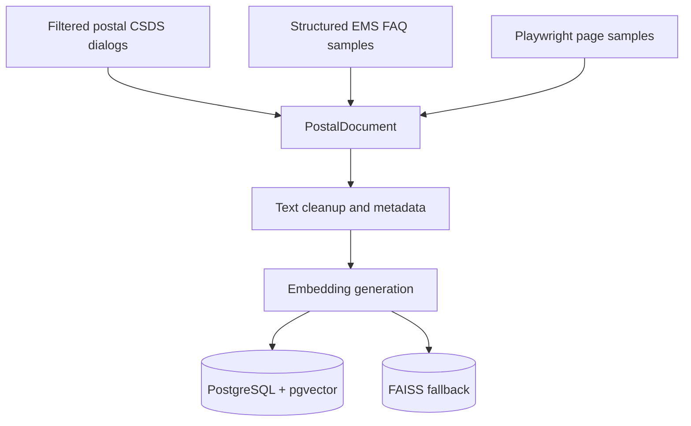
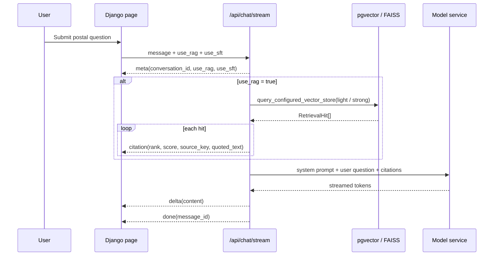
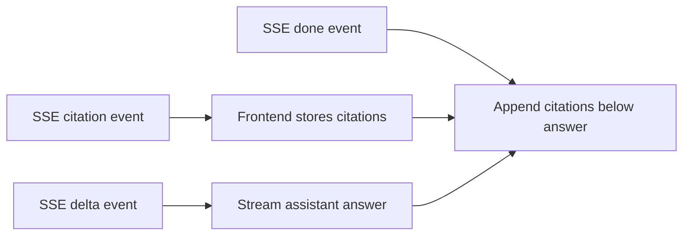
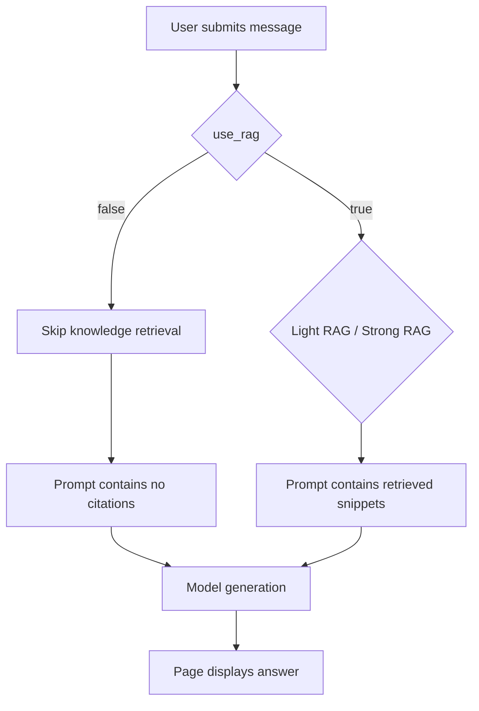
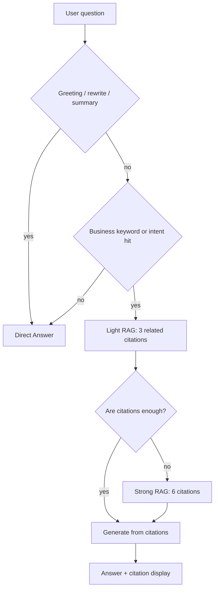

# RAG Architecture

The second phase was not a plain “send the user question to the model” chatbot. A postal knowledge retrieval layer sits before generation, and the answer, citations, scores, and conversation history shown on the page all come from that same chain.

RAG solves a specific problem here: many postal customer-service questions depend on rules, processes, and policy text. The model can write the answer, but the supporting facts should come from the knowledge base. For example, when the user asks how to handle a package held by customs, the system should retrieve material about customs inspection, declaration, return handling, or cargo clearance before asking the model to write the reply.

This part shows that the system is not just a wrapper around one model API. It covers knowledge sourcing, embedding, retrieval routing, citation display, history replay, and Light/Strong RAG switching. The user sees one answer, but the system has already retrieved evidence, checked whether it is enough, composed the answer, and kept the citations.

## Knowledge sources

The knowledge base has two main sources.

The first source is the postal-related customer-service data filtered in phase one. This keeps postal-domain QA turns, summaries, and classification metadata from the CSDS data processing work.

The second source is the crawled postal FAQ, agreements, process pages, and policy pages. The `dataset.jsonl` described in the crawler report contains EMS FAQ records and Playwright-collected page samples. It keeps fields such as `title`, `summary`, `evidence_text`, `url`, and `policy_categories`. `summary` is useful as a short answer candidate, `evidence_text` keeps the traceable source text, and `url` or locator fields make the sample auditable.

These materials are not pasted into one long prompt. They are normalized into document records, embedded, and loaded into PostgreSQL + pgvector for the formal path. FAISS is kept as a local fallback for debugging.

The current implemented RAG corpus contains 6,407 documents: 6,321 CSDS postal-dialogue slices and 86 policy / FAQ records from the week1 crawler JSONL. The legacy dialogue data keeps using `dialogue_embeddings.h5` and `dialogue_metadata.json`. The new policy / FAQ data uses a separate `policy_embeddings.h5` and `policy_metadata.json`, so it does not modify the old H5 and is not generated inside the Django import command.

After import, pgvector and FAISS use the same merged document set. The FAISS metadata marks the provider as `old-h5+policy-h5` and the embedding model as `dialogue_embeddings.h5+policy_embeddings.h5`, making the legacy dialogue vectors and new policy vectors explicit.

## Why PostgreSQL + pgvector

The formal vector path uses PostgreSQL + pgvector instead of relying only on a local demo store.

First, the Django system already needs a database for conversations, messages, citations, and tickets. Keeping documents and vectors in PostgreSQL reduces the number of moving parts and keeps the data relationships easier to inspect. Second, pgvector supports similarity search inside the database, which fits the `PostalDocument`, metadata, embedding, and citation chain. Third, when an answer needs to be checked later, the system can trace from message to citation to document and metadata in one database-backed path.

FAISS is still kept for local debugging and offline validation. It starts quickly, does not require a running database service, and is useful for checking embeddings and retrieval quality in small experiments. The formal system is better served by PostgreSQL + pgvector because it matches Django persistence and citation tracing.



## What happens in one RAG request

When the user sends a question, the frontend posts the conversation id, message, `use_rag`, and `use_sft` to the backend. The endpoint is `POST /api/chat/stream`, and the response uses SSE so the page can render while the backend is still generating.

SSE was chosen over a blocking HTTP response because customer-service answers can be long, especially when RAG citations are involved. The page can show the answer as it is generated and append citations when the response finishes. SSE is also lighter than WebSocket for this use case because the main need is server-to-browser streaming text, not complex bidirectional realtime communication.

When RAG is enabled, the backend first decides whether the question needs Light RAG or Strong RAG. Common FAQ questions and clear business terms start with Light RAG and retrieve 3 highly related snippets. Rule-heavy questions, questions with more conditions, or cases where the model judges the current evidence insufficient move to Strong RAG and expand retrieval to 6 snippets. Each hit carries a rank, similarity score, source key, and quoted text.



The citations are not decorative text added after the answer. The backend puts the retrieved snippets into the prompt before generation, in a shape similar to:

```text
User question:
How should a package held by customs be handled?

Available cited dialogs:
[Citation 1 score=0.8231]
...

[Citation 2 score=0.7914]
...
```

The model receives the user question together with the available citations. The system prompt also tells it to prioritize cited postal dialogs and to say when the evidence is insufficient.

## How citations appear on the page

The page does not show only a filename or a vague “from knowledge base” label. The frontend receives `citation` events first and stores them locally. The answer body is streamed through `delta` events. After `done`, the page appends the citation blocks below the assistant message.

Each citation is rendered as an expandable block with a title like:

```text
引用 1 · score 0.8231
```

After expanding the block, the user can see the recalled text. For dialog-based snippets, the frontend recognizes line prefixes such as `用户[0]:` and `客服[1]:`, then displays user turns and agent turns separately.

A typical result can be read like this:

```text
Assistant answer:
If a package is held by customs, first confirm whether it is under inspection, whether declaration materials are needed, or whether the item has been treated as over-value or over-quantity mail. If declaration, return, or cargo clearance is required, the recipient should follow the customs instructions.

Cited dialogs
  Citation 1 · score 0.8231
    用户[0]: 邮件滞留海关如何处理
    客服[1]: 海关部门对于无法预判价值或价值较高的邮件都会进行查验，一般最长不超过一个月

  Citation 2 · score 0.7914
    用户[0]: 海关定义邮件内件超值超量怎么办
    客服[1]: 对于内件数量或价值超过海关限定的邮件，需要收件人办理退运或者按货物办理通关手续
```

This is more useful than saying “the answer comes from the knowledge base.” The reader can see which snippets supported the answer. If the answer is wrong, it is easier to tell whether retrieval found the wrong evidence or whether the model misread the right evidence.



## How citations are persisted

After the answer is generated, the backend creates the assistant message and saves the retrieved hits as `Citation` rows. The message history API then returns those citations to the frontend.

That means citations are not only visible during streaming. They still appear after refreshing the page or reopening an old conversation.

```mermaid
flowchart TD
    A[Message: assistant answer] --> B[Citation]
    B --> C[score]
    B --> D[quoted_text]
    B --> E[metadata]
    F[GET /api/conversations/{id}/messages] --> A
    F --> B
    B --> G[Frontend renderCitations]
```

The main citation fields returned by the history API are:

| Field | Meaning |
|---|---|
| `score` | Vector similarity score between the query and the recalled snippet. |
| `quoted_text` | The text shown on the page after basic display cleanup. |
| `metadata` | Source metadata such as category, source path, or original index. |

During streaming, the `citation` event also includes `rank` and `source_key`. `rank` controls display order. `source_key` identifies the recalled document, usually composed from split, index, session id, and dialogue id.

## What the RAG toggle changes

The RAG toggle on the page directly changes backend behavior.



When RAG is off, the same chat endpoint is still used, but the prompt has no retrieved evidence. This mode is useful for comparing pure model answers against knowledge-grounded answers.

When RAG is on, the answer can show citation blocks. For business questions, those blocks explain the basis of the answer. For simple greetings or rewriting requests, RAG may retrieve unrelated material, which is why the design also needs routing instead of blindly retrieving for every message.

## Light RAG and Strong RAG

The system design report separates Light RAG and Strong RAG to control context length and implementation complexity.

Light RAG means the system first uses keywords or regex rules to decide whether retrieval is needed, then retrieves 3 highly related snippets. It fits common FAQ questions or clear business terms such as compensation, customs clearance, complaint progress, and prohibited items.

Strong RAG means the system expands retrieval to 6 snippets for questions that depend heavily on rules, deadlines, compensation, prohibited items, customs, or appeals, or when the model judges that the 3 Light RAG snippets are not enough. The expanded pass prefers higher-trust sources such as FAQ, agreements, and standard clauses.

The 3/6 split is intentional. Three citations are usually enough for a common FAQ-style answer and one or two supporting details without making the prompt too heavy. Six citations fit rule-heavy questions that need cross-checking, such as customs clearance, compensation, prohibited items, and appeals, where the model may need to see conditions, limits, and process steps together.



This is not a “generate an answer, score it, then retrieve again” loop. The check happens inside the same request path, which keeps the system simpler than a multi-stage answer-review-regenerate pipeline.

## When RAG should not run

Some requests do not need the knowledge base:

1. “你好”
2. “谢谢”
3. “把上一句说得更礼貌一点”
4. “总结一下刚才的回答”

Forcing RAG onto those requests usually adds context with no benefit and can make the model treat a light interaction as a heavy business question. RAG is for rules, processes, and policy evidence. It is not meant to be attached to every message.

Real-time questions are better handled by tools. For desensitization, the document only keeps time and date as tool-call demos. Tracking-number lookup, freight information, delay reasons, and similar internal API scenarios are removed here.
