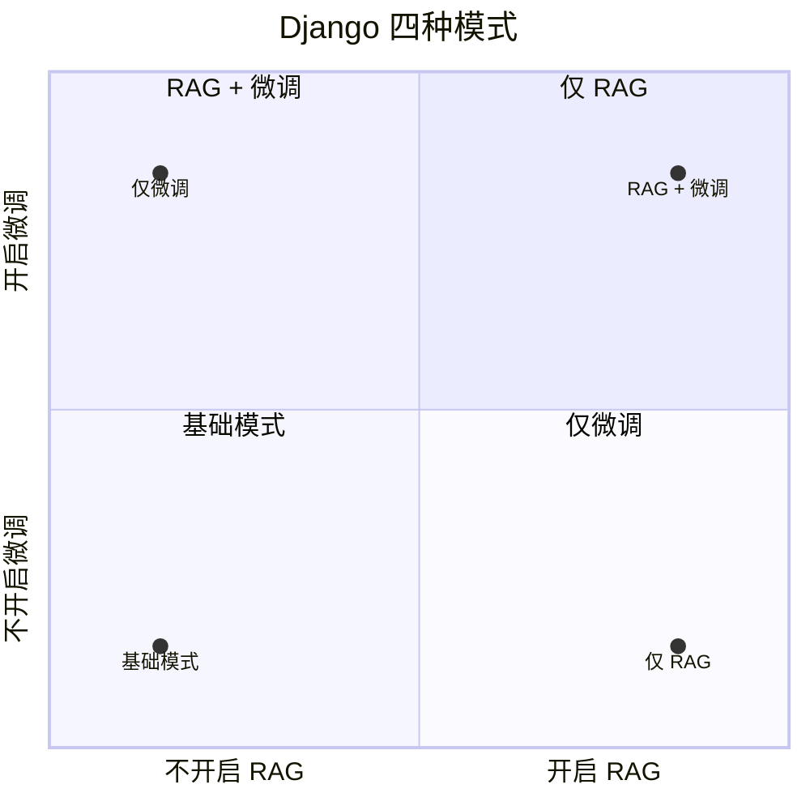

# Django 系统与接口

第二阶段确实落了一套完整的 Django 系统，但这层更适合看作承接 RAG 和模型能力的 demo 系统，而不是整个项目的核心目标本身。Web 页面、接口编排、会话持久化和 RAG 引用展示，都在这一层完成。

## 系统结构

项目主体位于：

```text
week2/post-service-agent/
```

实际结构可以概括为：

```text
templates/web/chat.html     页面模板
apps/web                    页面层
apps/api                    django-ninja API 与 SSE
apps/core                   Django ORM 模型
post_ai                     provider、RAG、prompt、ticket JSON
PostgreSQL + pgvector       会话、消息、工单、文档、向量
```

这种拆法比较直接：

1. Django 负责页面、接口、ORM 和业务持久化。
2. `post_ai` 负责模型调用、RAG、prompt 和工单 JSON。
3. 检索和推理能力通过 provider 层接入，不在业务代码里写死某一个模型后端。

## 页面能力

Web 页面不是只放了一个聊天框，而是按实际客服使用链路做了比较完整的交互组织。

当前页面层主要包括：

1. 左侧历史会话列表。
2. 会话置顶和删除。
3. 右侧聊天区域。
4. RAG 开关。
5. SFT 开关与不可用提示。
6. SSE 流式回答。
7. 引用片段展示。
8. Markdown 渲染和净化。
9. 修改上一条问题。
10. 重新回答上一条问题。
11. 手动生成工单。
12. 工单 JSON 复制与下载。
13. Provider 健康状态展示。

页面层的目标不是只展示模型输出，而是把“对话、引用、工单、状态”这些和客服场景相关的要素放到同一条可演示链路里。

## API 能力

接口层使用 `django-ninja` 组织，重点不是把 Django 当成纯页面框架，而是同时承担内部 API 服务。

API 层主要负责：

1. 会话创建、读取、删除。
2. 消息收发。
3. 流式输出编排。
4. RAG 结果回传。
5. 工单 JSON 生成与保存。
6. Provider 健康检查。

其中流式回答使用 SSE，这样前端能边接收边渲染，体验上更接近真实系统，而不是一次性整段返回。

## 四种运行模式

这套 Django 系统不只是一个固定模式的聊天页面，而是可以通过“是否开启 RAG”和“是否开启微调”切出四种模式，用来直观看不同组合下的实际表现。

四种模式可以直接放到一个二维象限里理解：



具体展开如下：

1. 不开启 RAG，不开启微调。
2. 开启 RAG，不开启微调。
3. 不开启 RAG，开启微调。
4. 开启 RAG，开启微调。

这样做的价值很直接：同一个页面和同一套接口层，可以把不同能力组合的回答体验放到一个统一入口里进行比较。

## 四种模式的效果分析

除了页面上的开关体验，这套系统还配过脚本，用于分析四种模式下的最终效果差异。

这部分代码当前整理版里还没有全部迁进来，但在项目推进口径上，这个分析链路本身是纳入过整体方案的，不是只停留在手工点页面对比。

## 数据层

当前正式链路使用 PostgreSQL + pgvector。

数据层主要存放：

1. 会话。
2. 消息。
3. 工单。
4. 邮政知识文档。
5. 文档 embedding。

现有导入口径里，RAG 文档和向量都已经落进数据库，对应的数据量在整理版里保留为：

```text
PostalDocument: 6321
PostalEmbedding: 6321
```

`db.sqlite3` 只是在当前整理环境里可能出现的本地开发残留，不是这一阶段的正式数据链路。

这也是为什么第二阶段不是一个“只连模型”的聊天页面，而是一套带持久化、带知识库、带检索能力的完整系统。
