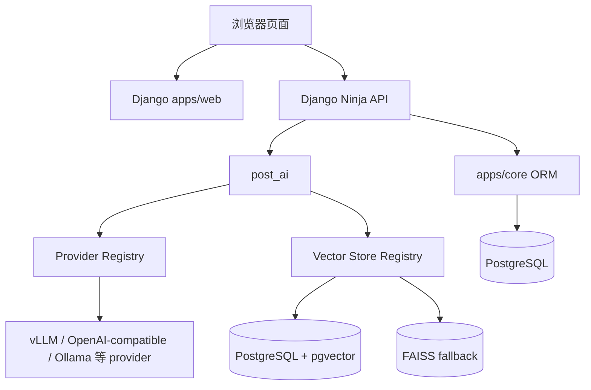
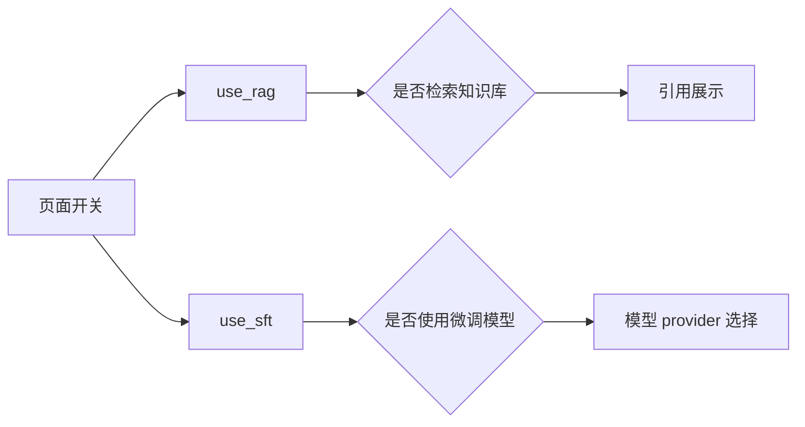
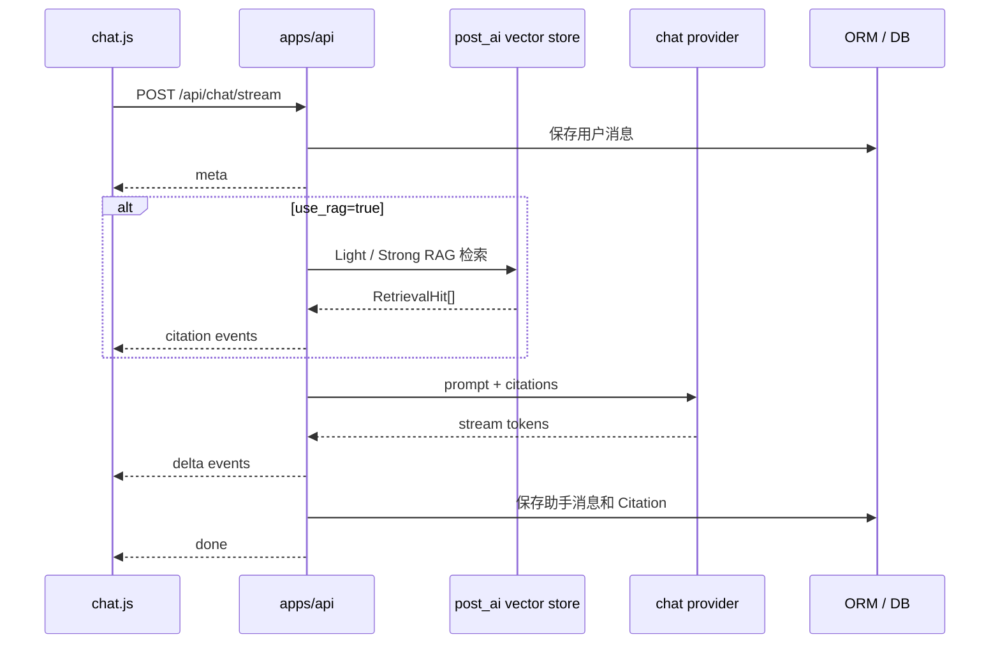
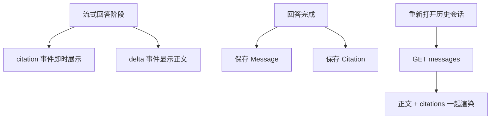
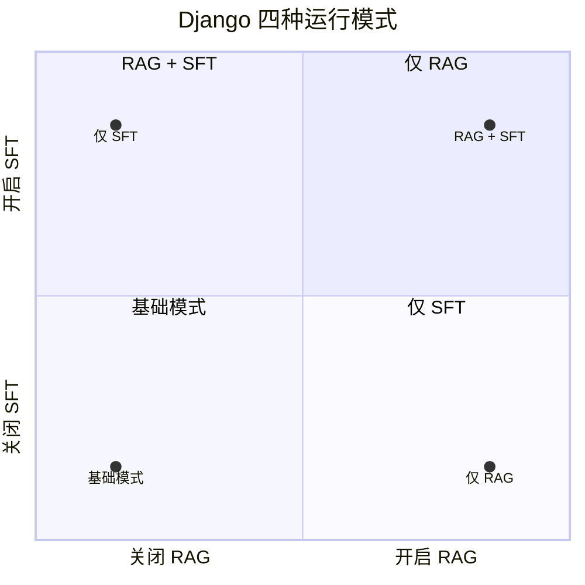
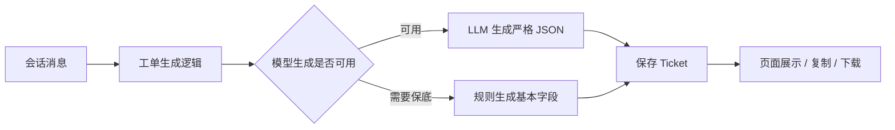

# Django 系统与接口

第二阶段落地的是一套 Django 客服系统。它不是项目的核心研究点本身，核心仍然是 RAG 和 LoRA，但 Django 这层把“页面、接口、会话、引用、工单、模型调用”接到了一起，所以它是整个方案能被实际演示和验证的入口。

这部分的重点在于把前面的能力做成可操作的系统，而不是停留在脚本和报告里。用户可以在页面里切换 RAG、切换微调模型、查看引用、生成工单，也可以通过同一套接口保留历史会话和后续分析数据。

项目主体在：

```text
week2/post-service-agent/
```

## 系统组件视图


## 系统怎么拆

代码结构可以按职责看：

| 位置 | 职责 |
|---|---|
| `templates/web/chat.html` | 聊天页面骨架，包括侧边栏、模式开关、输入框、工单面板入口。 |
| `static/web/js/chat.js` | 前端交互，负责发请求、消费 SSE、渲染 Markdown、引用和工单。 |
| `apps/api` | `django-ninja` API，负责会话、消息、流式回答、工单和健康检查。 |
| `apps/core` | Django ORM 模型，保存会话、消息、引用、工单、邮政文档等数据。 |
| `post_ai` | 模型 provider、RAG 检索、prompt 拼装、工单 JSON 生成。 |
| PostgreSQL + pgvector | 正式链路的数据和向量存储。 |
| FAISS | 本地 fallback，便于调试和离线验证。 |



这样拆的好处是页面代码不直接关心模型服务怎么部署，API 也不把某一个模型后端写死。模型和向量库都通过 provider 或 registry 接入，后续替换推理服务或向量后端时，不需要重写页面。

## 为什么选 Django

这套系统需要的不只是一个模型调用接口，还需要页面、会话、消息、引用、工单、数据库模型、CSRF、静态资源和管理结构。Django 对这类“带页面、带数据库、带后台状态”的系统比较合适。

具体到这个项目，Django 的价值主要在三点：

1. ORM 能把 Conversation、Message、Citation、Ticket、PostalDocument 这些对象关系管起来。
2. 模板和静态资源可以快速做出可演示页面，不需要为了 demo 再引入一套过重的前端工程。
3. `django-ninja` 可以在 Django 里直接组织 API，页面和接口共用同一套数据模型。

如果只做一个纯 API demo，用 FastAPI 也能完成；但这个项目需要同时展示页面交互、引用、历史会话和工单 JSON，Django 更顺手。

## 页面上有什么

页面不是一个孤立聊天框，而是围绕客服使用链路组织的。

左侧是会话列表，可以新建、切换、置顶和删除会话。中间是聊天区域，用户发送问题后，助手回答会通过 SSE 流式显示。右侧或下方可以展开工单面板，查看由当前对话生成的工单 JSON。

页面上有两个关键开关：

1. `检索增强生成（RAG）`
2. `监督微调模型（SFT）`

RAG 开关会直接传给后端的 `use_rag`。打开时，后端会检索知识库并返回引用；关闭时，后端不查知识库，只让模型按当前 prompt 生成。

SFT 开关用于切换微调模型链路。打开后，请求进入微调模型路径；关闭时，请求走基础模型路径。这个开关和 RAG 开关组合后，可以在同一个页面里直接观察四种能力组合的差异。



## 一次发送请求的过程

用户点击发送后，前端会调用：

```text
POST /api/chat/stream
```

请求体里包含：

```json
{
  "conversation_id": 1,
  "message": "邮件滞留海关如何处理？",
  "use_rag": true,
  "use_sft": false
}
```

后端返回 SSE。事件顺序大致是：

```text
meta -> citation -> delta -> done
```

如果出错，则返回 `error`。

这里使用 SSE，是因为用户需要看到流式回答，而不是等模型一次性返回完整文本。引用则先通过 `citation` 事件返回，正文通过 `delta` 返回，结束时用 `done` 统一收口。这样页面体验更接近真实客服系统，也方便调试每个阶段：检索是否成功、模型是否开始生成、最终消息是否落库。



`meta` 里主要告诉前端当前会话 ID、RAG 是否开启、SFT 是否开启。`citation` 里带每条引用的 `rank`、`score`、`source_key`、`quoted_text`。`delta` 是模型流式正文。`done` 表示本轮回答完成，并返回助手消息 ID。

## 引用展示不是摆设

RAG 打开后，页面会在回答下方展示“引用对话”。每条引用是一个可展开块，标题里有 rank 和 score，展开后能看到召回文本。

前端渲染时会识别类似下面的引用内容：

```text
用户[0]: 邮件滞留海关如何处理
客服[1]: 海关部门对于无法预判价值或价值较高的邮件都会进行查验，一般最长不超过一个月
```

它会把 `用户[0]:` 和 `客服[1]:` 作为说话角色显示，而不是把整段文本糊在一起。

历史消息也会带引用。页面重新打开某个会话时，会调用：

```text
GET /api/conversations/{conversation_id}/messages
```

这个接口会返回消息列表和每条助手消息对应的 `citations`，所以刷新页面后引用不会消失。



## 四种运行模式

页面上的两个开关可以组合出四种模式，用来比较不同能力组合下的实际体验。



四种模式对应的行为如下：

| 模式 | `use_rag` | `use_sft` | 行为 |
|---|---:|---:|---|
| 基础模式 | false | false | 不检索知识库，走默认模型生成。 |
| 仅 RAG | true | false | 检索知识库，带引用生成。 |
| 仅 SFT | false | true | 不检索知识库，走微调模型生成。 |
| RAG + SFT | true | true | 先检索知识库，再由微调模型组织答案并展示引用。 |

这四种模式的意义不是为了把页面做复杂，而是为了在同一个入口里比较能力差异。例如同一个问题“保价邮件损坏怎么赔”，可以分别看基础模型、带 RAG 的基础模型、微调模型、RAG + 微调模型的回答差别。项目里也配套了脚本，用于分析四种模式下的最终效果。

这一点是系统价值比较集中的地方：页面不是只展示“能聊天”，而是把模型能力和知识库能力拆开给用户看。RAG 负责依据，SFT 负责场景表达，二者组合后再看回答是否更稳、更像邮政客服。这种四象限设计也方便后续做定量评估，不需要每次靠人工感觉判断。

四象限的选型来自实际问题拆分：RAG 和 SFT 解决的不是同一件事。RAG 解决“依据从哪里来”，SFT 解决“模型怎么用邮政客服语气和结构回答”。如果只保留一个总开关，就看不出到底是知识库带来的变化，还是微调模型带来的变化。拆成四种模式后，每次实验都能明确比较变量。


## 工单 JSON

页面上还有“生成工单”和“查看工单”。这部分服务的是客服场景里的后处理：对话结束后，把用户诉求、问题类型、处理摘要、处理结果、是否需要跟进整理成结构化 JSON。

后端入口是：

```text
POST /api/conversations/{conversation_id}/ticket/generate
```

生成后会保存到 `Ticket`，再次点击不会覆盖已生成工单。页面上可以复制 JSON，也可以下载 JSON 文件。



工单字段包括：

| 字段 | 含义 |
|---|---|
| `service_type` | 服务类型，固定为邮政客服。 |
| `issue_type` | 问题类型，例如清关、赔付、投诉等。 |
| `user_request` | 用户诉求的一句话概括。 |
| `summary` | 对客服处理过程的短摘要。 |
| `resolution` | 当前处理结果或建议。 |
| `need_follow_up` | 是否需要继续跟进。 |

## 数据库和环境边界

正式链路使用 PostgreSQL + pgvector。数据库里保存会话、消息、引用、工单、邮政文档和向量。

当前 RAG 入库结果是 6407 条文档和对应向量：6321 条旧 CSDS 邮政对话切片复用 `dialogue_embeddings.h5`，86 条 policy/FAQ 记录来自 `dataset.jsonl`，并通过离线生成的 `policy_embeddings.h5` 入库。Django 的 `ingest_postal_rag` 只读取已有 H5 并写 PostgreSQL，不负责现场调用 embedding 模型。

仓库里可能看到 `db.sqlite3`，它是本地开发残留，不是正式链路的数据库形态。PostgreSQL 才是第二阶段系统设计里用于持久化和向量检索的主路径。

从架构上看，这套 Django + PostgreSQL + pgvector 的组织方式已经符合较大规模部署的基本要求。PostgreSQL 在这里主要承担会话、消息、引用、工单和向量检索相关的数据管理，并不需要承受特别重的高频写入压力。对于百人到千人级别的内部使用或演示验证场景，这样的数据库层设计是可以承担的。

真正的压力点不在 SQLite 或 PostgreSQL 的选择上，而在大模型推理层。如果走本地模型部署，需要继续围绕 vLLM 实例、GPU 资源、nginx 转发和后续 Ingress 做更细的负载均衡；如果走外部模型 API，则需要重点考虑接口安全、调用权限、流量限制和异常降级。

安全上，这一版主要覆盖基础的 CSRF、XSS 和前端 Markdown 净化。鉴权、权限分级、审计日志、生产环境配置收紧等内容可以继续扩展；当前页面和部署链路的重点是承接 RAG 与模型能力，并提供可演示、可对比、可分析的系统入口。
