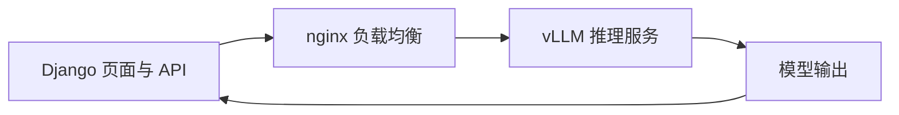

# 推理部署

模型推理部分并不是只停留在本地测试，而是按服务链路组织过一版部署。但这一层更适合作为模型能力的承接与演示链路，而不是项目的唯一重点。

## 部署形态

推理服务采用 `vLLM` 部署，运行在一台 `A100` 机器上，硬件形态为单机 `8` 卡。

这一层的目标不是只把模型跑起来，而是提供一套稳定的在线推理入口，供上层 Django 系统调用。

选择 `vLLM` 是因为它更适合把大模型变成在线推理服务。相比简单脚本直接加载模型，vLLM 更关注吞吐、并发请求和服务化接口，适合接在 Django API 后面。A100 8 卡则给了足够的显存和并行能力，能支撑 3B、7B 这类模型在服务形态下运行和对比。

## 负载均衡

推理服务前面使用 `nginx` 做负载均衡。

这样组织的目的主要是：

1. 统一对外入口。
2. 便于后端服务转发。
3. 便于后续继续扩展推理节点或调整路由策略。

这里用 nginx，不是为了把部署写复杂，而是为了把 Django 和具体推理进程解耦。Django 只面向一个稳定入口，后面推理服务如何调整、是否多开、是否替换模型，都可以在 nginx 后面处理。系统还没有推进到 k8s 时，nginx 是一个足够直接、可控的入口层。

因此，从系统架构上看，Web 和数据库层已经不是主要瓶颈。Django 可以多开，PostgreSQL + pgvector 可以承担当前这类会话、引用、工单和知识检索负载；对于百人到千人级别的使用规模，主要压力会集中到模型推理服务上。

如果使用本地部署的大模型，后续重点应放在 vLLM 多实例、GPU 利用率、nginx 转发策略和更上层的 Ingress/容器编排。如果使用外部 API，问题则转向接口安全、调用权限、流量墙、限流和异常降级。

## 服务分层

整体推理链路可以概括为：

```text
Django / API 层
  -> nginx
  -> vLLM 推理服务
  -> 模型输出返回
```

对应的服务关系可以画成：



这意味着上层业务代码不直接和单个模型进程强耦合，而是通过服务层访问推理能力。

## Django 与推理层的关系

Django 这一层本身是可以多开的，因此它和推理服务之间并不是单进程绑定关系。

当前整理版里，系统做到的是：

```text
Django
  -> nginx
  -> vLLM
```

这一层已经足够支撑 demo 和系统验证，但还没有继续推进到 `k8s`。

如果后面继续往上走，更自然的方向会是把现在的入口组织进一步收敛到容器编排体系里，例如用 `Ingress` 去替代当前的 `nginx` 入口角色。

## 与微调模型的关系

当前整理版里，模型结论保留的是一版统一口径：

1. `Qwen2.5-3B` 使用 `rank 2`
2. `Qwen2.5-7B` 使用 `rank 4`

这类结果本身存在一定随机性，所以当前文档站点保留的是稳定口径，而不是把每轮 sweep 全部展开。

## 安全与环境边界

这一阶段的重点并不在安全体系本身，所以当前整理版里保留的是比较基础的一层边界：

1. `CSRF`
2. `XSS`

同时也要明确，当前口径里还存在这些未继续收紧的部分：

1. 仍有 `DEBUG` 开发模式残留。
2. 还没有完整鉴权体系。
3. 还没有更完整的生产安全治理。

这部分在当前链路里更多是“先把系统跑通并验证主线能力”，而不是“已经完成正式生产安全收口”。

## 为什么保留这部分说明

如果站点里只写“做了 LoRA 微调”，但不写推理服务怎么落地，那整个系统会断成两半：

1. 只看到训练，不知道如何上线调用。
2. 只看到 Django，不知道模型服务怎么承接。

把 `vLLM + A100 8 卡 + nginx` 这一层写出来，整个项目链路才完整，但它在主次关系上仍然属于承接层，不是项目的第一目标。
