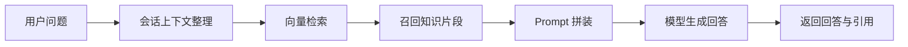

# RAG 方案

第二阶段的智能客服不是纯生成式对话，而是明确按 RAG 方案组织。这部分是整个项目的核心主线之一。

## 目标

RAG 在这里承担的作用比较明确：

1. 让邮政相关知识有来源。
2. 让模型回答能带引用。
3. 降低规则型、流程型问题的幻觉风险。
4. 让知识更新和模型参数更新分开处理。

## 知识来源

当前知识来源主要来自两部分：

1. 第一阶段筛选后的邮政客服数据与结构化材料。
2. 爬虫整理出的邮政 FAQ、协议、流程和页面材料。

这些内容最后不是直接拼成一个长文档，而是整理成知识文档与 embedding，进入 PostgreSQL + pgvector。

## 检索链路

RAG 链路在系统里是一个独立层，不和前端页面逻辑耦死，因此它可以被页面层、接口层和后续评估脚本共同复用。

链路可以概括为：

```text
用户问题
  -> 会话上下文整理
  -> 向量检索
  -> 召回相关知识片段
  -> 与 prompt 一起送入模型
  -> 返回回答与引用
```

也可以画成一条更直观的链路：



这里的重点不是“检索越多越好”，而是让引用和回答保持对应关系，让回答结果能被追溯和解释。

## 数据组织

当前正式向量链路走 PostgreSQL + pgvector，同时保留了本地 FAISS fallback。

这样做的原因很实际：

1. PostgreSQL + pgvector 更适合正式链路。
2. FAISS 本地 fallback 便于调试和本地验证。

因此系统里没有把 RAG 写死成单一向量后端，而是保留了 provider 化的切换空间。

## 回答与引用

RAG 在页面上的呈现，不是只有模型回答正文，还包括召回引用展示。

这样做的价值主要有两点：

1. 用户能看到回答对应的知识来源。
2. 后续排查错误时，更容易区分是检索问题还是生成问题。

## 与模型层的关系

RAG 在这里不是替代模型，而是给模型提供可引用的知识上下文。这也是为什么项目主线会把它单独拎出来，而不是把它当成页面里的一个附属开关。

生成模型负责：

1. 理解问题。
2. 组织语言。
3. 输出自然回答。

RAG 负责：

1. 补充事实依据。
2. 提供规则和流程支撑。
3. 降低纯生成的漂移风险。
