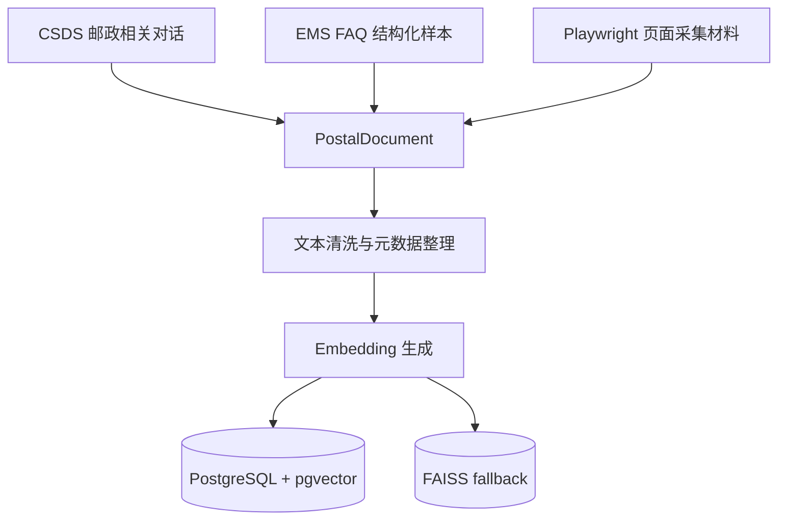
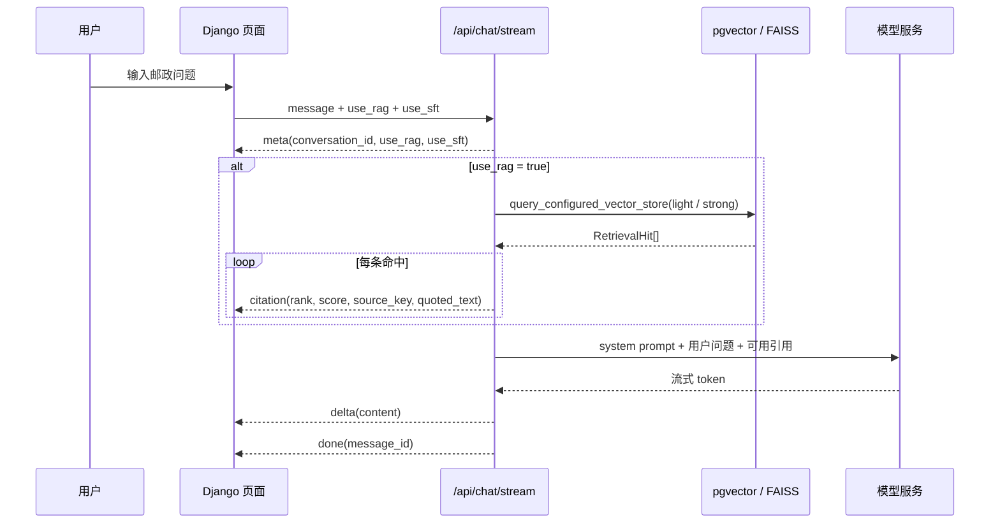
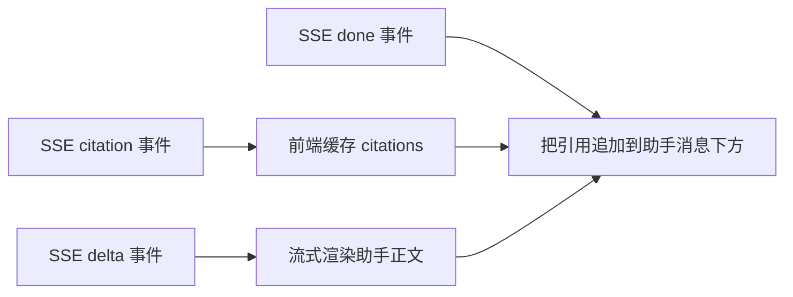
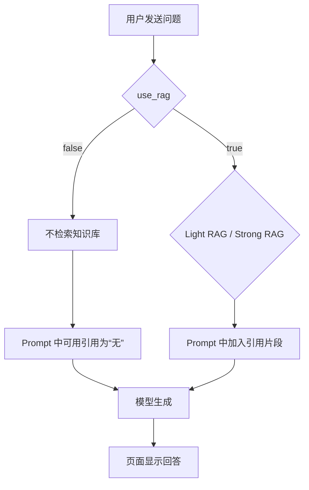
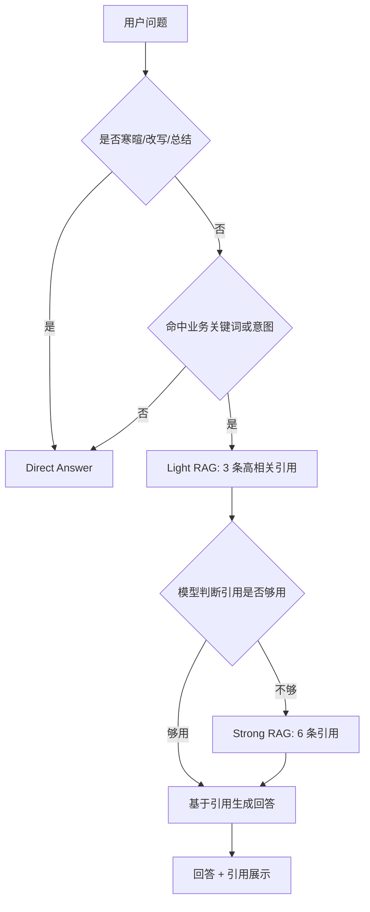

# RAG 方案

第二阶段的客服系统不是把问题直接丢给模型生成答案，而是在模型前面加了一层邮政知识检索。页面上看到的回答、引用、分数、历史消息，都是这条链路的一部分。

RAG 在这里解决的是一个很具体的问题：邮政客服里有很多规则、流程和条款类问题，模型可以负责把话说清楚，但依据最好来自知识库。比如用户问“邮件滞留海关怎么处理”，系统不应该只靠模型记忆回答，而应该先找出和“海关查验、滞留、申报、退运”相关的材料，再让模型基于这些材料组织回复。

这部分能看出整个系统不是简单调用一个大模型接口。它处理了知识来源、向量化、检索路由、引用展示、历史会话回放和轻重 RAG 切换。用户看到的是一条回答，系统内部实际完成的是“找依据、判断依据够不够、组织答案、保留引用”的完整流程。

## 知识从哪里来

知识来源主要有两类。

第一类是第一阶段筛选后的邮政相关客服数据。这部分来自 CSDS 对话数据的筛选结果，保留的是和邮政业务相关的问答、摘要和分类信息。

第二类是爬虫整理出来的邮政 FAQ、协议、流程和页面材料。对应报告里记录的 `dataset.jsonl` 包含 EMS FAQ 和 Playwright 页面采集样本，字段里保留了 `title`、`summary`、`evidence_text`、`url`、`policy_categories` 等信息。`summary` 可以给模型作为短答案参考，`evidence_text` 用来追溯来源，`url` 或定位字段用于回看原始页面。

这些内容不会直接拼成一个超长 prompt。系统会先把它们整理成文档记录，再生成 embedding，正式链路走 PostgreSQL + pgvector；本地调试保留 FAISS fallback。

当前落地后的 RAG 数据规模是 6407 条：其中 6321 条来自 CSDS 邮政相关对话，86 条来自 week1 爬虫整理的 policy/FAQ JSONL。旧对话数据继续复用 `dialogue_embeddings.h5` 和 `dialogue_metadata.json`，新增 policy/FAQ 数据单独使用 `policy_embeddings.h5` 和 `policy_metadata.json`，不写进旧 H5，也不在 Django 导入时现场生成 embedding。

导入完成后，pgvector 与 FAISS 都使用同一批合并后的文档。当前 FAISS metadata 中的 provider 标记为 `old-h5+policy-h5`，embedding model 标记为 `dialogue_embeddings.h5+policy_embeddings.h5`，用于明确区分历史对话向量和新增政策向量的来源。

## 为什么选 PostgreSQL + pgvector

向量库没有单独选一个只适合 demo 的本地方案，而是把正式链路放在 PostgreSQL + pgvector 上，原因有三点。

第一，Django 系统本来就需要数据库保存会话、消息、引用和工单，把文档和向量也放进 PostgreSQL，可以减少系统组件数量，数据关系更容易管理。第二，pgvector 支持在数据库里直接做向量相似度检索，适合把 `PostalDocument`、metadata、embedding 和引用记录放在同一条数据链路里。第三，后续要排查某次回答为什么引用了某段材料时，可以从消息、引用、文档、向量元数据一路查回去。

FAISS 仍然保留，是为了本地调试和离线验证。它启动快，不依赖数据库服务，适合验证 embedding、召回效果和小规模实验。但正式系统更适合 PostgreSQL + pgvector，因为它和 Django 的持久化链路更一致。



## 一次 RAG 请求怎么走

用户在页面上发送问题时，前端会把当前会话 ID、用户问题、`use_rag` 和 `use_sft` 一起发到后端。后端入口是 `POST /api/chat/stream`，返回方式是 SSE，所以页面可以一边接收一边渲染。

这里选 SSE，而不是普通 HTTP 一次性返回，是因为客服回答通常会比较长，尤其开启 RAG 后还要组织引用依据。SSE 可以让页面先显示“正在生成”的正文，再在完成后追加引用，用户不用等整段回答完全生成结束。它也比 WebSocket 更轻，当前场景主要是服务端向前端推送流式文本，不需要复杂的双向实时通信。

开启 RAG 时，后端先判断问题适合轻量检索还是强检索。常见 FAQ、业务词明确的问题先走 Light RAG，召回 3 条高相关片段；规则依赖更强、问题条件更多，或模型判断已有材料不足时，会切到 Strong RAG，扩大到 6 条。每条命中都会带上排名、相似度分数、来源 key 和引用文本。



这条链路里，引用不是回答结束后临时拼出来的装饰。后端会在生成前把检索结果写进 prompt，格式类似：

```text
用户问题:
邮件滞留海关如何处理？

可用引用对话:
[引用1 score=0.8231]
...

[引用2 score=0.7914]
...
```

模型收到的是“用户问题 + 可用引用”，不是孤立问题。系统提示词也要求它优先依据引用对话回答，缺少依据时说明依据不足。

## 页面上的引用长什么样

页面展示引用时，不是只显示一个来源文件名。前端收到 `citation` 事件后，会先把引用缓存起来；模型正文通过 `delta` 流式显示；等收到 `done` 后，页面把引用追加到这条助手消息下面。

每条引用会渲染成一个可展开块，标题类似：

```text
引用 1 · score 0.8231
```

展开后能看到被召回的原始片段。对于从对话数据来的内容，前端还会识别 `用户[0]:`、`客服[1]:` 这种行首标记，把用户话术和客服回复分开显示。

一个典型页面效果可以理解成这样：

```text
助手回答：
如果邮件滞留海关，通常需要先确认是否正在查验、是否需要补充申报材料，或是否被认定为超值超量邮件。若涉及申报、退运或按货物通关，应根据海关要求办理。

引用对话
  引用 1 · score 0.8231
    用户[0]: 邮件滞留海关如何处理
    客服[1]: 海关部门对于无法预判价值或价值较高的邮件都会进行查验，一般最长不超过一个月

  引用 2 · score 0.7914
    用户[0]: 海关定义邮件内件超值超量怎么办
    客服[1]: 对于内件数量或价值超过海关限定的邮件，需要收件人办理退运或者按货物办理通关手续
```

这比只给一句“答案来自知识库”更有用。读页面的人能看到模型回答参考了哪几段材料；后续如果回答不对，也能判断是检索没找对，还是模型把找对的材料理解错了。



## 引用怎么落库

回答生成完成后，后端会创建助手消息，并把本轮命中的引用写入 `Citation`。历史消息接口再读取这些引用，返回给前端。

因此引用不仅在流式回答时可见，刷新页面、切换历史会话后也能重新显示。

```mermaid
flowchart TD
    A[Message: assistant answer] --> B[Citation]
    B --> C[score]
    B --> D[quoted_text]
    B --> E[metadata]
    F[GET /api/conversations/{id}/messages] --> A
    F --> B
    B --> G[前端 renderCitations]
```

接口里，引用对外返回的主要字段是：

| 字段 | 含义 |
|---|---|
| `score` | 向量检索相似度分数，用来判断这条材料和问题的接近程度。 |
| `quoted_text` | 展示给页面的引用正文，后端会做基础文本清洗。 |
| `metadata` | 文档元信息，例如来源、类别、原始索引等。 |

流式阶段的 `citation` 事件里还会带 `rank` 和 `source_key`。`rank` 用于页面排序，`source_key` 用于定位召回文档，例如由 split、index、session_id、dialogue_id 拼出来的键。

## RAG 开关做了什么

页面上的 RAG 开关不是装饰。它会直接影响后端是否检索知识库。



关闭 RAG 后，系统仍然会走同一个聊天接口，但 prompt 里没有检索引用。这个模式适合对比“纯模型回答”和“带知识库回答”的差异。

开启 RAG 后，页面会多出引用块。对于业务问题，引用块能说明回答依据；对于闲聊问题，如果开启 RAG 也可能检索到无关材料，所以后续设计里才需要路由策略，不是所有请求都强行检索。

## Light RAG 和 Strong RAG

系统设计报告里把 RAG 分成 Light RAG 和 Strong RAG，是为了控制上下文长度和链路复杂度。

Light RAG 的意思是：先用关键词或 regex 判断是否需要查知识库，命中后取 3 条高相关片段。它适合常见 FAQ 或明确业务词的问题，比如“保价怎么赔”“清关要多久”“投诉进度怎么查”。

Strong RAG 的意思是：如果问题明显涉及规则、时限、赔付、禁寄、清关、申诉等高依赖知识的问题，或者模型判断轻量检索的 3 条材料不够支撑回答，就扩大到 6 条，并优先保留 FAQ、协议、标准条款这类可信来源。

这里选择 3 和 6，不是随便拍一个数字。3 条引用通常足够覆盖一个常见问题的主答案和一两个补充依据，prompt 不会被撑得太长；6 条引用适合处理需要交叉确认的规则问题，例如清关、赔付、禁寄和申诉，能让模型同时看到条件、限制和处理流程。



这个设计不是“低置信度时回答后再检索一次”。它仍然是在同一轮链路里完成判断和检索切换，避免把系统做成多轮评分、多轮重答的复杂流程。

## 什么时候不应该走 RAG

有些请求不需要知识库。比如：

1. “你好”
2. “谢谢”
3. “把上一句说得更礼貌一点”
4. “总结一下刚才的回答”

这些请求强行挂 RAG，通常只会增加上下文长度，还可能让模型误以为用户在问复杂业务问题。RAG 的重点是给规则、流程和条款类问题提供依据，不是把所有问题都塞进知识库。

实时类问题更适合走 tool。出于脱敏考虑，文档中只保留时间和日期作为 tool 调用 demo；单号查询、货运信息、延误原因等依赖内部接口的实时查询能力，在这里移除。
