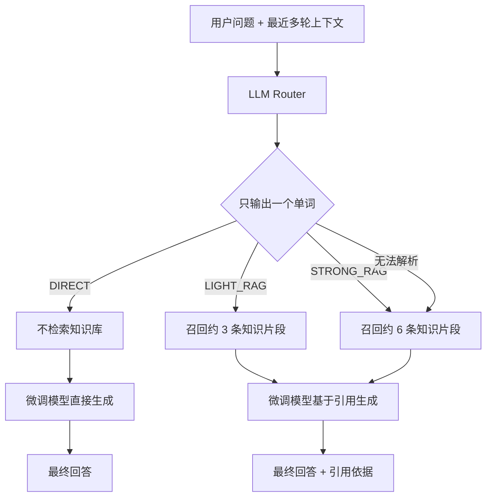

# 邮政客服 LLM 系统设计报告

## 1. 设计说明

本设计主要围绕邮政客服问答系统的整体接入方式展开，重点包括以下三部分：

1. 微调后的模型和 RAG 知识库怎么分工。
2. 哪些问题直接回答，哪些问题再去查知识库。
3. 检索链路怎么控制在够用、但不过重的范围里。

## 2. 场景背景

邮政客服问答不是一个纯闲聊系统，其中包含几类性质明显不同的问题：

1. 礼貌应答、寒暄、改写、总结类问题。
2. 常见业务问答，例如寄递、清关、保价、赔付、投诉处理。
3. 明显依赖规则、政策、流程和时效信息的问题。
4. 需要引用证据或标准条款的问题。

这几类问题不适合全部采用同一条处理链路。仅依赖模型时，规则型问题容易出现事实偏差；如果所有请求都强制接入 RAG，又会拖慢简单问题的处理速度，并显著增加上下文长度。知识片段过多时，模型还可能偏离用户问题本身。

## 3. 设计目标

本方案主要希望解决以下问题：

1. 对业务知识类问题给出更稳的回答，并尽量提供可追溯依据。
2. 对简单对话类问题保持低延迟，不让系统显得过重。
3. 让微调模型负责表达、意图理解和结构化输出，不把所有事实记忆都压在参数里。
4. 检索一次不够时，可以在同一轮链路内自然切到更强的检索模式。
5. 整体方案不要过度复杂，尽量能分阶段落地。

## 4. 总体架构

整体链路可先按以下方式组织：



各模块作用如下：

### 4.1 轻量路由层

负责在模型生成前做一层低成本判断，决定当前问题更适合直接回答、轻量检索，还是强检索。

这里不建议只依赖关键词或 regex。邮政客服存在大量多轮追问，例如用户上一轮问赔付规则，下一轮只说“那这个赔吗”。这种短句本身不包含明显关键词，但实际必须接入知识库。因此第一版正式链路应使用一个轻量 LLM Router 作为主路由，关键词和 regex 只作为兜底或审计辅助。

### 4.2 微调模型

模型层主要负责：

1. 理解邮政业务语境。
2. 识别用户问题类型和表达方式。
3. 生成自然、统一、符合客服风格的回答。
4. 在需要时输出结构化字段，例如建议操作、风险提示、下一步处理。

### 4.3 RAG 知识库

知识库层主要提供外部证据，不将全部事实记忆压到模型参数中。知识库中优先纳入以下几类内容：

1. FAQ 标准问答。
2. 服务协议、业务规则、限制条款。
3. 清关、赔付、投诉、改单、查询等流程型知识。
4. 强时效或容易变化的说明文档。

这里还需要补充一个边界条件：知识库并非实时更新。当前知识库可覆盖的时间边界设定为 `2026-01-19`。如果用户询问的是该时间点之后才可能发生变化的信息，模型不能将知识库中的历史内容直接当作最新事实回答。

### 4.4 直接回答边界

有些问题不适合走知识库，也不需要在本版设计中额外引入 tool。

适合直接回答的情况包括：

1. 寒暄、感谢、结束语。
2. 改写、润色、总结、格式调整。
3. 与邮政业务无关的闲聊。
4. 明显只问当前时间或当前日期的问题。

这类问题与规则知识检索不同，其核心需求不是历史知识片段。系统应将此类请求单独分流，避免为了“看起来用了 RAG”而把无关 FAQ 或政策材料塞进上下文。

### 4.5 模型判断层

这一层不引入“回答后再评分、再检索”的复杂流程，而是在当前一轮回答中直接判断现有知识是否足够。如果当前知识已经满足回答需要，则直接生成答案；如果不足，再扩大检索范围。

## 5. 微调模型与 RAG 的分工

在这套系统中，微调模型与 RAG 并非二选一关系，而是分工明确、协同工作。

### 5.1 微调模型负责什么

微调模型更适合承担以下能力：

1. 邮政客服场景下的表达风格对齐。
2. 常见问题意图识别。
3. 多轮上下文承接。
4. 把检索到的证据组织成自然语言回答。
5. 输出统一格式，比如“结论 + 依据 + 建议下一步”。

### 5.2 RAG 负责什么

RAG 更适合承担以下能力：

1. 提供最新或更可靠的事实依据。
2. 支撑规则型、流程型、条款型问题。
3. 降低模型脱离知识源自由发挥的风险。
4. 在问题较细、较偏、较复杂时提供补充信息。

### 5.3 为什么不能只靠其中一种

如果只靠微调模型：

1. 模型会承担过多事实记忆负担。
2. 时效性问题容易过期。
3. 容易在边界案例上臆造细节。

如果只靠 RAG：

1. 每次都要查库，链路开销大。
2. 简单问题会被无意义地拉长。
3. 无关证据进入上下文后可能让回答变啰嗦甚至变差。
4. 模型像“检索拼接器”，而不是自然对话助手。

可以概括为：模型负责表达与组织，知识库负责事实依据与规则支撑。

## 6. 为什么不能所有请求都强制 RAG

这一点非常关键。RAG 并非接入越多越好。

表面上看，检索本身并不慢，似乎每个请求都附带少量知识片段也不会有太大问题。但在实际链路中，这种做法会持续加重上下文负担，而且收益并不稳定。

### 6.1 会增加无效上下文

像“你好”“谢谢”“帮我润色一下上一句”“总结一下刚才回答”这类问题，本身不依赖外部知识。对这类请求强行追加 FAQ、规则或政策片段，并不能提高回答质量，只会让上下文长度膨胀。

### 6.2 会降低响应速度

每次请求都检索、召回、拼接上下文，会直接增加额外延迟。对于简单问题，这部分开销没有收益。

### 6.3 会增加模型困惑

如果用户只是问一个很轻的问题，但上下文里被塞进多段业务材料，模型可能会：

1. 误以为用户在问复杂业务问题。
2. 把回答写得很重、很长。
3. 从无关知识片段里抓错重点。
4. 产生不必要的错误联想。

### 6.4 会增加 token 成本

即使检索本身很快，长期看无差别拼接知识片段也会增加系统成本，并压缩可用上下文预算。

因此，更合适的方式是按需触发 RAG，并在轻量检索不足时，于同一轮链路内切换到更强的检索模式。

## 7. RAG 触发策略设计

为了兼顾实现可行性与链路复杂度，这里采用一套相对克制的分层路由。

先分三类：

1. `DIRECT`
2. `LIGHT_RAG`
3. `STRONG_RAG`

Router 的输出必须极简，避免为了路由本身浪费 token。它只允许输出一个单词，不输出 JSON、不解释、不加标点。

```text
DIRECT
LIGHT_RAG
STRONG_RAG
```

后端只解析这三个枚举。若模型输出为空、包含多余文本、拼写错误，或无法解析，统一按 `STRONG_RAG` 处理。这样可以保证失败时走更保守的路径，避免因为路由错误导致规则型问题被直接回答。

## 7.1 DIRECT

直接让微调模型回答，不查知识库。

适用场景：

1. 寒暄、问候、结束语。
2. 对前文的改写、总结、解释。
3. 明显不依赖外部业务知识的闲聊式请求。
4. 已经在当前对话上下文中获得足够信息的问题。
5. 只问当前时间或当前日期，且不涉及邮政业务规则的问题。

例如：

1. “你好”
2. “帮我把上一句说得更礼貌一点”
3. “总结一下你刚才说的重点”

## 7.2 LIGHT_RAG

Light RAG 只补充少量短知识片段，避免一次性引入过多上下文。

适用场景：

1. 常见 FAQ 问题。
2. 业务词比较明确，但问题不复杂。
3. 用户需要的是标准答法，而不是复杂条款推理。

实现上可先采用以下方式：

1. Router 输出 `LIGHT_RAG` 后，召回少量高相关片段，例如 3 条左右。
2. 优先使用摘要化后的证据，不要把整段长文全塞进去。
3. 如果生成前发现证据明显不足，可在同一轮升级为 `STRONG_RAG`。

## 7.3 STRONG_RAG

对于高风险、高规则依赖、高时效依赖问题，再切换到更强的检索链路。

适用场景：

1. 清关、赔付、投诉、申诉、改单、限制品、时限、资费等规则型问题。
2. 用户明确询问“依据是什么”“官方怎么说”“需要哪些材料”“多久能处理”。
3. 模型判断当前 Light RAG 提供的知识还不够支撑回答。
4. 多轮对话中当前问题依赖上一轮业务上下文，但当前句子本身很短或含糊。
5. Router 不确定、输出异常或无法解析。

实现上可先采用以下方式：

1. 把召回范围从轻量模式继续扩大，例如扩到 6 条左右。
2. 优先保留高可信来源，例如 FAQ、协议、标准条款。
3. 输出时显式区分“结论”和“依据”。

## 7.4 LLM Router Prompt

Router prompt 可以设计成下面这种强约束形式：

```text
你是邮政客服系统的 RAG 路由器。你只判断当前用户问题是否需要检索知识库。

你只能输出下面三个单词之一：
DIRECT
LIGHT_RAG
STRONG_RAG

不要解释，不要输出 JSON，不要输出标点，不要输出其他文字。

判断规则：
1. 如果只是寒暄、感谢、结束语、闲聊、改写、润色、总结、格式调整，输出 DIRECT。
2. 如果只是问当前时间或当前日期，输出 DIRECT。
3. 如果是普通邮政 FAQ、业务流程咨询、常见寄递问题，输出 LIGHT_RAG。
4. 如果涉及清关、报关、海关、赔付、赔偿、理赔、投诉、申诉、改单、禁寄、限寄、危险品、资费、时限、时效、超时、延误、材料、证明、官方依据、条款、规则，输出 STRONG_RAG。
5. 多轮对话中，如果当前问题依赖上一轮业务上下文，按业务问题处理，不要因为当前句子短就输出 DIRECT。
6. 如果不确定，输出 STRONG_RAG。
```

这一层只做路由，不生成最终答案。真正的客服回答仍由后续模型在 Direct 或 RAG 上下文中生成。

## 8. 具体触发条件

为了避免触发逻辑过于抽象，第一版应把 LLM Router 的输出和后端动作固定下来。

### 8.1 路由输出到后端动作

后端解析 Router 输出后执行：

| Router 输出 | 后端动作 |
|---|---|
| `DIRECT` | 不检索，直接生成回答 |
| `LIGHT_RAG` | 召回约 3 条知识片段，再生成回答 |
| `STRONG_RAG` | 召回约 6 条知识片段，再生成回答 |
| 解析失败 | 按 `STRONG_RAG` 处理 |

### 8.2 保守原则

路由层应尽量保守。只要问题可能涉及业务规则、材料、赔付、清关、禁限寄、资费、时效或官方依据，就不应走 `DIRECT`。

保守原则不是为了让所有问题都检索，而是为了避免把高风险业务问题误判成普通闲聊。误把简单问题判成 `LIGHT_RAG` 或 `STRONG_RAG`，主要损失是少量延迟；误把业务规则问题判成 `DIRECT`，则可能导致错误客服建议。

### 8.3 多轮对话规则

多轮对话不能只看当前最后一句。Router 至少应看到最近几轮用户和助手消息，尤其是上一轮是否已经进入业务场景。

例如：

1. 用户先问：“国际件被海关扣了怎么办？”
2. 助手解释清关处理方式。
3. 用户追问：“那要准备什么？”

第三句虽然很短，但明显依赖清关上下文，应输出 `STRONG_RAG`，不能因为没有明显关键词就输出 `DIRECT`。

### 8.4 关键词和 regex 的角色

关键词和 regex 可以保留，但不作为主路由。它们更适合承担三类作用：

1. LLM Router 不可用时的兜底。
2. 对高风险词做强制升级，例如命中“危险品”“赔付”“清关”时直接不低于 `STRONG_RAG`。
3. 记录审计信号，方便后续分析路由是否合理。

也就是说，关键词规则不再负责完整理解用户意图，而是给 LLM Router 提供保护栏。

## 9. 一次链路里的检索切换

本版设计不引入“回答后再评分、再检索、再重答”的复杂链路。

流程可简化为：

1. 先把当前问题和必要的最近对话上下文交给 LLM Router。
2. Router 只输出 `DIRECT`、`LIGHT_RAG` 或 `STRONG_RAG`。
3. 后端解析输出；无法解析时默认 `STRONG_RAG`。
4. 如果是 `DIRECT`，不检索，直接生成答案。
5. 如果是 `LIGHT_RAG`，召回约 3 条相关知识。
6. 如果是 `STRONG_RAG`，召回约 6 条相关知识。
7. 生成模型基于当前路由和可用证据输出最终回答。

这样做主要有两点好处：

1. 链路更简洁，不需要额外引入一套回答后评分机制。
2. 既避免所有问题都直接进入重检索，也避免在知识明显不足时直接作答。

## 10. 推荐的第一版落地方案

如果目标是先实现一版结构清晰、工程上可落地的系统，第一版无需一次性引入过多模块，可先按以下方式实现：

### 10.1 路由方式

先使用 LLM Router 构成第一层路由。Router 只输出一个单词：`DIRECT`、`LIGHT_RAG` 或 `STRONG_RAG`。关键词和 regex 保留为兜底、强制升级和审计辅助。

### 10.2 检索方式

知识库按 FAQ、协议条款、流程说明三类分层存储，优先从高可信短文本里召回。

### 10.3 生成方式

微调模型负责统一输出客服风格，并把结果组织成：

```text
结论
依据
建议下一步
```

### 10.4 检索切换方式

Router 直接决定 `DIRECT`、`LIGHT_RAG` 或 `STRONG_RAG`。如果 Router 输出异常或无法解析，后端直接按 `STRONG_RAG` 执行。

这套第一版方案的特点在于：

1. 结构清楚。
2. 工程复杂度可控。
3. 既体现了 RAG 的价值，也避免把 RAG 到处乱挂。

## 11. 设计依据与合理性

这套方案并非为了增加技术名词，而是围绕几个实际权衡展开：

1. 让简单请求保持快，不要把每个问题都搞成重型检索链路。
2. 让知识型问题有证据支撑，减少纯生成带来的幻觉风险。
3. 让微调模型与知识库承担各自更适合的职责。
4. 让系统能够先从轻量 Router 起步，再逐步演进。

归根结底，这套设计的重点不在于形式上的复杂度，而在于明确以下边界：什么时候应直接回答，什么时候应接入轻量知识库，什么时候应进入强检索，以及在路由无法判断时如何保守兜底。

## 12. 后续迭代方向

后续如果继续完善，可以沿着以下方向迭代：

1. 用更稳定的 LLM Router 或 query classifier 替代纯关键词规则。
2. 对不同知识源设置不同可信等级和召回优先级。
3. 增加对多轮对话的检索状态管理，避免重复查库。
4. 对时效性强的知识设置定期更新和失效机制。
5. 把知识库时间边界、路由枚举和无法解析时的保守策略一起写进 system prompt，减少模型误判。

## 13. 总结

在邮政客服场景下，微调模型与 RAG 不宜被设计成二选一关系，更合适的方式是分工明确、按需协同。

较为合适的实现方式是：

1. 对简单对话直接回答。
2. 对业务知识问题按需检索。
3. 对普通业务问题使用 `LIGHT_RAG`。
4. 对高风险、规则型、多轮追问或无法判断的问题使用 `STRONG_RAG`。

这样既能控制链路成本和响应速度，也能在关键业务问题上把回答做得更稳。
