# 邮政相关对话筛选与向量空间可视化结果报告

本报告系统汇总 `week1/filter/outputs/vis` 目录下的全部可视化结果，重点说明邮政相关对话筛选流程、向量空间分布特征及不同类型对话在长度维度上的差异。

`filter` 模块的整体流程是：

1. 先把每条完整对话编码成 embedding
2. 再使用 `gpt-oss:20b` 判断该对话是否和快递 / 邮政相关
3. 最后把全部对话 embedding 降到二维空间中做可视化
4. 同时比较“相关对话”和“其他对话”的 token 长度分布

因此，本报告中的图像主要用于回答以下两个问题：

1. 被筛出来的快递 / 邮政相关对话，在 embedding 空间中是否形成聚类
2. 相关对话与其他对话，在长度分布上是否存在差异

## 1. 方法概述

### 1.1 Embedding

当前实现以：

- 单条完整对话 = 一个编码单位

也就是说，一整段用户与客服的多轮对话会先被拼接，再送入 embedding 模型编码。  
这样做的目的是让向量表达更接近“整段对话主题”，而不是单轮局部表达。

### 1.2 LLM Filter

在得到 embedding 之后，并不会直接做聚类标签，而是先通过一个大模型判断：

- 该对话是否和快递 / 邮政相关

当前结果里主要分成两类：

- `True`：快递 / 邮政相关对话
- `False`：其他对话

### 1.3 PCA

`PCA` 是线性降维方法。  
其基本原理是：在高维空间中寻找能够最大程度保留数据方差信息的正交投影方向，再将原始向量映射到这些主成分构成的低维空间。  
在本实验中，`PCA` 的主要特点包括：

- 稳定
- 快
- 结果容易重复
- 更适合观察整体分布趋势

局限是：

- 对复杂非线性结构不够敏感

实验目的：

- `PCA` 的实验目的，是先从线性视角观察 embedding 空间结构。
- 它主要用于判断被筛选出的邮政相关对话，是否在整体空间中表现出区域集中趋势。

### 1.4 t-SNE

`t-SNE` 是非线性降维方法，擅长把局部邻近结构在二维平面上拉开。  
其基本原理是：先在高维空间中把样本之间的相似关系转成概率分布，再在低维空间中寻找另一组概率分布，使两者尽可能接近，从而保留高维空间中的局部近邻关系。  
在本实验中，`t-SNE` 的主要特点包括：

- 更适合观察局部聚类
- 对近邻结构较敏感
- 可视化聚类感通常更强

它更适合用来看：

- 某些局部簇是否清晰

但它也更容易受参数影响，并且全局距离解释性不如 PCA。

实验目的：

- `t-SNE` 的实验目的，是进一步观察局部邻域结构，判断邮政相关对话是否会形成更清晰的局部聚类。
- 如果 `PCA` 只能给出较弱的整体趋势，那么 `t-SNE` 往往更适合识别局部簇。

### 1.5 UMAP

`UMAP` 也是非线性降维方法。  
其基本原理是：先在高维空间中构建近邻图，近似刻画数据所在流形的局部拓扑结构，再在低维空间中重建这一结构，从而尽可能保留样本之间的邻域关系。  
相比 `t-SNE`，它往往更兼顾：

- 局部邻域结构
- 一定程度的全局结构
- 可视化效率与稳定性通常较好

因此在 embedding 可视化里经常和 PCA、t-SNE 一起使用。

实验目的：

- `UMAP` 的实验目的，是作为第三种降维视角，对 `PCA` 与 `t-SNE` 的观察结果进行交叉验证。
- 如果三种方法都指向相近的聚集趋势，那么对“筛选结果具有语义结构基础”的判断会更稳妥。

### 1.6 Token 分布直方图

除了降维图以外，当前还增加了按标签叠加的对话长度分布图。  
这里的长度统计口径为：

- 对整条对话文本先去空格
- 再用 `cl100k_base` 编码
- 统计 token 数

图中两种颜色分别代表：

- 灰色：其他对话
- 红色：快递 / 邮政相关对话

图例中的 `n` 表示该类别包含的样本数量。

实验目的：

- token 长度分布实验的目的，是从文本长度这一辅助维度解释筛选结果。
- 该实验并不把长度当作判别依据，而是观察被筛中的对话是否普遍更长，从而为结果解释补充一个辅助维度。

---

## 2. 训练集结果分析

### 2.1 PCA

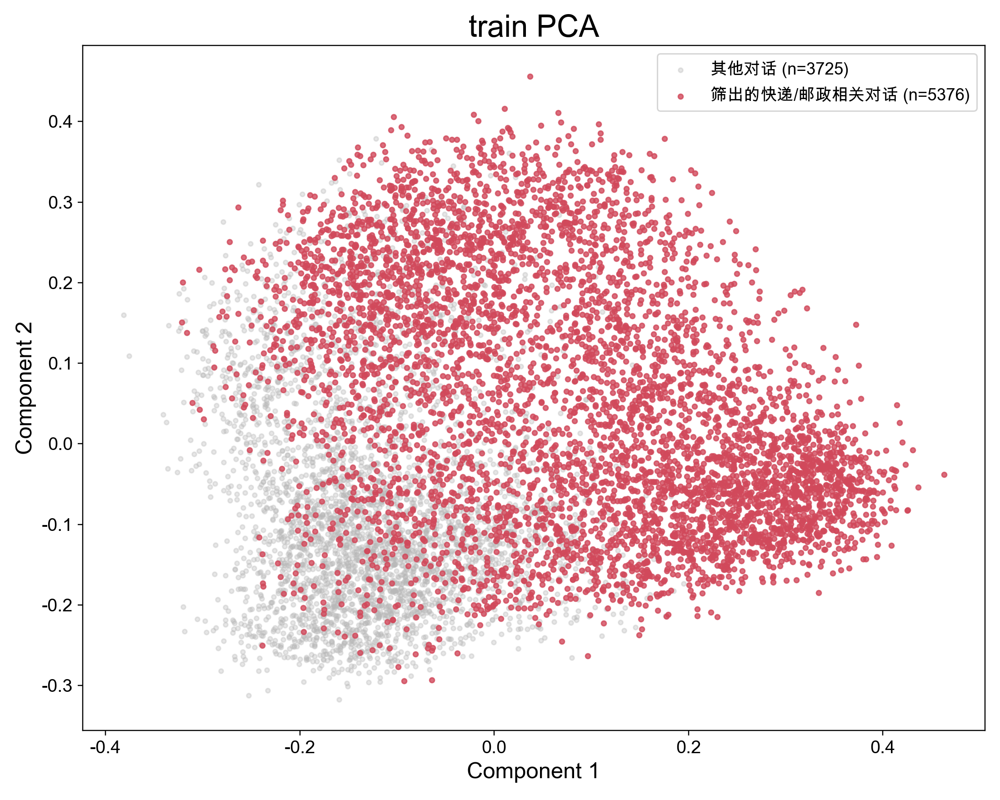

这张图展示训练集 embedding 经 PCA 降到二维后的分布。  
图中：

- 灰色点表示其他对话
- 红色点表示被 LLM 识别为快递 / 邮政相关的对话

若红色点在某些区域更集中，则说明相关对话在 embedding 空间中存在主题聚集趋势。

结果分析：

- 训练集 PCA 图中红色样本在部分区域密度较高，这表明“邮政/快递相关”对话在全局线性空间中已经呈现出一定程度的可分性。
- 同时，灰色与红色样本仍存在较大范围重叠，这说明仅依赖线性投影尚不足以将两类样本完全分开，也支持了后续引入非线性降维视角的必要性。

### 2.2 t-SNE

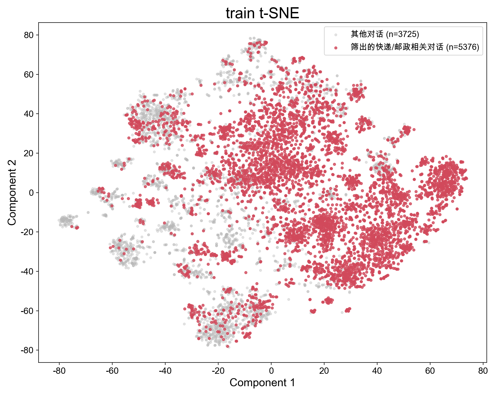

这张图更强调局部邻域结构。  
如果红色点在 t-SNE 图上形成明显簇状区域，往往说明“邮政 / 快递相关”这一语义标签在 embedding 空间中有一定可分性。

结果分析：

- 训练集 t-SNE 图中红色样本的局部聚集趋势通常比 PCA 更明显，这说明在近邻结构层面，相关对话之间具有更强的一致性。
- 若红色样本呈现多个局部小簇而非单一聚集区，则可将其理解为“邮政相关”内部可能包含多个相互关联但并不完全相同的业务子主题。

### 2.3 UMAP

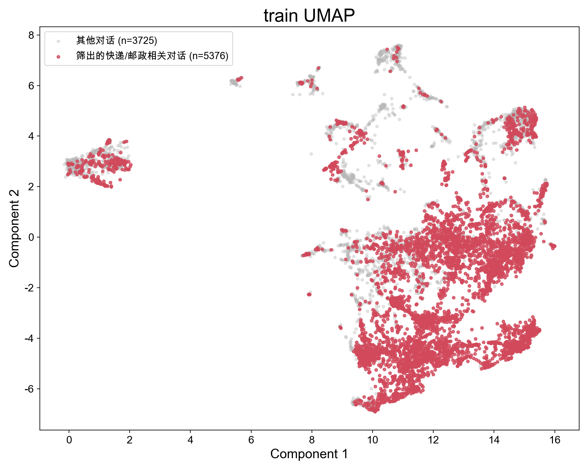

这张图提供了另一种非线性降维视角。  
它有助于和 PCA、t-SNE 交叉对照，避免只依赖单一降维方法得出结论。

结果分析：

- 训练集 UMAP 图若同样呈现红色样本在局部区域更集中，则说明相关对话的聚集现象并非单一降维算法造成的偶然视觉结果。
- 当 `PCA`、`t-SNE` 与 `UMAP` 三种方法均指向相似趋势时，可以更有把握地认为 embedding 已捕捉到一部分与邮政相关主题有关的空间结构。

### 2.4 Token 长度分布

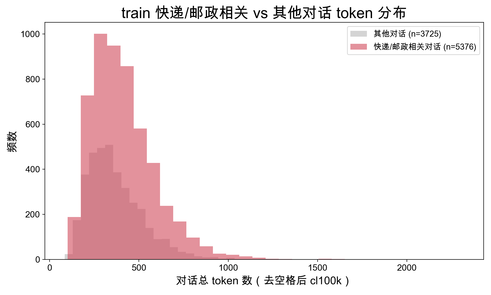

这张图把训练集中的两类对话叠加到一张直方图里。  
它主要回答：

- 快递 / 邮政相关对话是否更长
- 两类对话长度分布是否存在明显重叠或偏移

结果分析：

- 训练集长度直方图若显示红色分布整体略向右，表明被筛中的相关对话平均长度略高，这与物流查询、售后处理等业务场景通常需要更多信息交互的事实是一致的。
- 但两类分布仍存在显著重叠，这说明长度差异只能作为辅助证据，不能直接证明某条对话是否属于邮政相关样本。

---

## 3. 验证集结果分析

### 3.1 PCA

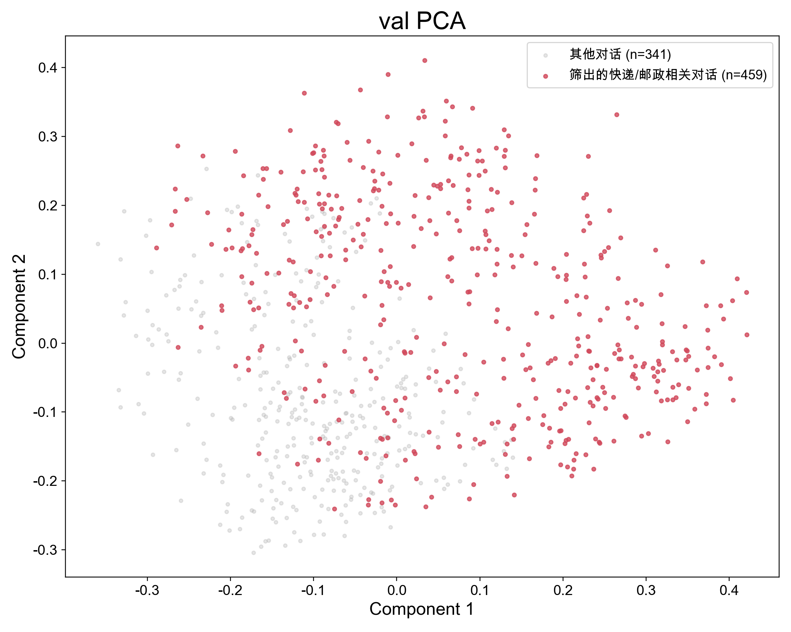

验证集 PCA 图用于检查验证集中的相关对话是否仍然落在相似的 embedding 区域中。

结果分析：

- 验证集 PCA 图与训练集呈现相近趋势，这表明筛选出的相关对话在不同 split 中具有相似的整体空间位置分布。

### 3.2 t-SNE

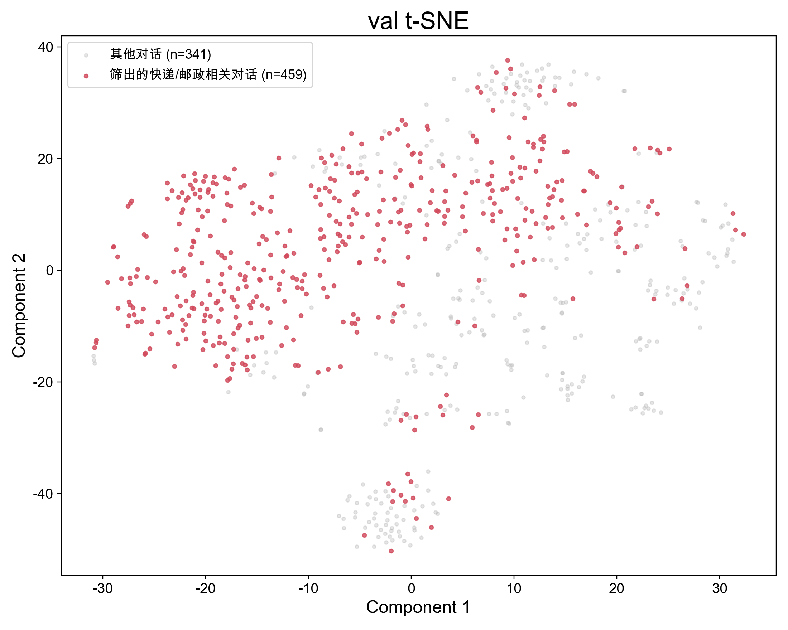

验证集 t-SNE 图更关注局部簇结构是否和训练集一致。

结果分析：

- 验证集 t-SNE 中若仍可观察到红色样本的局部簇结构，则说明训练集中的聚集现象并非偶然，而具有一定可重复性。

### 3.3 UMAP

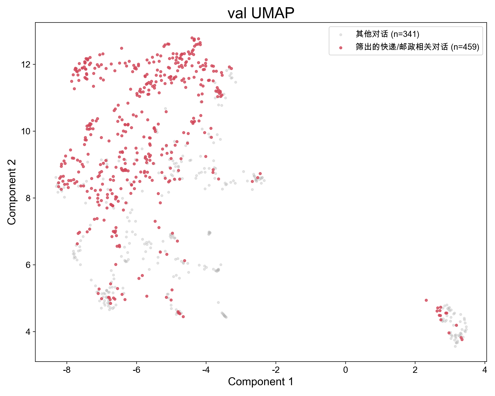

验证集 UMAP 图有助于判断验证集上的空间结构是否稳定。

结果分析：

- 验证集 UMAP 若与训练集保持一致，则进一步支持“embedding + LLM filter” 所得到的标签具有一定的结构性和解释性。

### 3.4 Token 长度分布

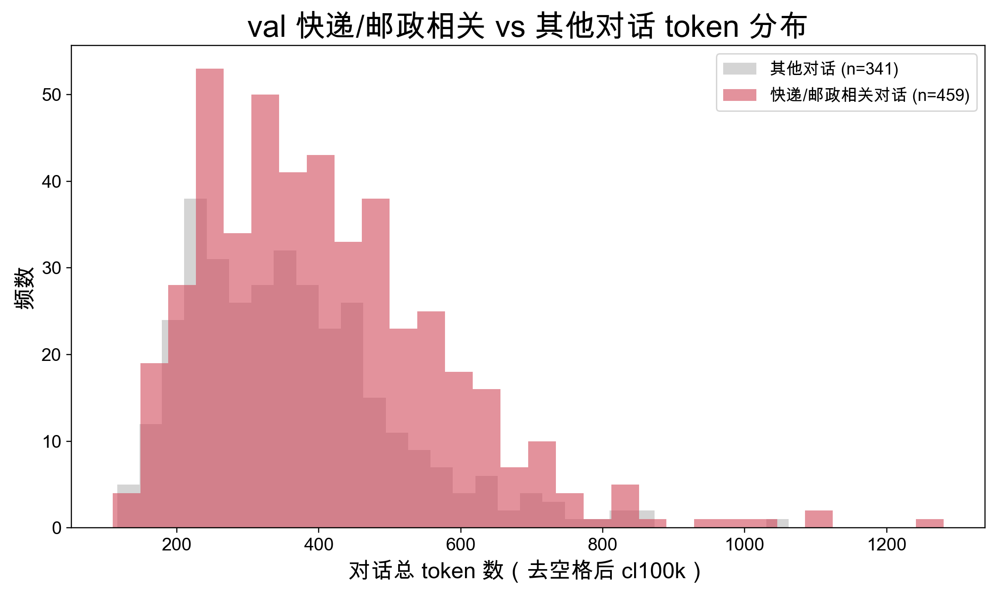

这张图比较验证集里两类对话的 token 长度分布。  
如果分布趋势和训练集相近，说明长度模式较稳定。

结果分析：

- 验证集两类长度分布若与训练集相似，则说明被筛中样本的长度特征并非训练集中的偶发现象，而是较为稳定的数据属性。

---

## 4. 测试集结果分析

### 4.1 PCA

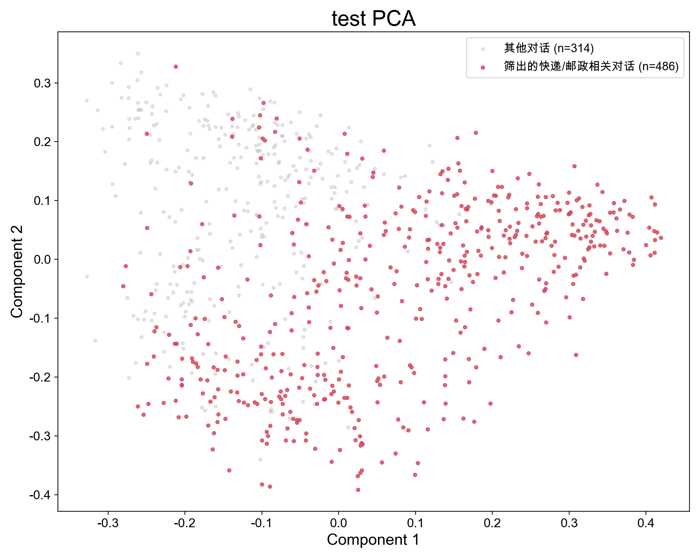

测试集 PCA 图用于观察最终评估数据中的两类样本是否保持相近的空间分布规律。

结果分析：

- 测试集 PCA 仍呈现与训练、验证阶段相近的趋势，这表明相关样本的空间结构具有一定泛化性。

### 4.2 t-SNE

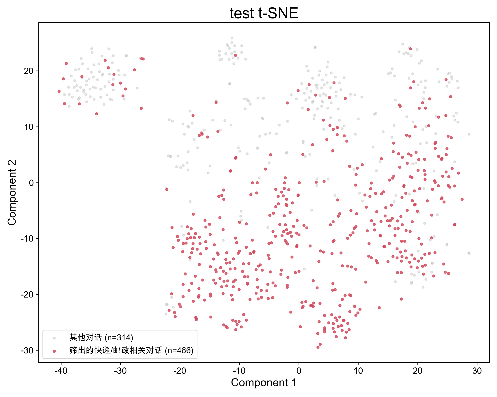

测试集 t-SNE 图更容易看出局部团簇是否仍然存在。

结果分析：

- 测试集 t-SNE 中若红色样本仍能形成局部团簇，则说明筛中的相关对话在 embedding 空间中并非随机散布，而具有一定的语义聚集基础。

### 4.3 UMAP

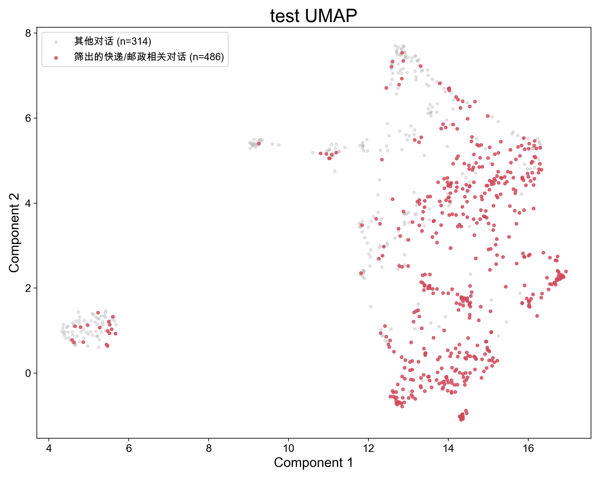

测试集 UMAP 图可以与 PCA / t-SNE 共同使用，判断测试集是否仍具备相似的主题结构。

结果分析：

- 测试集 UMAP 若保持类似的局部聚集形态，则说明这一结构在训练集、验证集和测试集三个 split 中均较为一致。

### 4.4 Token 长度分布

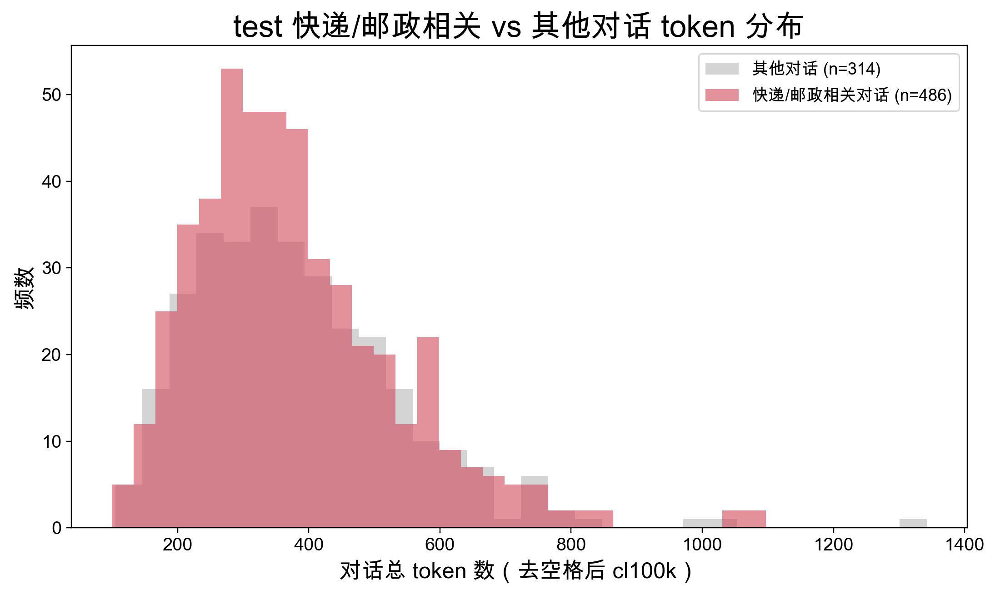

这张图反映测试集中相关对话与其他对话的长度差异情况。

结果分析：

- 测试集长度分布若仍显示红色样本略长或更集中，则说明长度差异并非训练集特有现象，而是在不同数据划分中均有体现。

---

## 5. 全量数据结果分析

### 5.1 PCA

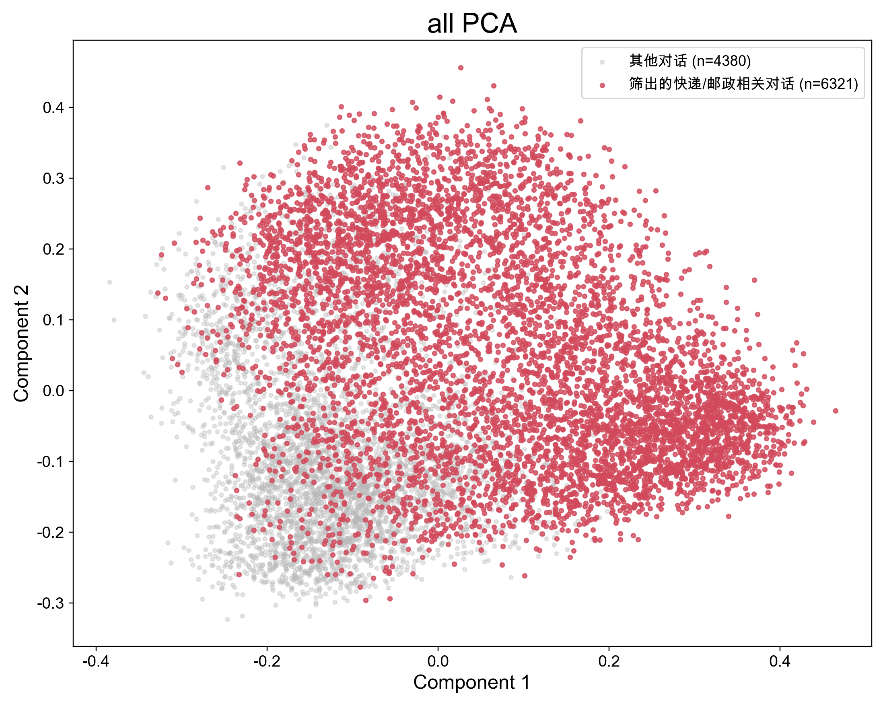

这张图把 train / val / test 合并后统一降维，适合从全局上看全部对话的空间分布结构。

结果分析：

- 全量 PCA 图表明，在整体数据空间中确实存在更容易聚集“邮政相关”样本的区域，这说明筛选结果具有一定的位置偏好。
- 不过，这种位置偏好仍然主要体现为趋势性证据，不能直接替代下游分类或聚类性能指标。

### 5.2 t-SNE

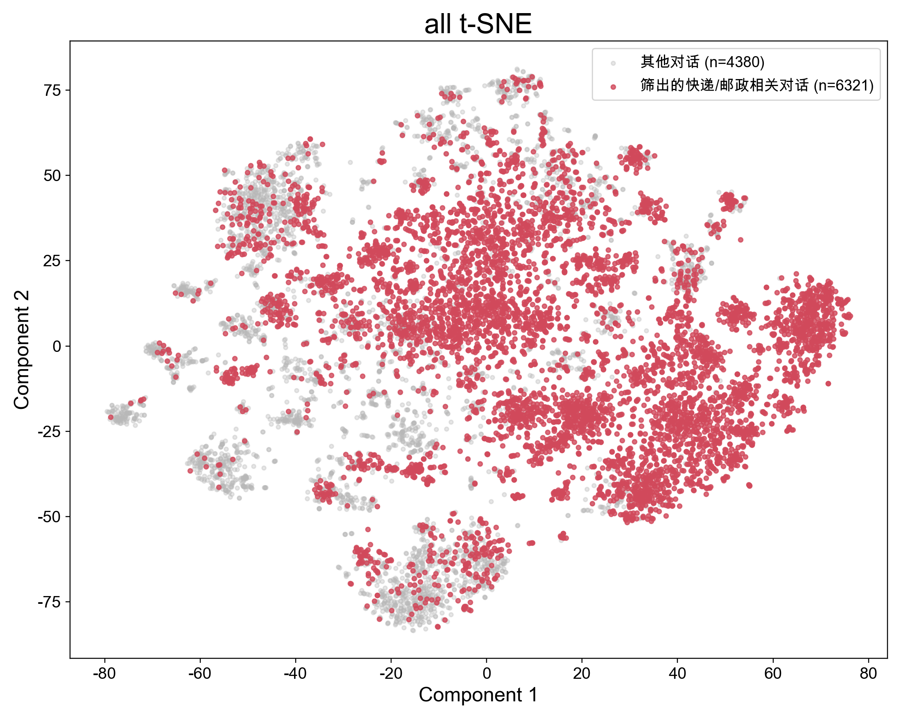

全量 t-SNE 图适合观察整个数据集范围内，相关对话是否形成更稳定的局部聚类。

结果分析：

- 全量 t-SNE 是最能直观体现局部聚类感的图像之一，其结果表明“邮政相关”样本在低维空间中呈现出更明显的局部聚集。
- 若红色样本形成多个相对分离的聚集区，则可合理推断该类样本内部包含查询、售后、配送、工单等多个业务子主题，而非单一类型对话。

### 5.3 UMAP

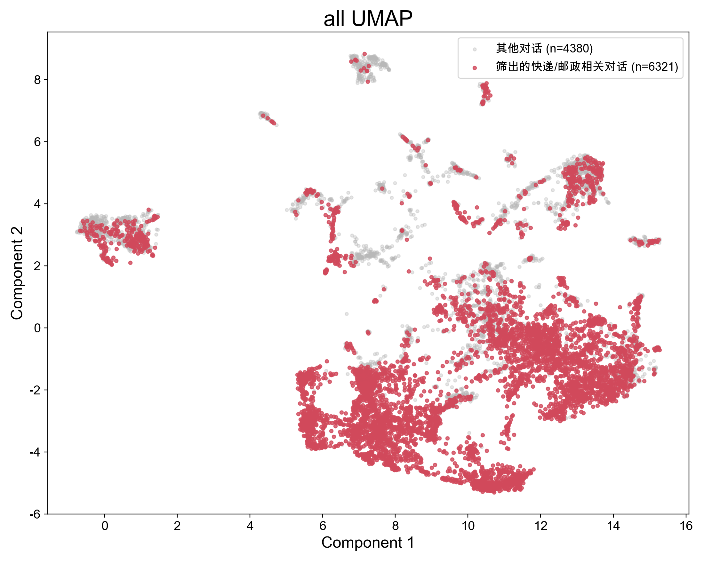

全量 UMAP 图提供了另一种整体空间结构视图，适合辅助判断 embedding 对主题的表达效果。

结果分析：

- 全量 UMAP 若与 t-SNE 呈现相似的局部聚集趋势，则会进一步支持“embedding 已学习到与业务主题有关的空间结构”这一判断。

### 5.4 Token 长度分布

这张图把整个数据集中的两类样本长度分布叠加到一起，是长度比较最直观的一张总览图。

结果分析：

- 全量长度直方图能够直接反映两类对话是否存在整体长度偏移，因而是长度分析中最具总览意义的一张图。
- 若红色样本平均更长，则这一现象可以被视为一个具有解释力但并不充分的辅助特征，说明相关业务对话通常包含更多信息交换与状态确认过程。

---

## 6. 图像解读说明

### 6.1 降维图不是分类准确率

这些散点图的作用是帮助理解 embedding 空间结构，不是直接证明分类器性能。  
它们可以说明：

- 同类语义样本是否更接近
- 被筛出的相关对话是否在某些区域更密集

但它们不能直接替代准确率、召回率之类的指标。

### 6.2 多种降维方法需要交叉看

单看某一张图，容易受到降维算法本身特性的影响。  
因此更合理的做法是：

- PCA 看整体线性结构
- t-SNE 看局部聚类
- UMAP 看兼顾局部和部分全局结构的分布

三者一起看，结论会更稳。

### 6.3 Token 直方图提供了长度维度的补充解释

如果只看降维图，我们只知道“空间上怎么分布”。  
而加上 token 长度分布图后，还能回答：

- 邮政相关对话是不是普遍更长
- 是否存在一类对话明显偏短或偏长

这能帮助理解筛选结果背后的数据特征。

综合分析：

- 当前图组整体支持“筛中的邮政相关对话在 embedding 空间中具有一定结构性”这一判断，而不是完全随机分布。
- 但这些图仍然只能作为可解释性证据，不能直接替代严格的分类评估指标。

---

## 7. 综合结论

当前 `filter` 模块的可视化结果可以总结为三层：

1. **Embedding 空间层**
   - 通过 PCA、t-SNE、UMAP 观察全部样本和被筛中样本的空间关系

2. **标签对比层**
   - 用颜色区分“邮政相关”和“其他对话”
   - 并在图例中直接展示两类样本数

3. **长度分布层**
   - 通过 token 直方图比较两类对话在长度上的差异

因此，这些图共同支持了一个更完整的实验判断：  
当前筛选流程不仅给出了“哪些对话被判定为快递 / 邮政相关”的标签结果，也显示出这些样本在向量空间中的局部聚集趋势，以及在文本长度维度上的一定差异。需要说明的是，这些图像结果提供的是可解释性证据，而不是分类性能本身；它们更适合用于后续人工核验、样本整理与主题分析。
