# CSDS 数据集统计分析与关键词提取结果报告

本报告系统汇总 `week1/stats/outputs/vis` 目录下的全部统计分析与关键词提取可视化结果，并对相关方法、图像含义及结果特征进行归纳说明。  
报告重点围绕以下两个方面展开：

1. 数据基础统计结果
2. 关键词提取方法结果，包括 `TF-IDF`、`TextRank`、`KeyBERT`

## 1. 方法概述

### 1.1 基础统计

基础统计模块主要统计：

- 对话轮数
- 整条对话 token 数
- 整条对话词数
- 全量词频

其中 token 统计口径为：

- 使用 `cl100k_base`
- 编码前先去掉空格

词数统计口径为：

- 利用原始数据已经分词这一事实
- 按空格切分后直接统计词数

当前实现细节：

- 统计粒度分成两层：一层是“整条完整对话”，另一层是“单轮 utterance”
- 整条对话的 token 数，是将同一条对话中所有 utterance 的 token 数累计得到
- 整条对话的词数，是将同一条对话中所有 utterance 的词数累计得到
- 同时保留了 `words` 与 `documents` 两类中间结果：
  - `words` 用于后续高频词统计和普通词云
  - `documents` 用于后续 `TF-IDF`、`TextRank`、`KeyBERT`

为什么要先做这一步：

- 如果一开始就直接做关键词提取，而不先看长度、轮数和词数分布，很容易对数据规模和复杂度没有基本判断。
- 基础统计虽然不能直接回答“主题是什么”，但它能先回答“数据有多长、对话有多复杂、不同 split 是否一致”这些更底层的问题。
- 对实习项目来说，这一步相当于先把数据轮廓画清楚，避免后面直接在方法层面做分析，却不知道数据本身是否稳定。

### 1.2 TF-IDF

`TF-IDF` 用来找：

- 在部分对话中比较突出
- 但又不是所有对话中都泛滥出现

的词。  
本项目里采用：

- 单条完整对话 = 一个 document

然后统计词在当前文档中的相对频率 `TF`，以及它在全部文档中的逆文档频率 `IDF`，再将两者相乘得到关键词分数。

为什么不直接统计高频词：

- 如果只做词频统计，最容易跑到前面的往往是 `的`、`了`、`您`、`亲` 这类高频但缺少主题区分能力的词。
- 中文客服语料中还有大量模板化表达，比如问候语、礼貌语、固定回复，这些词即使出现很多次，也不一定能代表业务主题。
- 因此这里不能只看“谁出现得多”，而需要进一步判断“谁既在局部重要，又没有在所有文档中泛滥出现”，这正是 `TF-IDF` 的作用。

### 1.3 TextRank

`TextRank` 不是单纯看词频，而是先建立词共现图，再用类似 `PageRank` 的方法迭代更新词的重要性。  
在本项目中：

- 每条完整对话中的词序列会被转成局部共现关系
- 窗口大小设置为 `4`
- 最后取得分较高的词作为关键词

当前实现细节：

- 共现窗口参数写死为 `WINDOW_SIZE = 4`。它控制的是“一个词会和后面多远范围内的词建立共现关系”。窗口过小，会让很多本来相关的业务词连不上；窗口过大，则会把关系连得过于松散。当前取 `4`，是为了在局部搭配和噪声控制之间做一个折中。
- 图迭代使用的阻尼系数为 `DAMPING = 0.85`。这个参数继承了 `PageRank` 的经典设定，控制的是“当前词的重要性有多少比例来自它周围邻居节点”。取值偏高时，更强调共现网络传播带来的中心性；取值偏低时，词本身的初始分数影响更大。当前取 `0.85`，主要是为了让关键词结果更多反映共现结构。
- PageRank 风格迭代轮数为 `ITERATIONS = 30`。它控制的是分数更新重复多少轮。轮数太少时，分数可能还没有稳定；轮数过多虽然问题不大，但计算会更冗余。当前取 `30`，足以让这一规模下的共现图分数基本收敛。
- 当前实现先对每条 document 调用 `filter_document` 做同口径清洗，再构建无向共现图
- 最终除了输出 `score`，还会额外统计关键词在语料中的出现次数 `count`

为什么不只停留在 TF-IDF：

- `TF-IDF` 解决的是“高频泛化词”问题，但它本质上仍然主要依赖词频和文档频率。
- 有些词未必在统计意义上最突出，但如果它总是和多个核心业务词一起出现，它在主题结构里仍然可能很重要。
- 因此这里进一步使用 `TextRank`，目的是从共现网络的角度识别主题中心词，而不是只看统计权重。

### 1.4 KeyBERT

`KeyBERT` 是语义嵌入路线。  
它会把文本和候选关键词映射到语义空间中，再根据相似度挑选关键词。  
本项目中：

- 先对每条对话做词级过滤
- 再把同一 split 的全部对话拼接成一个大文本
- 最后提取该 split 的整体关键词

当前实现细节：

- 每条 document 会先经过 `filter_document` 清洗，再重新拼成文本
- 当前不是“逐条对话分别抽关键词”，而是把同一个 split 下的全部文档按换行拼接后，统一抽取一组关键词
- 关键词长度范围设定为 `keyphrase_ngram_range=(1, 2)`。它的含义不是简单列参数，而是限定候选关键词既可以是单个词，也可以是由两个词组成的短语。这样做的目的，是避免结果过于碎片化：如果只允许单词，往往只能看到“退款”“发票”这类单点词；允许双词短语后，模型就有机会保留更完整的局部业务表达，从而让结果更接近真实主题单位。
- 输出数量由 `top_n=top_k` 控制。这个参数控制最终保留多少个得分最高的关键词。它不是改变关键词的生成逻辑，而是控制报告展示范围，避免结果过长影响可读性。
- 当前实现保持了最简调用方式，没有额外引入 batch、并行或设备控制

为什么还要做语义方法：

- `TF-IDF` 和 `TextRank` 都属于传统统计方法，即使已经比单纯词频更强，仍然主要依赖词面信息。
- 但客服语料里经常会出现“词频不高、却很能代表主题”的表达，或者多个表达在语义上接近、词面上却不完全一致。
- 因此这里再加入 `KeyBERT`，目的是补上语义层面的判断，看看从语义相似度角度得到的关键词，是否与统计方法形成互相印证。

### 1.5 词云与柱状图

当前可视化主要有四类：

1. 直方图：看长度分布
2. 高频词柱状图：看最常出现的词
3. 普通词云：按词频展示常见词
4. 方法词云 / Top20 图：按关键词方法的分数展示结果

---

## 2. 基础统计结果分析

实验目的：

- 基础统计实验的目的，是先从长度、轮数和词数三个维度建立对数据集的整体认识。
- 这一步并不直接回答“主题是什么”，而是用于判断数据规模是否稳定、不同 split 是否分布一致，以及数据是否适合后续做模型训练与主题分析。

当前实现怎么做：

- `turn_counts` 直接统计每条样本里 `Dialogue` 的长度
- `dialogue_token_counts` 对整条对话先去空格，再用 `cl100k_base` 统计 token
- `dialogue_word_counts` 直接按空格切分后累计词数
- `utterance_token_counts` 和 `utterance_word_counts` 额外保留了单轮级别统计，便于观察单轮话语长度

### 2.1 训练集结果

#### 对话轮数分布

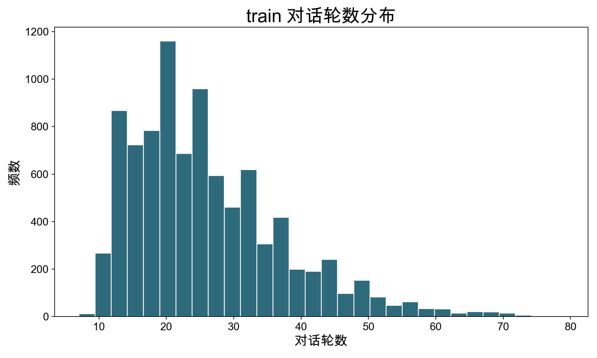

这张图展示训练集每条对话包含多少轮交互。  
它反映的是客服流程长度分布，可用于判断：

- 数据是否以短对话为主
- 是否存在明显的长尾复杂对话

#### 对话总 token 数分布

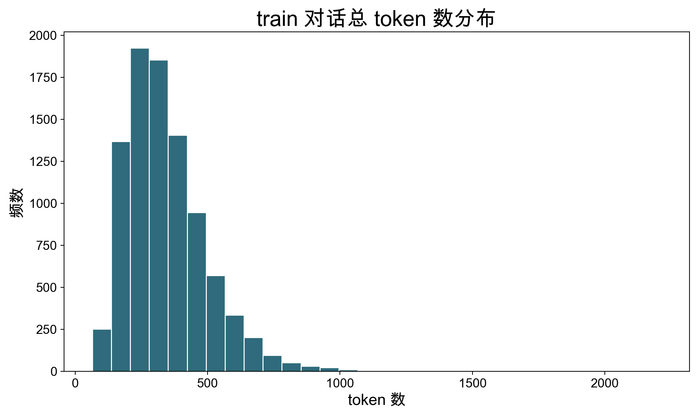

这张图展示训练集中每条完整对话的 token 长度分布。  
这里的 token 统计遵循：

- 去掉空格
- 使用 `cl100k_base` 编码

它主要帮助判断模型输入长度压力，以及大部分样本是否远低于上下文窗口上限。

#### 对话总词数分布

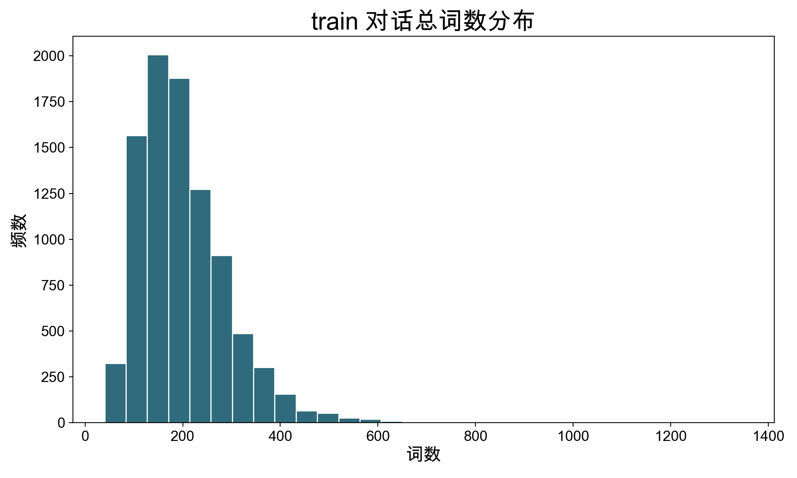

这张图反映训练集每条对话的词数分布。  
相较 token 分布，它更接近人对文本长度的直观理解。

#### 高频词 Top20

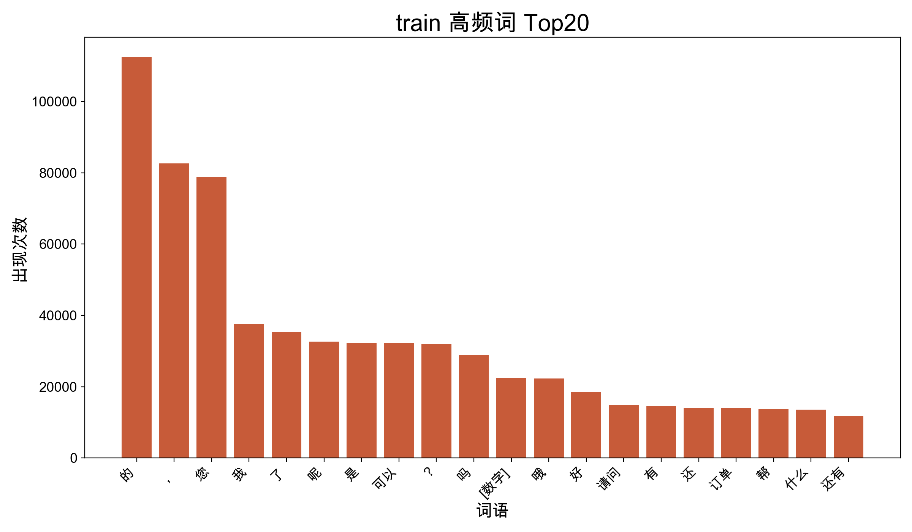

这张图展示训练集中出现频率最高的 20 个词。  
它适合快速观察：

- 数据的高频表达
- 是否还有明显停用词残留
- 客服语料的固定模板化表达是否很多

#### 普通词云

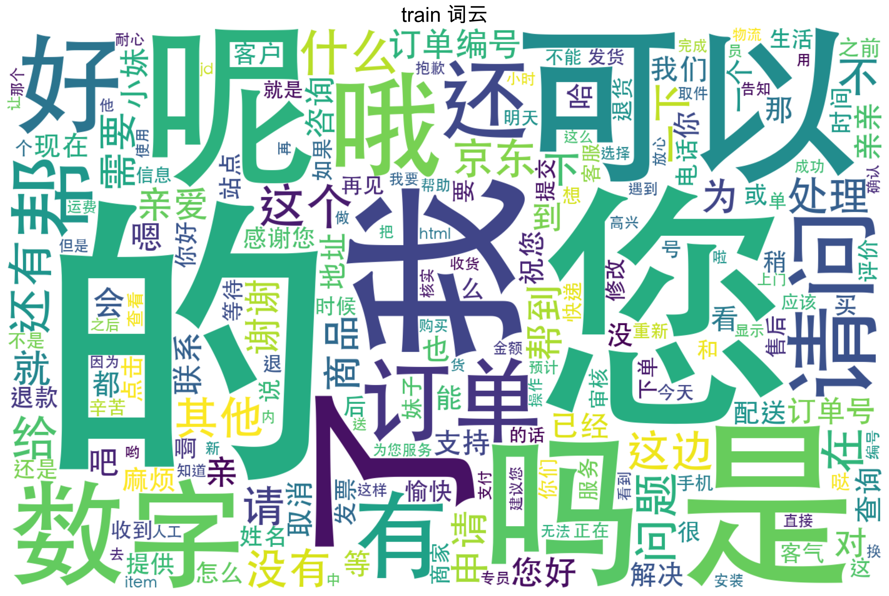

这张词云也是基于原始词频生成。  
词越大，表示在训练集中出现越频繁。  
它更偏直观展示，不是精确定量分析工具。

结果分析：

- 训练集图像整体表明，大多数对话长度集中在中等区间，仅有少量样本形成较长尾部分布，这说明数据主体仍以常规客服交互为主。
- 高频词与普通词云持续呈现订单、申请、退款、发票、配送等词汇，这说明训练数据具有较强的业务集中性，而非开放域闲聊语料。
- 从长度分布看，训练集虽包含部分较长对话，但整体规模远未接近超长上下文处理上限，这支持后续继续开展统计分析与模型训练。

### 2.2 验证集结果

#### 对话轮数分布

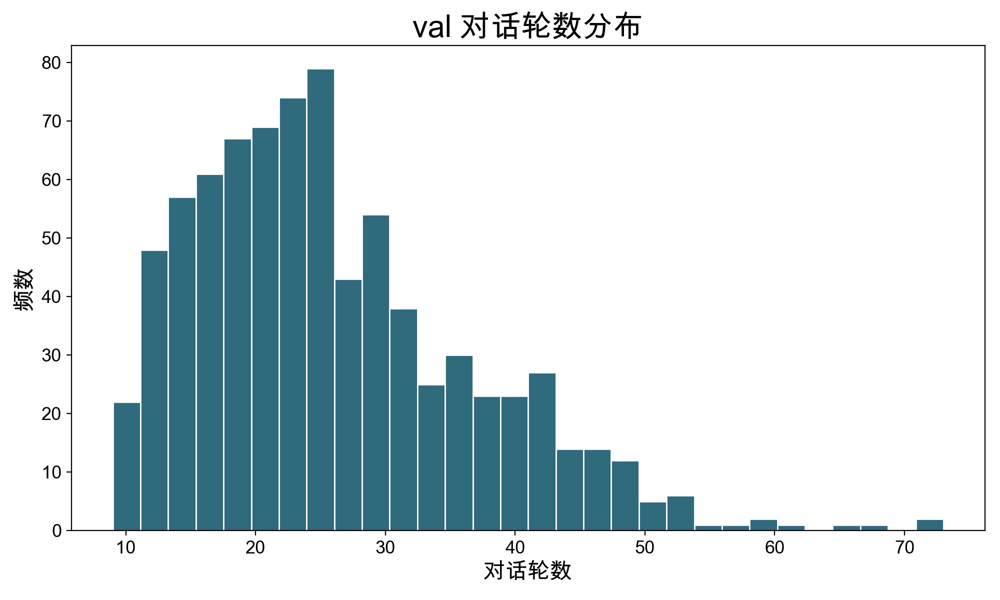

验证集对话轮数分布可用于和训练集比较，观察是否存在明显分布偏移。

#### 对话总 token 数分布

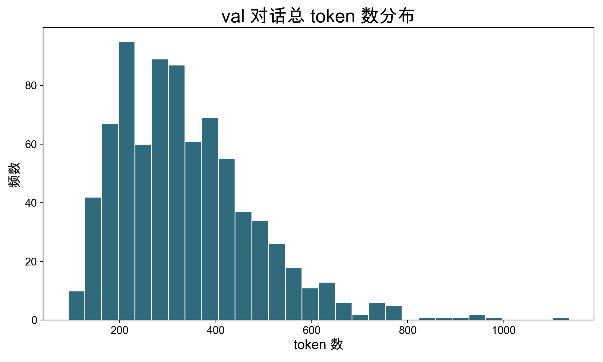

这张图可用于判断验证集样本长度是否和训练集保持一致。

#### 对话总词数分布

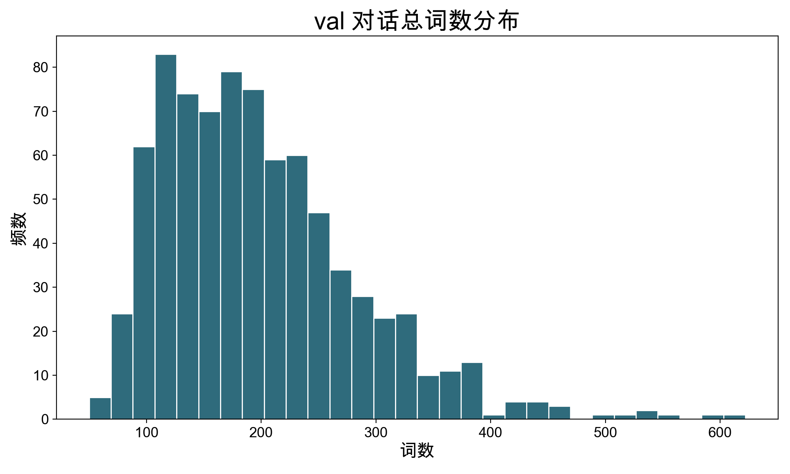

如果这张图和训练集形态接近，说明验证集在词数尺度上与训练集比较匹配。

#### 高频词 Top20

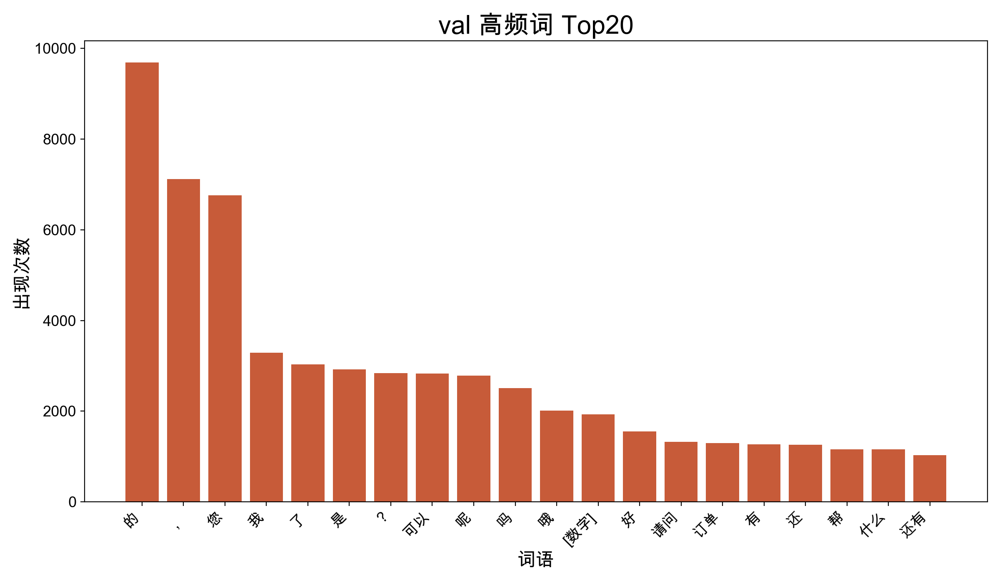

这张图适合对比训练集高频词，判断主题结构是否一致。

#### 普通词云

验证集词云用于从整体上观察验证集的常见主题词和话术风格。

结果分析：

- 验证集的轮数、token 数和词数分布与训练集整体接近，没有出现明显突兀的分布漂移，这表明验证集在长度尺度上具有良好代表性。
- 高频词结构与训练集大体一致，说明验证集在主题组成上与训练集保持较高匹配度。
- 这种一致性支持一个较稳妥的判断：后续利用验证集评估模型时，分布外波动预计不会过于严重。

### 2.3 测试集结果

#### 对话轮数分布

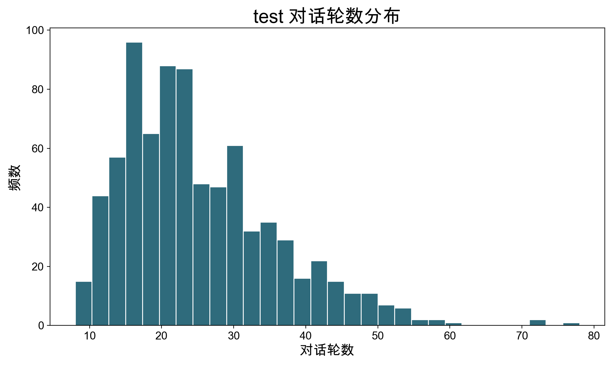

测试集的轮数分布是最终评估任务复杂度的重要参照。

#### 对话总 token 数分布

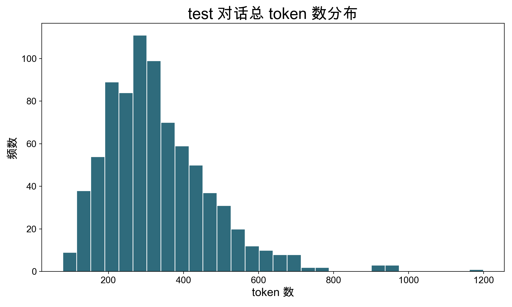

这张图可用于判断测试集长度是否和训练、验证集一致。

#### 对话总词数分布

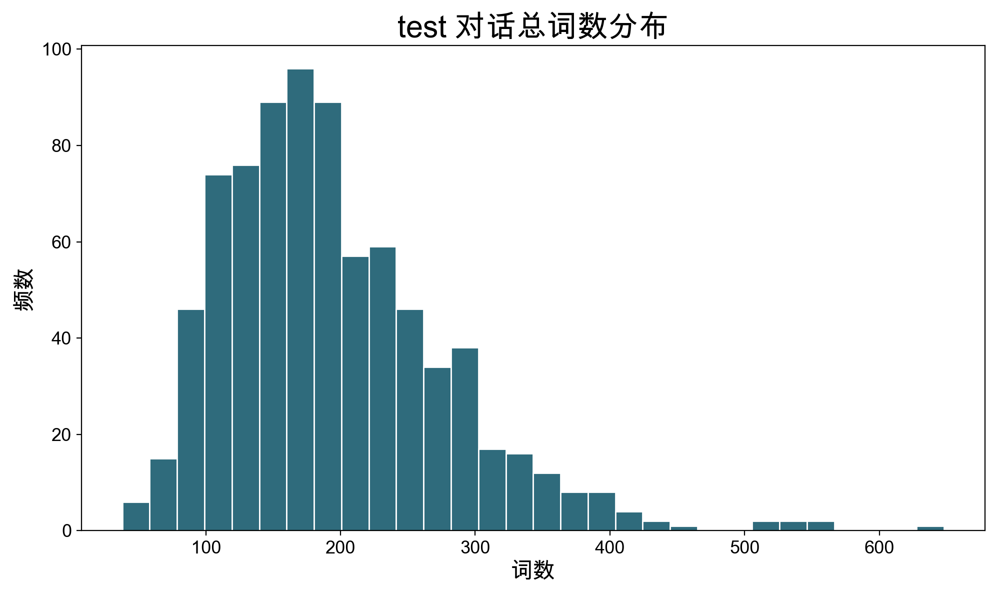

词数分布有助于观察测试集在表面长度上的稳定性。

#### 高频词 Top20

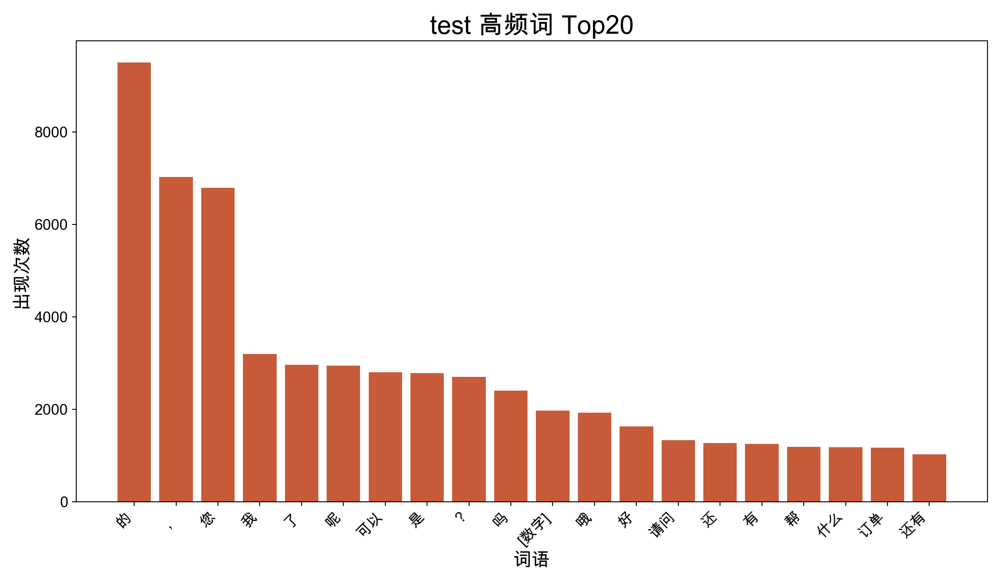

这张图可用于检查测试集的高频主题词是否与训练集、验证集基本一致。

#### 普通词云

测试集词云用于整体观察测试集的词汇风格。

结果分析：

- 测试集长度分布同样与训练集、验证集保持接近，这表明三个 split 的划分总体较为稳定。
- 测试集高频词仍然围绕客服、订单、售后、物流等相关表达展开，未出现完全不同的话题域。
- 从可视化结果看，测试集并不表现为显著偏移的外部域样本，而更像同一业务数据上的常规切分结果。

### 2.4 全量数据结果

#### 高频词 Top20

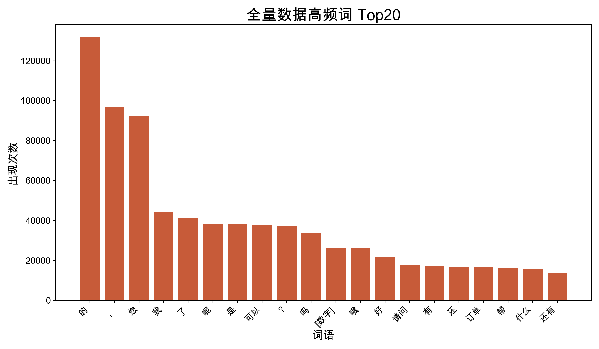

这张图把三个 split 的词汇合并后统一统计，适合看整个语料最核心的高频词。

#### 普通词云

这张词云是整个数据集的全局词汇概览，适合放在报告中作为最直观的整体展示图。

结果分析：

- 全量高频词与普通词云进一步表明，整个数据集的中心主题稳定集中在中文客服场景。
- 从全量视角看，订单、申请、退款、发票、配送等业务词具有持续且稳定的存在感，这说明语料的业务边界较为清晰。

---

## 3. TF-IDF 关键词结果分析

`TF-IDF` 图展示的是“按统计权重筛出的关键词”，而不是简单出现次数。  
因此这里的图更偏向“哪些词更能区分主题”。

实验目的：

- `TF-IDF` 实验的核心目的，是压低那些在所有对话里都频繁出现、但几乎不携带主题区分能力的词。
- 例如中文客服语料里常见的 `的`、`亲`、`您`、`了` 一类高频词，虽然出现次数很多，但通常不能有效代表业务主题。
- 因此，通过 `TF-IDF` 更容易把订单、退款、发票、配送、申请等具有业务辨识度的词筛出来。
- 当前实现并不是直接对原始分词结果做 `TF-IDF`，而是先经过一层显式拒绝规则过滤。现有拒绝词表中，已经包含 `的`、`了`、`是`、`我`、`你`、`请`、`亲`、`您好`、`您好呀`、`亲爱`、`订单`、`申请`、`查询`、`订单号` 等高频弱信息词或模板化客服表达。
- 此外，当前实现还会额外过滤单字词、纯数字 token，以及文档频率过低或过高的词。现有阈值为：`MIN_DOC_FREQ = 5`、`MAX_DOC_FREQ_RATIO = 0.45`。这意味着仅在极少数对话中出现的偶然词，以及在接近一半甚至更多对话中都出现的泛化词，都会被排除出最终关键词结果。

当前实现怎么做：

- 每条完整对话作为一个 document
- 先对每条 document 做 `filter_document` 清洗
- 对每篇文档分别计算词频 `Counter`
- 再统计每个词的 `document_frequency`
- 对每篇文档中的每个词计算 `tf * idf`
- 最后把同一个词在所有文档中的 `tf-idf` 分数累加，形成整个 split 的全局关键词分数

参数原理和意义：

- `MIN_DOC_FREQ = 5` 控制的是“一个词至少要在多少篇文档里出现，才有资格进入关键词候选”。这个阈值的作用，是排除只在极少数对话里偶然出现的词，避免结果被个别样本牵着走。
- `MAX_DOC_FREQ_RATIO = 0.45` 控制的是“一个词最多能出现在多少比例的文档中”。一旦某个词出现在接近一半甚至更多对话中，它通常已经更像通用背景词，而不是能区分主题的关键词，因此需要压掉。
- 这两个参数合在一起，实际形成的是一个“中间区间筛选”逻辑：过稀的词不要，过泛的词也不要，最后只保留既有一定覆盖面、又仍然具有主题区分能力的词。

### 3.1 训练集结果

#### TF-IDF Top20

这张图展示训练集中得分最高的 20 个 `TF-IDF` 关键词。  
它有助于识别：

- 在训练集中既常见、又有一定区分能力的业务词

#### TF-IDF 词云

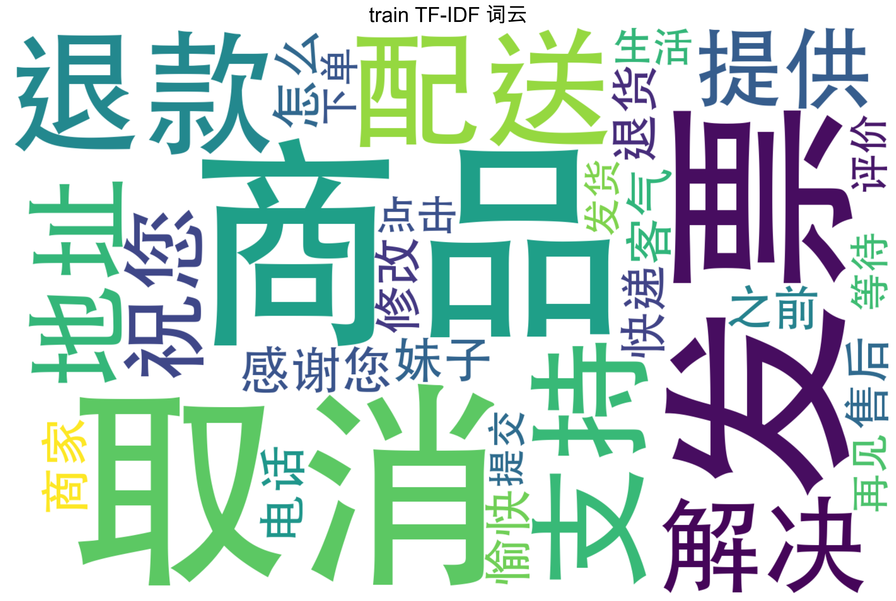

这张词云不是按频率放大，而是按 `TF-IDF` 得分放大。  
因此更能突出“重要词”而非“常见词”。

结果分析：

- 训练集 `TF-IDF` 结果相较普通高频词，更能突出具有业务区分能力的关键词，而不会单纯重复放大口语助词。
- 这说明当前采用的文档频率约束与 `TF-IDF` 加权机制在客服语料上是有效的，能够压低过于泛化的表达。
- 同时，由于当前实现已经显式排除了 `亲`、`您`、`您好`、`订单`、`申请`、`查询`、`订单号` 这类模板化或泛化表达，最终留下来的高分词更接近真正能反映业务主题的词，而不是客服礼貌话术或系统化固定说法。

### 3.2 验证集结果

#### TF-IDF Top20

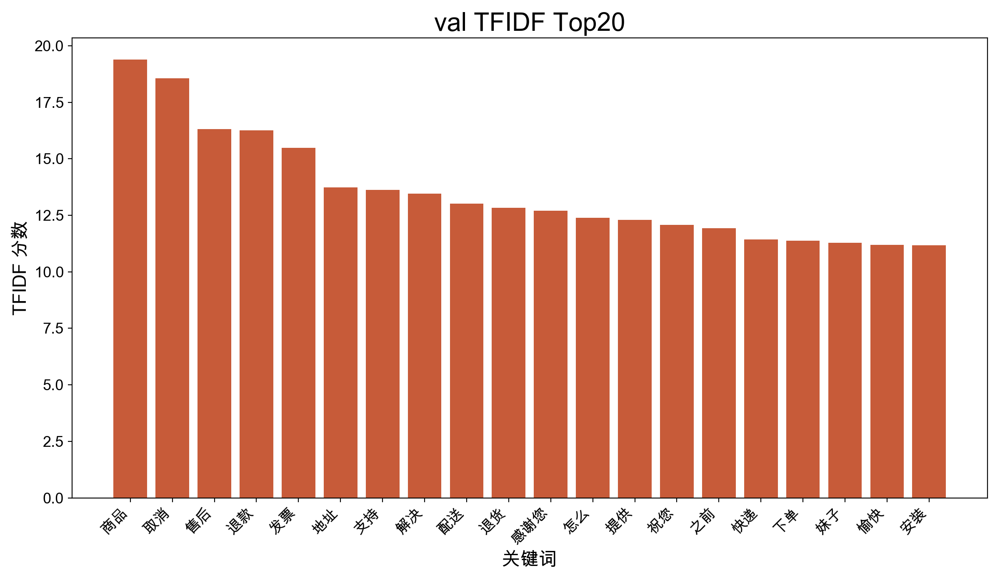

验证集的 `TF-IDF` Top20 可用于与训练集对比，看关键词结构是否一致。

#### TF-IDF 词云

这张图展示验证集在 `TF-IDF` 视角下的主要关键词。

结果分析：

- 验证集 `TF-IDF` 关键词结构与训练集高度接近，这说明训练与验证阶段被强调的业务主题基本一致。
- 若某些词在训练集与验证集中均稳定靠前，则可将其视为数据中的核心业务词，而非偶然出现的局部噪声。

### 3.3 测试集结果

#### TF-IDF Top20

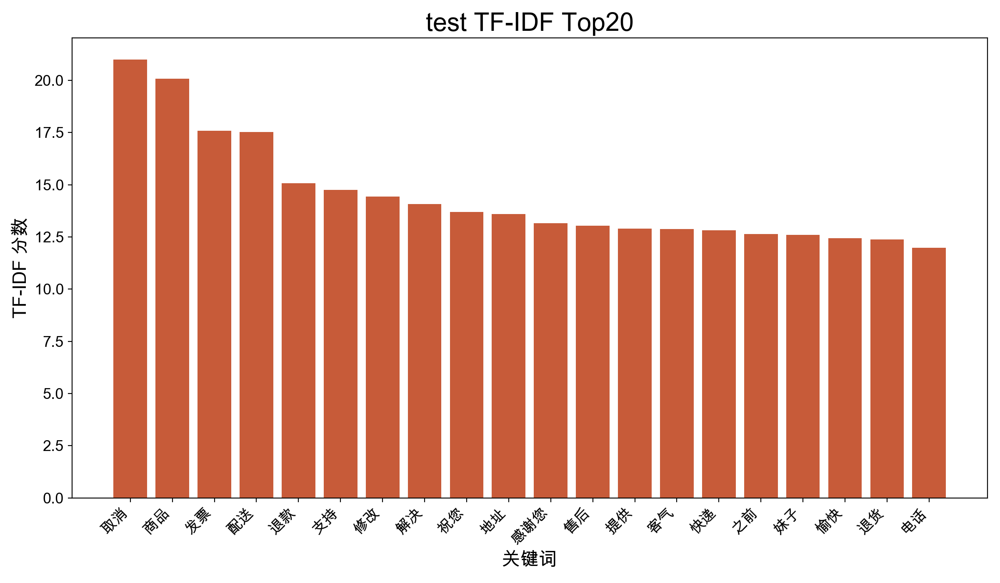

测试集 `TF-IDF` 结果反映了测试集中最有代表性的区分性词汇。

#### TF-IDF 词云

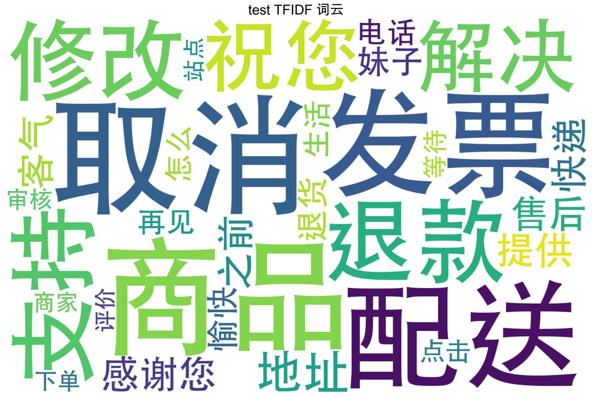

这张图可帮助快速理解测试集主要业务词汇的权重结构。

结果分析：

- 测试集 `TF-IDF` 结果没有出现与训练阶段完全脱节的新主题词簇，这说明测试集与训练集在主题重心上总体一致。
- 对后续模型训练与评估而言，这表明测试阶段更接近常规泛化，而不是跨业务域迁移。

### 3.4 全量数据结果

#### TF-IDF Top20

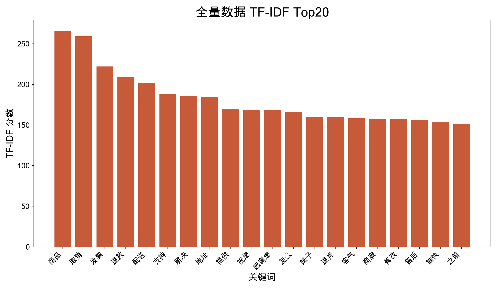

全量 `TF-IDF` Top20 展示整个数据集最具代表性的统计关键词。

#### TF-IDF 词云

这是整个数据集在 `TF-IDF` 权重下的全局关键词词云。

结果分析：

- 全量 `TF-IDF` 结果更接近一份“全数据主题摘要”，能够稳定突出订单、申请、退款、发票等业务中心词。
- 相比普通词云，这一组图更适合用于解释“哪些词更能区分客服主题”。

---

## 4. TextRank 关键词结果分析

`TextRank` 图强调的是词在共现网络中的“核心性”。  
因此它往往会偏向那些和其他业务词频繁共同出现的主题词。

当前实现怎么做：

- 输入仍然使用“单条完整对话 = 一个 document”的粒度
- 每条 document 先经过与 `TF-IDF` 相同的 token 清洗
- 在 document 内按滑动窗口构建无向共现关系
- 用 `DAMPING = 0.85`、`ITERATIONS = 30` 做 PageRank 风格迭代
- 结果按分数排序，取前 `top_k` 个词，同时保留词频 `count`

参数原理和意义：

- `WINDOW_SIZE = 4` 决定了共现关系是按多大的局部范围建立的。当前取值表示每个词会和后面最多 3 个词建立关系，因此更强调短距离共现，而不是整段对话里的宽泛同现。
- `DAMPING = 0.85` 决定了分数传播时，邻居节点的重要性会占多大比重。这个值较高时，网络中心词更容易被突出，适合做主题共现分析。
- `ITERATIONS = 30` 决定了 PageRank 风格更新的轮数。当前取值的意义在于让分数基本稳定下来，而不至于只跑几轮就过早停止。

实验目的：

- `TextRank` 实验的目的，不是再次简单统计词频，而是从“词与词之间的关系结构”出发，识别哪些词位于主题共现网络的中心。
- 这样做的意义在于，某些词即使出现次数不一定最高，但如果它总是和多个核心业务词一起出现，它仍然可能是更有代表性的主题词。

### 4.1 训练集结果

#### TextRank Top20

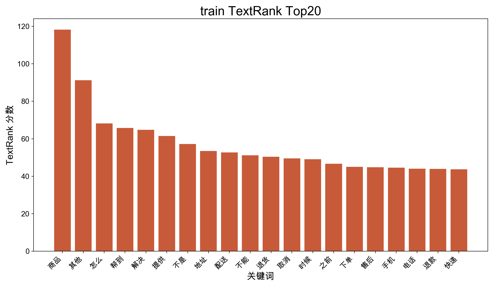

这张图展示训练集里在词共现图中得分最高的 20 个关键词。

#### TextRank 词云

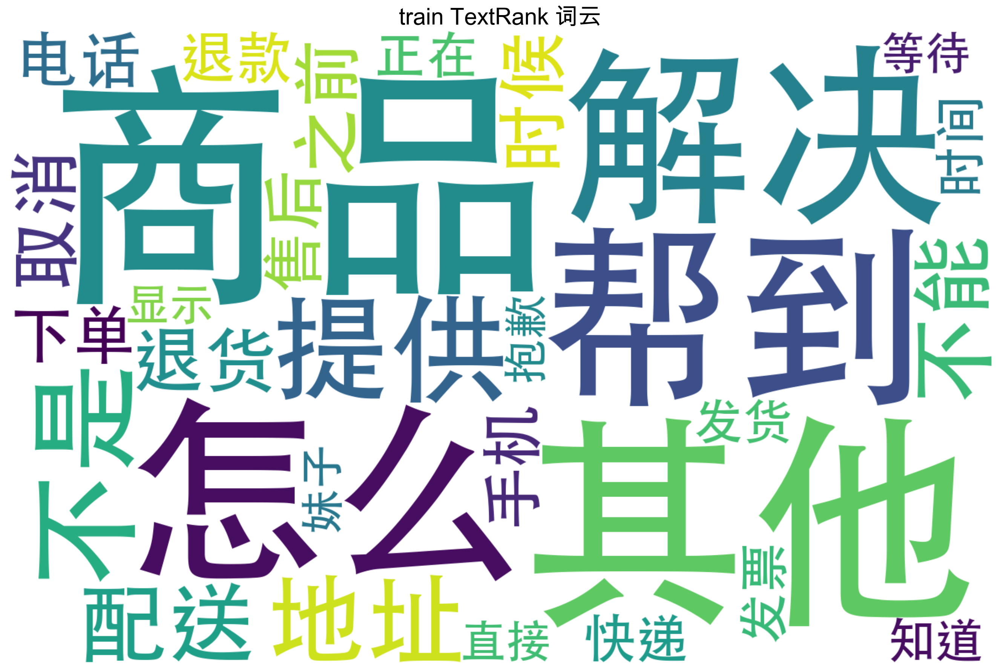

这张词云按 `TextRank` 分数展示关键词大小，可以直观看到共现网络中的核心词。

结果分析：

- 训练集 `TextRank` 结果通常会优先提升那些彼此经常共同出现的业务词，因此更偏向识别“主题网络中心词”。
- 若某些词在 `TF-IDF` 与 `TextRank` 中均稳定靠前，则可认为这些词既具有统计区分度，又位于主题共现结构的核心位置。

### 4.2 验证集结果

#### TextRank Top20

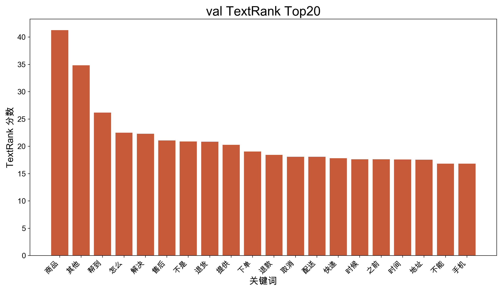

验证集 `TextRank` Top20 可用于比较验证集是否保持相似的主题网络结构。

#### TextRank 词云

这张图展示验证集在词共现网络里的主要中心词。

结果分析：

- 验证集 `TextRank` 结构与训练集接近，这说明业务词之间的共现关系在不同 split 中较为稳定。
- 该结果进一步支持一个判断：数据集不仅在长度分布上相近，在主题词之间的关系结构上也保持一致。

### 4.3 测试集结果

#### TextRank Top20

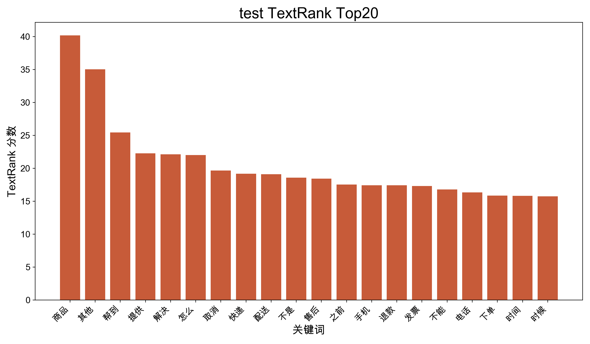

测试集 `TextRank` Top20 用于观察测试集的主题结构是否与前两者一致。

#### TextRank 词云

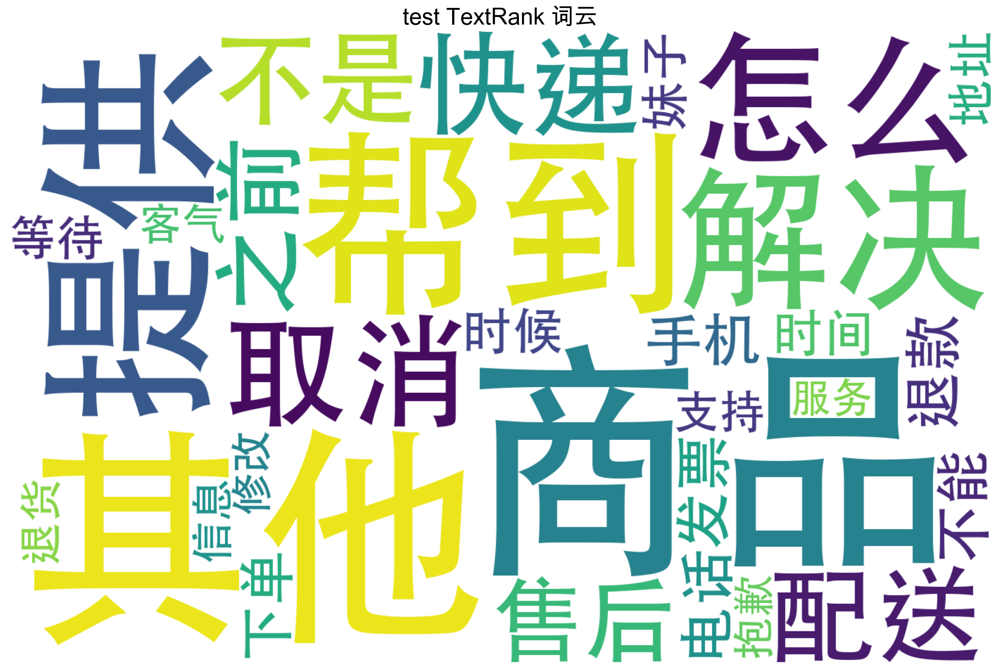

这张词云展示测试集在 TextRank 视角下的重要词。

结果分析：

- 测试集 `TextRank` 结果没有显示出特别异常的中心词网络，说明测试集的主题结构仍与前两者连续。
- 从汇报角度看，这增强了“数据切分合理”的论据。

### 4.4 全量数据结果

#### TextRank Top20

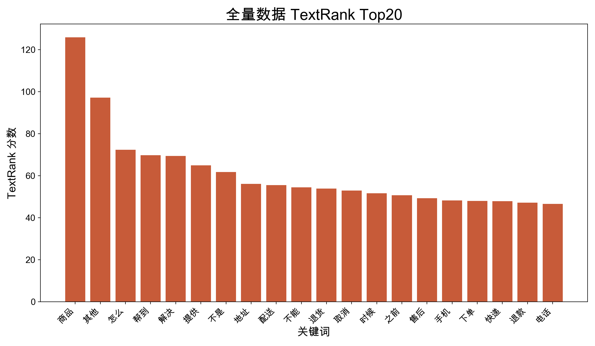

全量数据的 TextRank Top20 反映整个数据集里最核心的共现词。

#### TextRank 词云

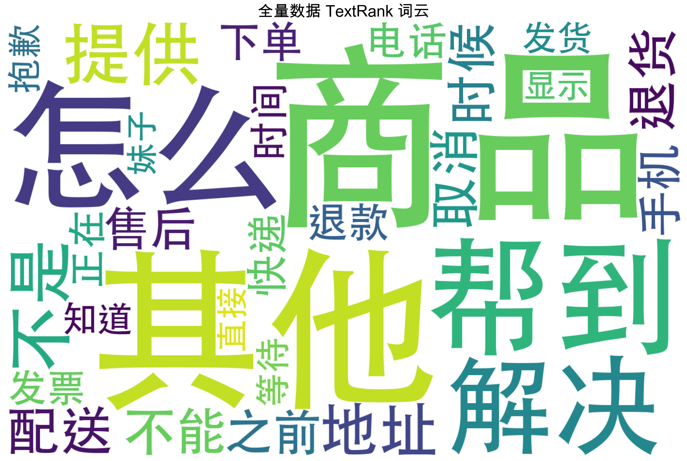

这张图是整个语料共现结构的直观展示。

结果分析：

- 全量 `TextRank` 更适合用于解释“整个客服语料里哪些词处于共现网络中心”。
- 与 `TF-IDF` 相比，它更容易突出经常一起出现的主题簇，而不只是某个词本身的区分度。

---

## 5. KeyBERT 关键词结果分析

`KeyBERT` 代表语义嵌入路线。  
与前两种传统方法相比，它更强调：

- 某个词或短语在语义上是否能代表整段文本主题

当前实现怎么做：

- 仍然以“单条完整对话 = 一个 document”为基础
- 先做 token 清洗，再将 token 列表重新拼成文本
- 将同一个 split 下所有文档用换行拼接成一个大文本
- 调用 `KeyBERT().extract_keywords(...)`
- 当前参数设置为 `keyphrase_ngram_range=(1, 2)`、`top_n=top_k`

参数原理和意义：

- `keyphrase_ngram_range=(1, 2)` 的作用，是让候选关键词既包含单词，也包含双词短语。这样做的意义在于，关键词不至于只剩下过碎的单词，同时又不会放宽到过长短语，保持主题表达和结果可读性之间的平衡。
- `top_n=top_k` 的作用，是限制最终返回的关键词数量。这个参数更多是展示控制参数，用来保证输出结果适合报告展示和横向比较。

实验目的：

- `KeyBERT` 实验的目的，是从语义层面进一步验证关键词提取结果，避免分析过程完全依赖传统词频统计。
- 与 `TF-IDF` 和 `TextRank` 相比，`KeyBERT` 更关注“这个词在语义上是否真的代表了整段文本”，因此有助于减少高频弱信息词对结果的干扰，并补充传统方法难以捕捉的语义代表性。

### 5.1 训练集结果

#### KeyBERT Top20

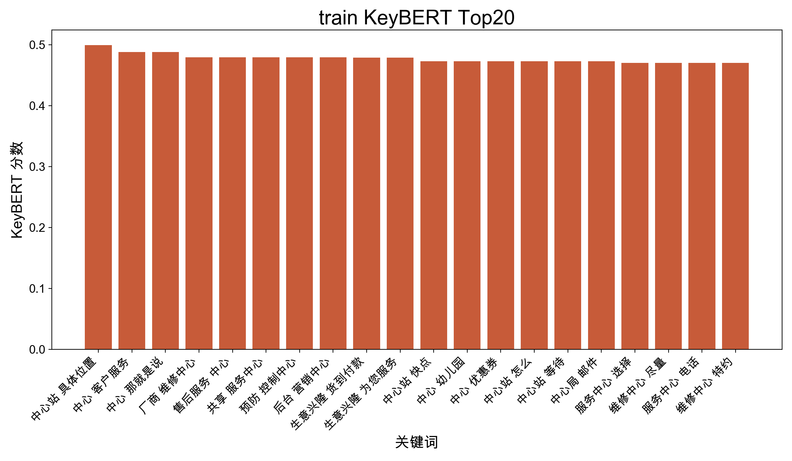

这张图展示训练集整体文本在 `KeyBERT` 视角下最有代表性的关键词。

#### KeyBERT 词云

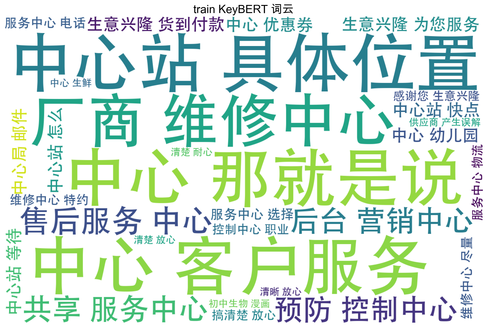

这张词云按 `KeyBERT` 关键词分数绘制，因此更偏“语义代表性”而不是频率。

结果分析：

- 训练集 `KeyBERT` 结果如果和 `TF-IDF` / `TextRank` 有重叠，说明这些词不仅统计上重要，语义上也能代表整体主题。
- 如果出现少量不同词，则往往说明语义方法更容易补出一些统计方法没有特别放大的主题表达。

### 5.2 验证集结果

#### KeyBERT Top20

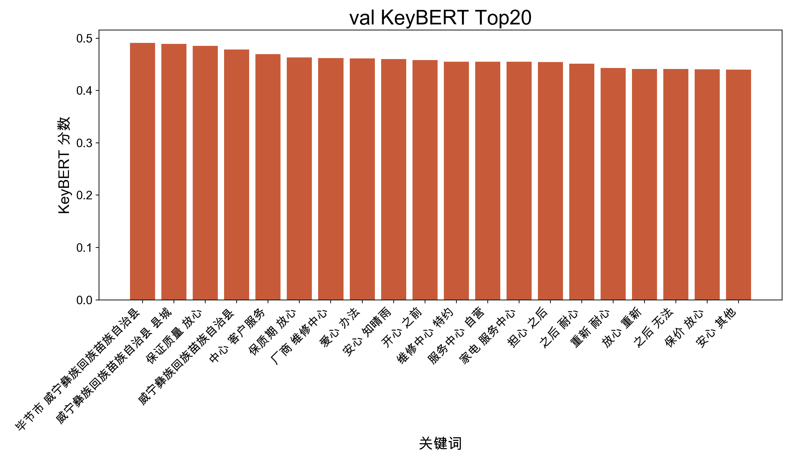

验证集 `KeyBERT` 结果可用于判断验证集整体主题是否与训练集接近。

#### KeyBERT 词云

这张图展示验证集在语义关键词视角下的主要主题。

结果分析：

- 验证集 `KeyBERT` 与训练集结果相近时，说明整体语义主题比较稳定。
- 这类稳定性对后续做主题总结或结构化抽取是有利的。

### 5.3 测试集结果

#### KeyBERT Top20

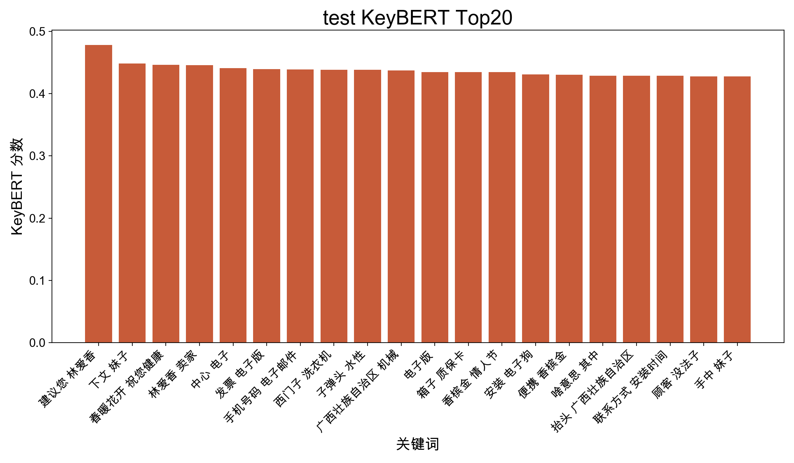

测试集 `KeyBERT` Top20 用于观察测试语料的主要语义主题词。

#### KeyBERT 词云

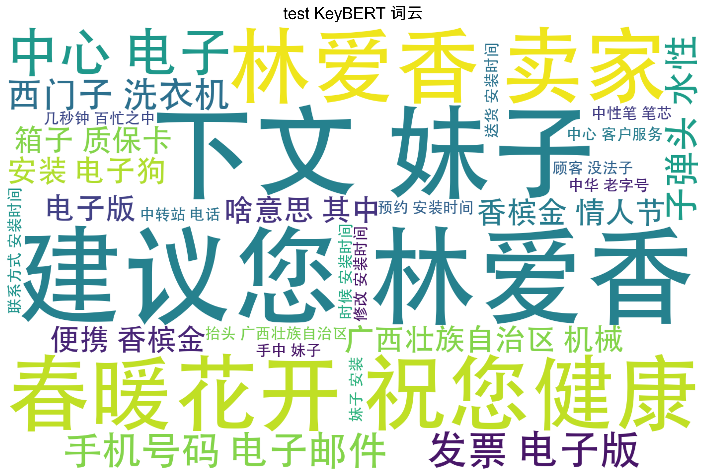

这张图是测试集的语义关键词词云。

结果分析：

- 测试集 `KeyBERT` 没有出现大规模偏离，也支持“测试集仍然围绕同一业务域”的判断。
- 和统计方法一起看时，语义路线能帮助确认这些业务主题不是词频偶然现象。

### 5.4 全量数据结果

#### KeyBERT Top20

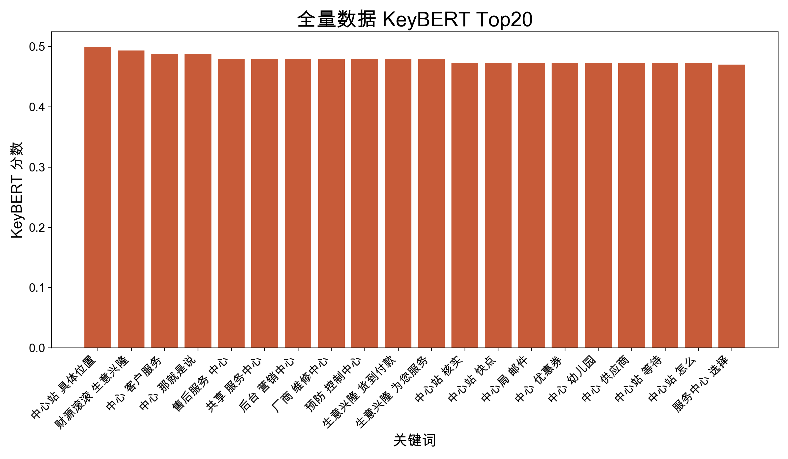

这张图展示整个数据集在 `KeyBERT` 视角下最有代表性的关键词。

#### KeyBERT 词云

这张词云是全量语料的语义关键词概览。

结果分析：

- 全量 `KeyBERT` 结果更像整份客服语料的语义摘要。
- 若某些词在三种方法中都稳定出现，可将其视作本数据集最可信的一批核心主题词。

---

## 6. 综合结论

结合本报告中的全部图像，当前 `stats` 模块实际上从三层视角刻画数据：

1. **长度与规模视角**
   - 通过轮数、token 数、词数分布看数据复杂度

2. **表层词频视角**
   - 通过高频词图和普通词云看语料最常见表达

3. **关键词提取视角**
   - `TF-IDF`：强调统计区分度
   - `TextRank`：强调共现网络中心性
   - `KeyBERT`：强调语义代表性

这三层组合在一起，能够比较完整地说明：

- 数据有多长
- 常见表达是什么
- 哪些词真正更能代表语料主题

因此，`week1/stats` 的结果不仅能作为数据分析输出，也能为后续的模型训练、主题理解和方法汇报提供支撑。

综合分析：

- 三种关键词方法虽然角度不同，但都反复指向订单、申请、退款、发票、配送、售后等业务主题，说明数据主题集中度较高。
- 基础统计和关键词结果结合起来，可以支持这样一个判断：当前数据是较典型的中文电商/物流客服多轮对话数据，适合继续做总结、分类和结构化抽取任务。
