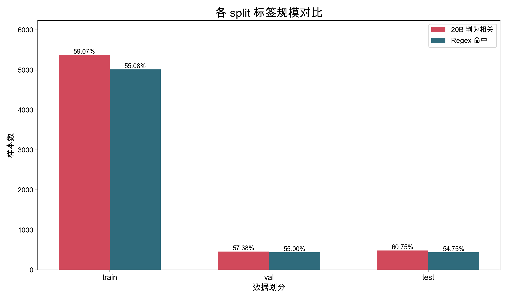
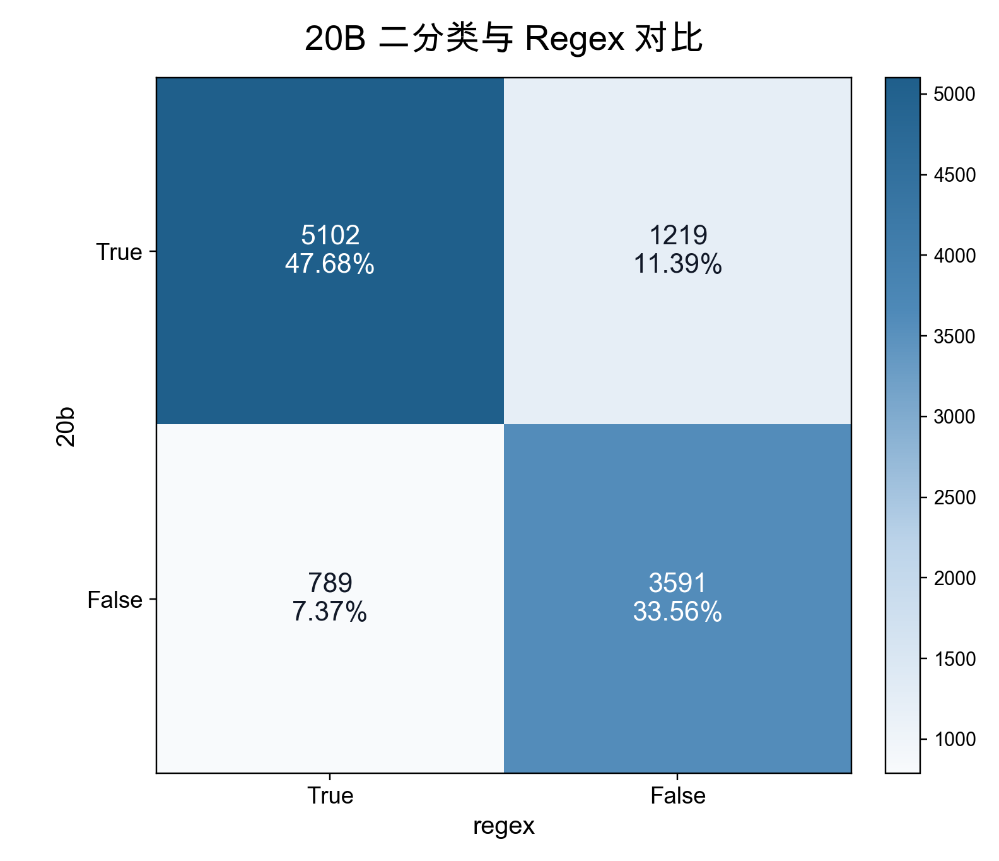
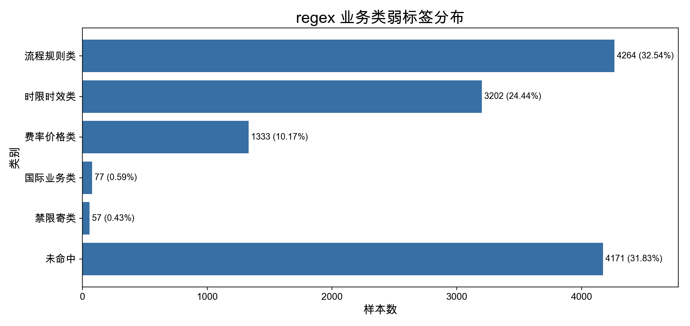

# 分类效果评估与边界 case 分析报告

## 1. 分析目的

第一版中使用 `gpt-oss:20b` 对 CSDS 对话做“快递 / 邮政相关”二分类。反馈要求补充说明：已有二分类结果是否做过探查、整体情况如何、是否存在边界 case、是否有量化指标评估分类效果，并建议用 Regex 分析总结字段中的关键词来打标签。

本报告只围绕两个结果做二分类对照：

1. 已完成的 `gpt-oss:20b` 二分类结果。
2. 基于总结字段关键词构造的 Regex 弱标签。

## 2. Regex 规则

Regex 是基于总结字段关键词构造的可解释对照标签，用来量化 20B 结果与关键词规则的一致性，并定位边界样本。

二分类 Regex 使用的关键词包括：

```text
邮政、中国邮政、EMS、ems、邮局、邮政快递、邮政包裹、特快专递、挂号信、平邮、邮政编码、邮政网点、邮政营业厅、商务件、
快递、物流、配送、派送、配送员、快递员、送货员、站点、分站、网点、自提点、提货点、派件点、配送点、
分拣、分拨、分部、揽收、取件、上门取件、上门取货、签收、拒收、收货、收件、寄回、寄出、寄送、
邮寄、包裹、运费险、运费、发货、到货、送达、送到、清关、海关、转站点、拦截、代收、货到付款
```

业务类 Regex 使用的关键词包括：

| 类别 | 关键词 |
|---|---|
| 费率价格类 | 运费、邮费、多少钱、价格、费用、收费、保价、报价、首重、续重 |
| 时限时效类 | 几天、多久、什么时候到、时效、预计、送达、到达、延误、超时、派送、物流、快递 |
| 流程规则类 | 怎么寄、怎么下单、修改地址、地址写错、取消、退回、签收、揽收、取件、上门、站点、网点、流程、规则 |
| 禁限寄类 | 禁寄、限寄、不能寄、可以寄吗、违禁、液体、电池、药品、食品、化妆品、危险品 |
| 国际业务类 | 国际、国外、海外、海关、清关、报关、跨境、进口、出口 |

## 3. 各 split 标签规模

| split | 总样本数 | 20B 判为相关 | Regex 命中 |
| --- | ---: | ---: | ---: |
| train | 9101 | 5376 (59.07%) | 5013 (55.08%) |
| val | 800 | 459 (57.38%) | 440 (55.00%) |
| test | 800 | 486 (60.75%) | 438 (54.75%) |



20B 判相关比例约为 59.07%，Regex 命中比例约为 55.05%。二者规模接近，说明 20B 的二分类结果主要覆盖了快递、物流、配送、订单流转等宽口径客服场景，整体方向与可解释关键词规则基本一致。

## 4. 20B 与 Regex 对照

| 标签组合 | 样本数 | 占比 |
| --- | ---: | ---: |
| 20b=True regex=True | 5102 | 47.68% |
| 20b=True regex=False | 1219 | 11.39% |
| 20b=False regex=True | 789 | 7.37% |
| 20b=False regex=False | 3591 | 33.56% |



20B 与 Regex 同时判为相关的样本有 5102 条，占全量 47.68%。这部分通常包含快递、物流、配送、取件、签收、站点、运费等显式业务词，是当前二分类结果中最容易解释的一类样本。

边界 case 主要来自两类：

1. `20b=True regex=False`：20B 判为相关，但总结字段没有命中 Regex。可能是模型根据完整对话上下文识别出的隐性物流场景，也可能是 20B 误收。
2. `20b=False regex=True`：Regex 命中，但 20B 判为不相关。可能是关键词出现在发票、售后、安装、会员等非寄递主题中，也可能是 20B 漏判。

因此，Regex 的价值是提供一个透明的对照视角和边界样本池，而不是替代模型输出。

## 5. Regex 业务类弱标签分布

| 类别 | 命中数 | 占比 |
| --- | ---: | ---: |
| 流程规则类 | 4264 | 32.54% |
| 时限时效类 | 3202 | 24.44% |
| 费率价格类 | 1333 | 10.17% |
| 国际业务类 | 77 | 0.59% |
| 禁限寄类 | 57 | 0.43% |
| 未命中 | 4171 | 31.83% |



Regex 业务类弱标签显示，当前数据中流程规则类和时限时效类最多，费率价格类有一定规模，国际业务类和禁限寄类较少。这与客服对话中常见的地址修改、签收拒收、配送时效、运费咨询等问题结构相符。

## 6. 结论

20B 与 Regex 的整体规模接近，说明第一版 20B 二分类结果并不是无依据扩张，而是大体落在快递、物流、配送和订单流转相关的宽口径场景中。

本报告的结论只基于 20B 与 Regex 对照：20B 给出已有二分类结果，Regex 给出可解释关键词弱标签。二者都服务于“第一版二分类结果是否合理、边界样本在哪里”这个问题。
