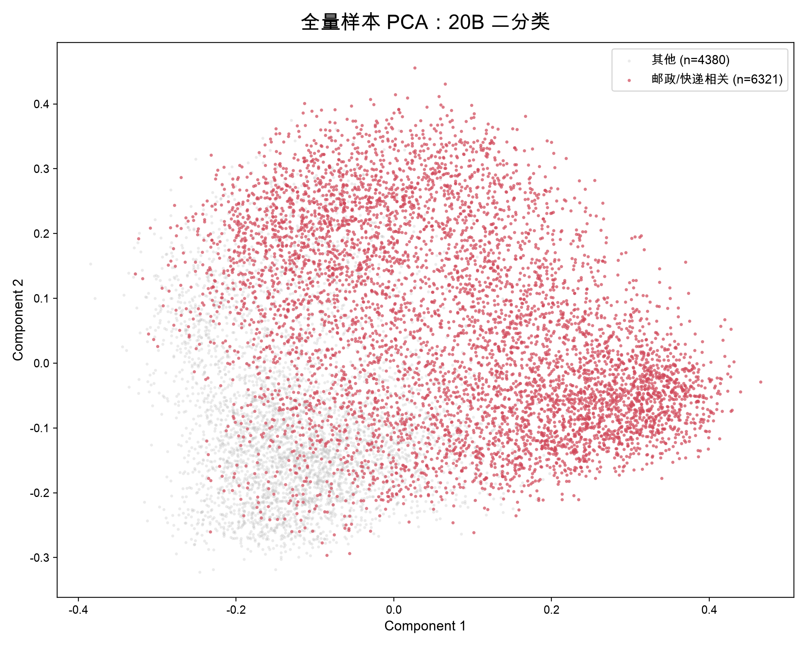
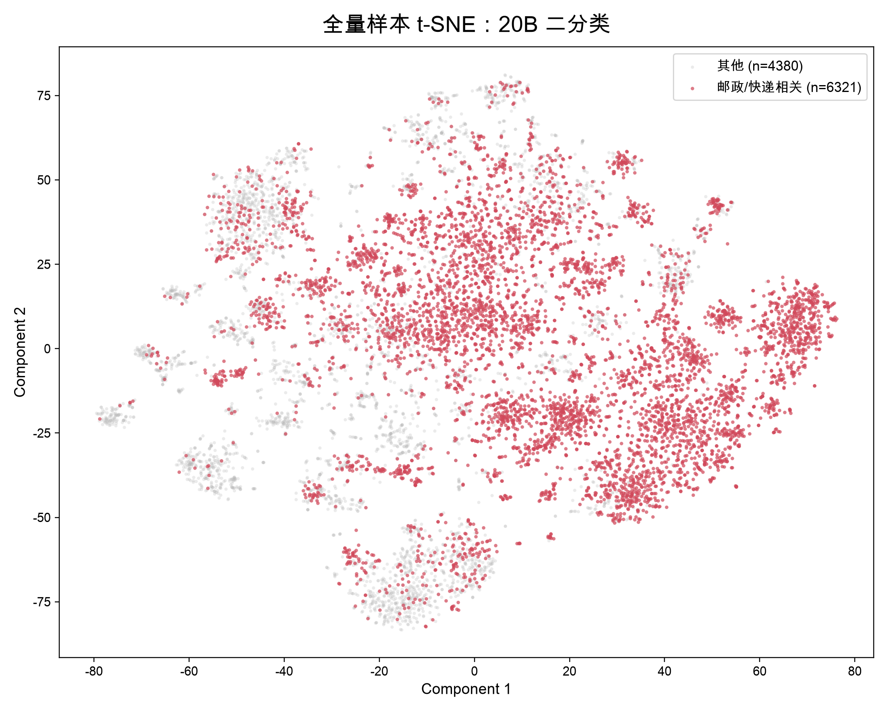
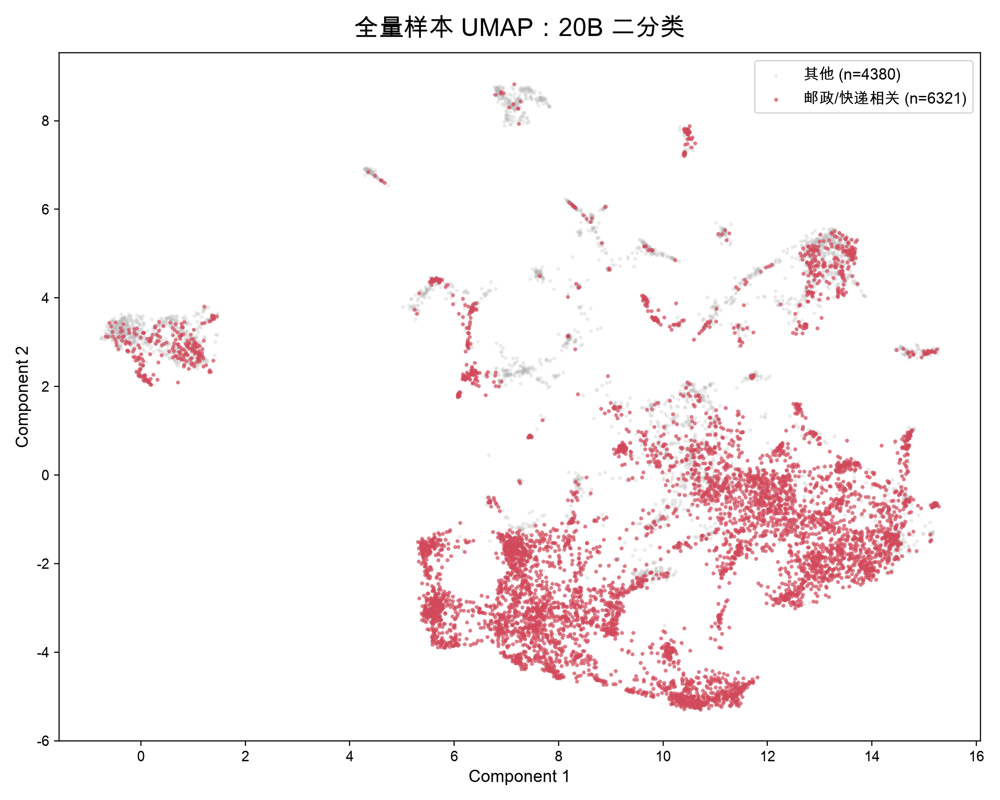
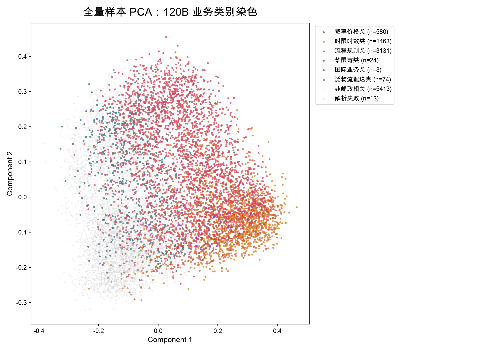
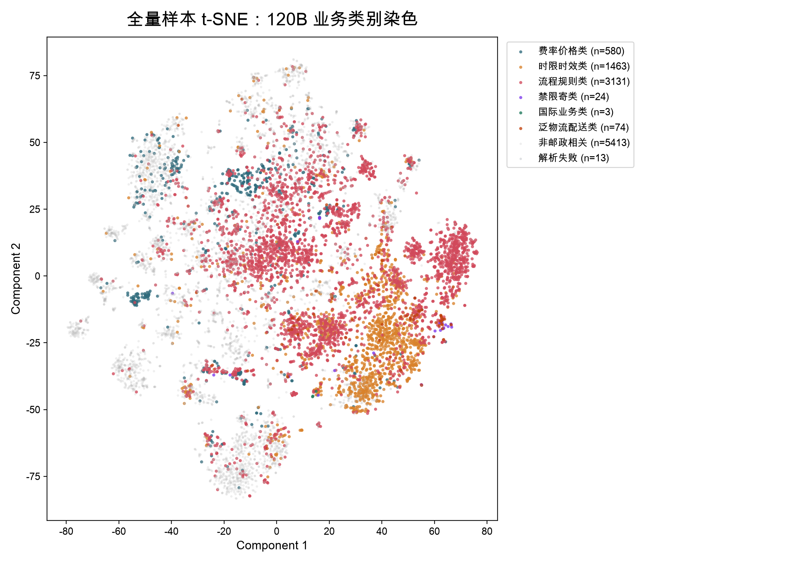
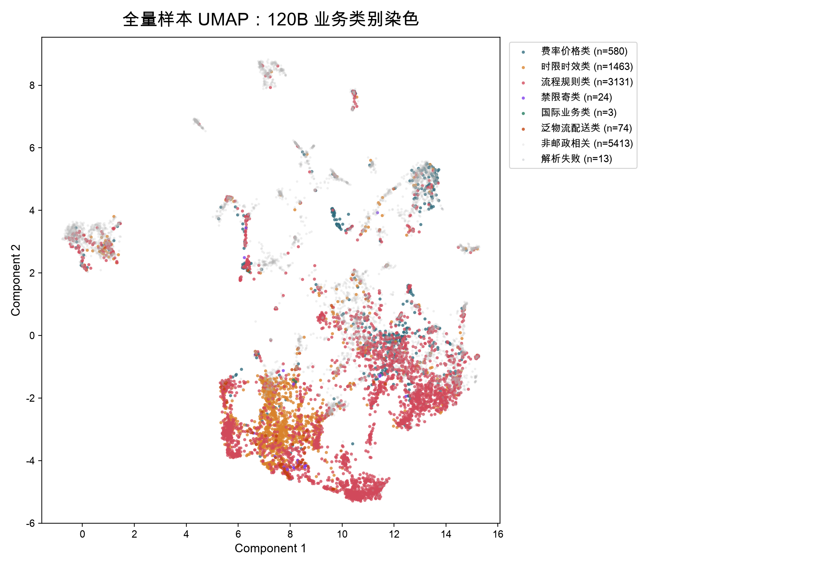

# 可视化聚类与标签优化报告

## 1. 分析目的

反馈要求可视化时能够更明显看出不同业务簇，可以尝试让每个点带标签，或者用聚类方法观察大概分为几类，例如费率价格类、时限时效类、流程规则类、禁限寄类、国际业务类等。

本报告分成两套图：

1. 二分类视图：沿用第一版 `gpt-oss:20b` 结果，灰色表示其他对话，红色表示邮政 / 快递 / 物流 / 配送相关对话。
2. 细分类视图：使用 `gpt-oss:120b` 的业务类别字段，只用于给相关业务类型染色，不参与 20B 与 Regex 的二分类对照。

## 2. 标签来源

可视化标签采用 `gpt-oss:120b` 输出的业务精细类别：

| 类别 | 说明 |
|---|---|
| 费率价格类 | 运费、邮费、收费、报价、保价等 |
| 时限时效类 | 多久到、什么时候送达、延误、派送进度等 |
| 流程规则类 | 地址修改、签收、拒收、退回、取件、站点等流程问题 |
| 禁限寄类 | 禁寄、限寄、违禁、液体、电池、药品等 |
| 国际业务类 | 国际、海外、清关、海关、跨境等 |
| 泛物流配送类 | 宽口径物流配送相关，但不适合归入以上细类 |
| 非邮政相关 | 不符合快递 / 物流 / 配送 / 邮政相关口径 |

120B 输出示例：

```json
{
  "broad_related": true,
  "category": "时限时效类",
  "reason": "用户询问快递预计送达时间。",
  "confidence": 0.95
}
```

其中 `category` 用于可视化染色；`broad_related` 只用于判断样本是否属于宽口径相关，不作为模型效果评估指标。

## 3. 可视化方案

PCA、t-SNE、UMAP 各生成两张图：

1. 读取 `week2/data/embeddings/dialogue_embeddings.h5` 中的 embedding。
2. 读取 `week2/data/llm_filter/postal_filter_results.json` 中第一版 20B 二分类结果，生成红灰二分类图。
3. 读取 `120b_broad_review_results.json`，使用其中 `category` 字段生成业务细分类染色图。
4. 三种降维方法使用同一套点位，只改变染色方式，避免把二分类评估和细分类解释混在一起。

## 4. 二分类红灰图

灰色为其他对话，红色为第一版 20B 判定的邮政 / 快递 / 物流 / 配送相关对话。







## 5. 业务细分类染色图

细分类图中，灰色仍表示非邮政相关或解析失败样本；其余颜色表示 120B 识别出的业务门类，包括费率价格类、时限时效类、流程规则类、禁限寄类、国际业务类和泛物流配送类。







## 6. 当前结论

第一版可视化只使用二分类颜色，能看出“快递 / 邮政相关”和其他对话的大致分布，但无法解释相关样本内部的业务结构。

第二版同时展示红灰二分类图和业务细分类染色图：前者保留第一版筛选结果的整体分布，后者用于观察费率价格类、时限时效类、流程规则类、禁限寄类、国际业务类等样本在 embedding 空间中的分布情况。该做法更适合回应“可视化时能否明显看出不同簇”的反馈。
