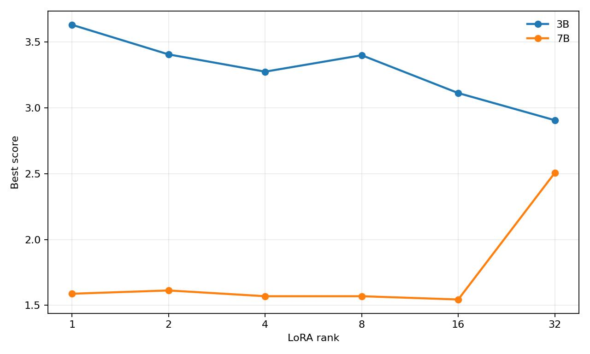
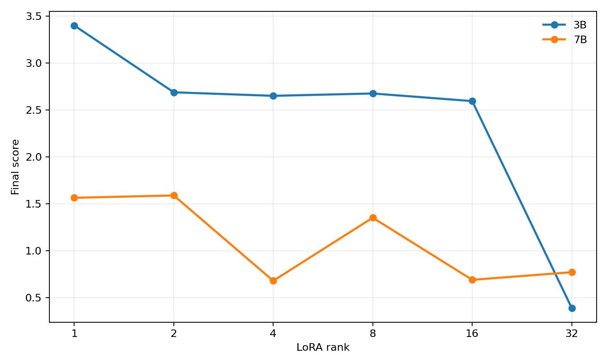
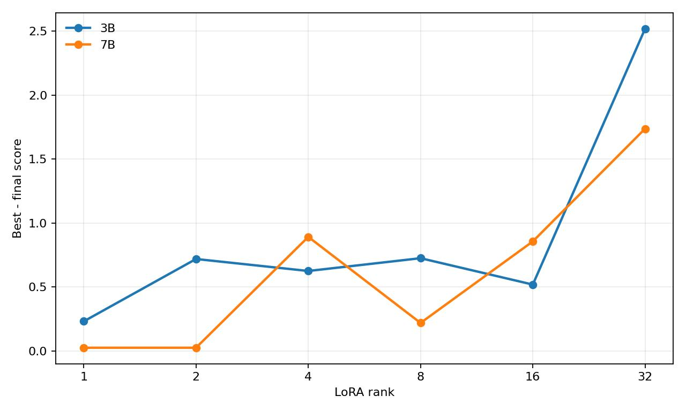
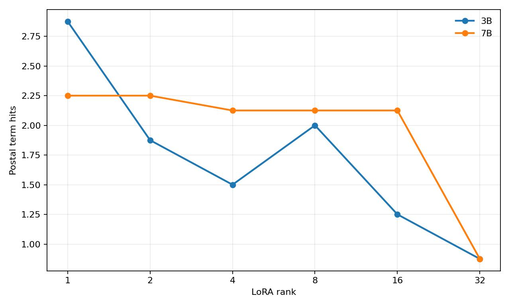
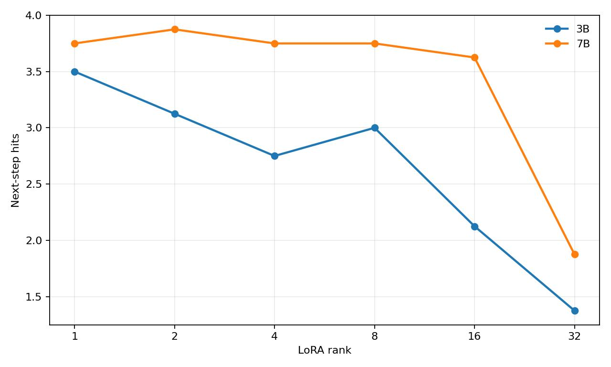
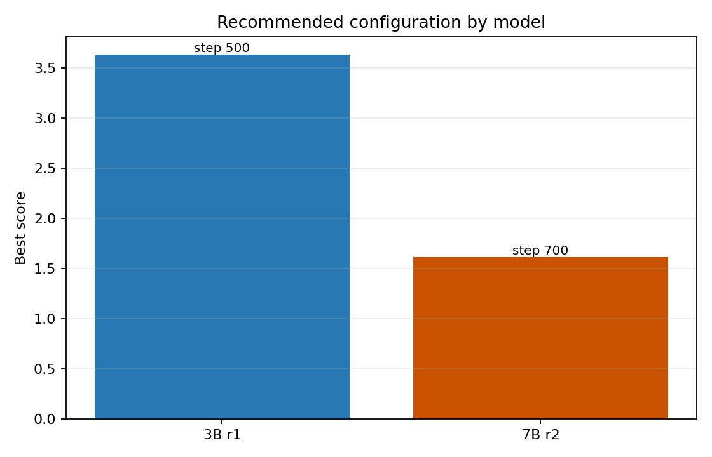

# Qwen2.5 MLX SFT Global Compare

本报告由 `global_compare/build_global_compare.py` 从结构化 monitor 数据生成，不读取已有图片，也不从图片反推数据。

数据源：

```text
runs/20260703_021130_qwen2.5-3b-lora_rank_sweep
runs/20260703_045302_qwen2.5-7b-lora_rank_sweep
```

## Summary Table

| Model | Rank | Best Step | Best Score | Final Score | JSON Valid | JSON Keys | Safety Risk | Postal Terms | Next Steps |
|---|---:|---:|---:|---:|---:|---:|---:|---:|---:|
| 3B | 1 | 500 | 3.6313 | 3.4000 | 1.0000 | 0.3333 | 0.0000 | 2.8750 | 3.5000 |
| 3B | 2 | 400 | 3.4062 | 2.6875 | 1.0000 | 0.3333 | 0.0000 | 1.8750 | 3.1250 |
| 3B | 4 | 200 | 3.2750 | 2.6500 | 1.0000 | 0.3333 | 0.0000 | 1.5000 | 2.7500 |
| 3B | 8 | 100 | 3.4000 | 2.6750 | 1.0000 | 0.3333 | 0.0000 | 2.0000 | 3.0000 |
| 3B | 16 | 400 | 3.1125 | 2.5938 | 1.0000 | 0.3333 | 0.0000 | 1.2500 | 2.1250 |
| 3B | 32 | 500 | 2.9062 | 0.3875 | 1.0000 | 0.3333 | 0.0000 | 0.8750 | 1.3750 |
| 7B | 1 | 900 | 1.5875 | 1.5625 | 1.0000 | 0.3333 | 0.0000 | 2.2500 | 3.7500 |
| 7B | 2 | 700 | 1.6125 | 1.5875 | 1.0000 | 0.3333 | 0.0000 | 2.2500 | 3.8750 |
| 7B | 4 | 300 | 1.5688 | 0.6771 | 1.0000 | 0.3333 | 0.0000 | 2.1250 | 3.7500 |
| 7B | 8 | 100 | 1.5688 | 1.3500 | 1.0000 | 0.3333 | 0.0000 | 2.1250 | 3.7500 |
| 7B | 16 | 200 | 1.5438 | 0.6875 | 1.0000 | 0.3333 | 0.0000 | 2.1250 | 3.6250 |
| 7B | 32 | 500 | 2.5063 | 0.7688 | 1.0000 | 0.0000 | 0.0000 | 0.8750 | 1.8750 |

## Key Findings

当前 3B 最优配置：

```text
Qwen2.5-3B-Instruct + LoRA rank 1
best_step=500
best_score=3.6313
adapter=runs/20260703_021130_qwen2.5-3b-lora_rank_sweep/rank_1/best_adapter/qwen2.5-3b-lora-r1
```

当前 7B 最优配置：

```text
Qwen2.5-7B-Instruct + LoRA rank 2
best_step=700
best_score=1.6125
adapter=runs/20260703_045302_qwen2.5-7b-lora_rank_sweep/rank_2/best_adapter/qwen2.5-7b-lora-r2
```

推荐配置不是只看瞬时 `best_score`，还要求 `json_keys > 0`、`score_drop <= 0.5` 且 `safety_risk = 0`。在这个稳定性约束下，3B 推荐 rank 1，7B 推荐 rank 2。这说明 LoRA rank 不能直接跨模型照搬，需要分别 sweep。

## Figures

### Best Score By Rank



### Final Score By Rank



### Score Drop By Rank



### Postal Terms By Rank



### Next Steps By Rank



### Recommended Configuration By Model


