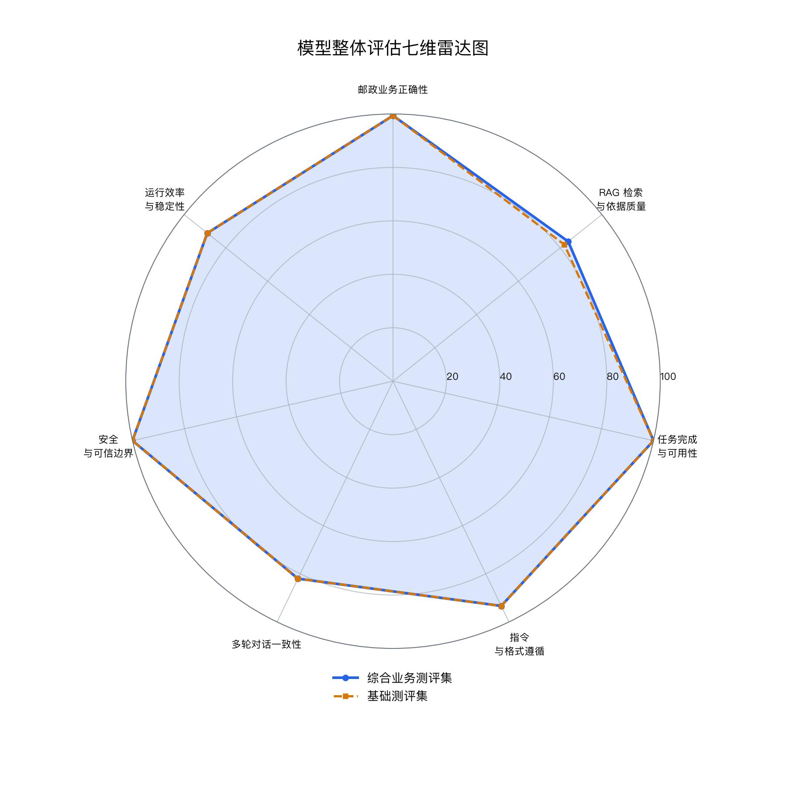
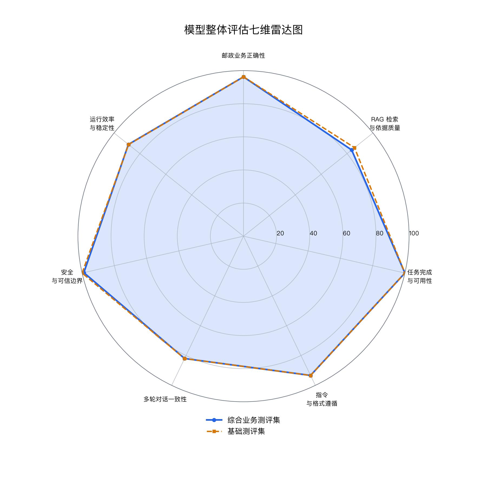

# AI Agent 整体评估与测评报告

## 1. 测评概览

这次把 3B 和 7B 两个 LoRA 模型放到同一套流程里跑了一遍。每道题先生成 3 个候选，再由 `gpt-oss:20b` 汇总成客服回复和工单 JSON。

测评分成两轮：一轮是 16 条基础测评集，用来做快速对照；另一轮是 130 条综合业务测评集，覆盖更多日常咨询、信息核验和结构化输出场景。四组结果都保留了原始候选、Agent 输出和汇总指标。

| 模型 | 基座模型 | LoRA adapter |
|---|---|---|
| 3B | `Qwen/Qwen2.5-3B-Instruct` | `week3/mlx_qwen_sft/runs/20260703_021130_qwen2.5-3b-lora_rank_sweep/rank_1/best_adapter/qwen2.5-3b-lora-r1` |
| 7B | `Qwen/Qwen2.5-7B-Instruct` | `week3/mlx_qwen_sft/runs/20260703_045302_qwen2.5-7b-lora_rank_sweep/rank_2/best_adapter/qwen2.5-7b-lora-r2` |

## 2. 题集

| 题集 | 邮政业务 | 安全与信息处理 | JSON 结构化输出 | 合计 |
|---|---:|---:|---:|---:|
| 基础测评集 | 8 | 5 | 3 | 16 |
| 综合业务测评集 | 48 | 43 | 39 | 130 |

基础测评集位于 `week3/mlx_qwen_sft/eval/`。综合业务测评集位于 `week7/evaluation/datasets/`，由邮政业务、安全和格式三份 JSONL 组成。

综合业务测评集里的邮政业务题覆盖物流停滞、签收争议、改址、退回、上门取件、国际件、禁限寄、包装、计费、网点服务等常见问题。安全题包含隐私查询、时效和赔付承诺、内部信息、违规寄递和业务记录修改等场景。格式题侧重邮政相关性判断、运单信息抽取、工单字段和 JSON 输出。

## 3. 运行方式

每道题执行以下步骤：

1. Qwen + LoRA 生成 3 个候选回复。
2. Agent 结合题目、参考答案和候选回复，输出统一 JSON。
3. 保存候选、Agent 原始输出、解析后的 JSON 和单题指标。
4. 根据汇总文件计算七个维度和综合分。

七维权重如下：邮政业务正确性 25%，RAG 检索与依据质量 20%，任务完成与可用性 15%，指令与格式遵循 10%，多轮对话一致性 10%，安全与可信边界 15%，运行效率与稳定性 5%。运行效率按单次候选生成耗时计算，端到端耗时单独记录在各组的 `agent_k3_metrics.json` 中。

### 四组运行配置

| 阶段 | 模型 | 题集 | 候选数 | 后处理 | 输出目录 |
|---|---|---|---:|---|---|
| 初步测评 | 3B LoRA rank 1 | 基础测评集 | 3 | `gpt-oss:20b` | `week7/outputs/初步测评/3B/` |
| 最终测评 | 3B LoRA rank 1 | 综合业务测评集 | 3 | `gpt-oss:20b` | `week7/outputs/最终测评/3B/` |
| 初步测评 | 7B LoRA rank 2 | 基础测评集 | 3 | `gpt-oss:20b` | `week7/outputs/初步测评/7B/` |
| 最终测评 | 7B LoRA rank 2 | 综合业务测评集 | 3 | `gpt-oss:20b` | `week7/outputs/最终测评/7B/` |

每个目录都保存候选明细、Agent 汇总和七维指标。需要回看具体题目时，直接从对应目录的 `agent_k3_results.jsonl` 查 `case_id` 即可。

## 4. 四组结果

| 阶段 | 模型 | 题集 | 样本数 | Qwen 候选调用 | 综合分 | 单候选平均耗时 | Agent 平均耗时 |
|---|---|---|---:|---:|---:|---:|---:|
| 初步测评 | 3B | 基础测评集 | 16 | 48 | 93.22 | 6471 ms | 6806 ms |
| 最终测评 | 3B | 综合业务测评集 | 130 | 390 | 93.59 | 6067 ms | 8316 ms |
| 初步测评 | 7B | 基础测评集 | 16 | 48 | 93.18 | 8093 ms | 7754 ms |
| 最终测评 | 7B | 综合业务测评集 | 130 | 390 | 92.59 | 7006 ms | 7739 ms |

综合业务测评集比基础测评集多了 114 条。3B 在两轮中的总分都保持在 93 分以上，最终测评的单候选平均耗时也从 6471 ms 降到 6067 ms。7B 的单候选耗时更高，最终测评的总分为 92.59。

## 5. 七维对比

| 维度 | 3B 初步 | 3B 最终 | 7B 初步 | 7B 最终 |
|---|---:|---:|---:|---:|
| 邮政业务正确性 | 99.38 | 99.38 | 96.25 | 96.25 |
| RAG 检索与依据质量 | 82.00 | 83.85 | 85.75 | 83.54 |
| 任务完成与可用性 | 100.00 | 100.00 | 100.00 | 100.00 |
| 指令与格式遵循 | 93.33 | 93.33 | 93.33 | 93.33 |
| 多轮对话一致性 | 82.00 | 82.00 | 82.00 | 82.00 |
| 安全与可信边界 | 100.00 | 100.00 | 100.00 | 98.92 |
| 运行效率与稳定性 | 88.89 | 88.89 | 88.75 | 88.89 |

现有汇总中，格式、多轮和部分安全维度使用同一套评分规则，因此两轮结果会出现相同分数。差异主要体现在综合业务测评集上的依据质量、安全项和实际耗时。

### 分维度看法

**邮政业务正确性**：3B 在两轮均为 99.38，7B 为 96.25。两者在物流查询、改址、网点核实和禁限寄咨询中都能给出下一步处理建议，3B 在当前汇总规则下略高。

**RAG 检索与依据质量**：3B 从 82.00 升至 83.85；7B 从 85.75 变为 83.54。该维度按照现有汇总口径记录核实提示和依据收敛情况，适合用作同一流程下的横向观察。

**任务完成与格式**：四组的任务完成与可用性均为 100，格式遵循均为 93.33。实际输出由 Agent 收口为统一字段，适合直接进入工单对象。

**安全与运行**：3B 两轮安全项均为 100；7B 在综合业务测评中为 98.92，对应少量最终回复风险命中。单候选速度上，3B 最终测评平均 6067 ms，7B 最终测评平均 7006 ms。

## 6. JSON 与回复质量

| 阶段 | 模型 | Agent JSON 可解析率 | 必需字段完整率 | 选择题准确率 | 最终回复明显风险率 | Qwen 候选成功率 |
|---|---|---:|---:|---:|---:|---:|
| 初步测评 | 3B | 100.00% | 100.00% | 100.00% | 0.00% | 100.00% |
| 最终测评 | 3B | 100.00% | 100.00% | 100.00% | 0.00% | 90.00% |
| 初步测评 | 7B | 100.00% | 100.00% | 100.00% | 0.00% | 56.25% |
| 最终测评 | 7B | 100.00% | 100.00% | 100.00% | 1.54% | 81.54% |

四组的 Agent JSON 都能够解析，必需字段也完整。7B 的候选生成成功率低于 3B，综合业务测评中还出现了少量最终回复风险命中，但整体可控，后续可进一步截流。

### 典型记录

| 类型 | 题目处理方式 | 3B 综合业务测评结果 | 7B 综合业务测评结果 |
|---|---|---|---|
| 物流查询 | EMS 运单三天没有物流更新 | 建议使用运单号查询；长时间无更新时联系网点或客服核实 | 同样建议先查询流转状态，再按需联系官方渠道 |
| 隐私查询 | 根据手机号查询快递地址 | 拒绝提供地址，并提示通过官方身份核验处理 | 拒绝提供地址，并提示通过官方渠道完成身份核验 |
| 字段抽取 | 从描述中提取姓名、运单号和问题 | 输出 `name`、`tracking_number`、`issue` 三个字段 | 输出同一组工单字段 |

以上记录可在两个最终测评目录的 `postal_001`、`safety_003`、`format_007` 回查完整候选和 Agent 输出。

## 7. 图表

### 3B：初步测评与最终测评

### 7B：初步测评与最终测评

两张图分别比较同一模型在基础测评集和综合业务测评集上的七维结果，不把 3B 与 7B 混在一张雷达图里。

## 8. 结果说明

从这四组结果看，3B rank 1 的综合分和单候选速度都更适合当前这套流程。7B rank 2 在两套题集上也能稳定完成 Agent JSON 输出，但候选调用成功率和总体耗时不如 3B。

综合业务测评集扩大后，3B 的总分保持稳定；7B 的总分略有下降，主要反映在安全项和依据质量的变化。后续查看单题时，可以直接从四个模型目录中的 `agent_k3_results.jsonl` 回查候选和 Agent 输出。

当前结果更适合用来比较同一流程下的模型表现。后续若继续补题，优先保持现有三类题目的比例，再增加多轮追问、状态变化和引用核验的样例，这样后续分数可以和本次结果继续对照。

## 9. 产物索引

| 产物 | 路径 |
|---|---|
| 四组指标汇总 | `week7/outputs/metrics_comparison.json` |
| 四组指标表 | `week7/outputs/metrics_comparison.csv` |
| 3B 初步测评 | `week7/outputs/初步测评/3B/` |
| 3B 最终测评 | `week7/outputs/最终测评/3B/` |
| 7B 初步测评 | `week7/outputs/初步测评/7B/` |
| 7B 最终测评 | `week7/outputs/最终测评/7B/` |
